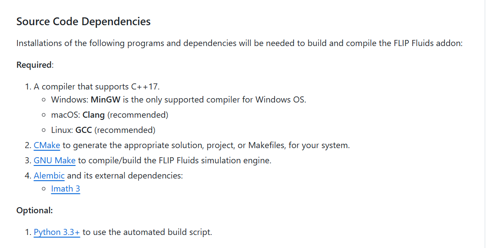
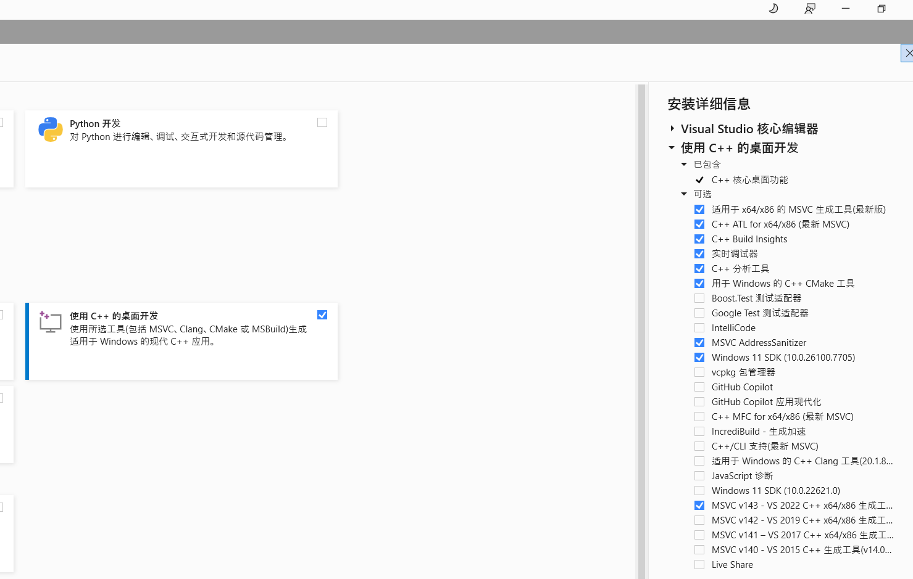
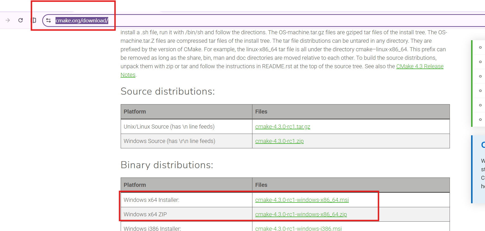
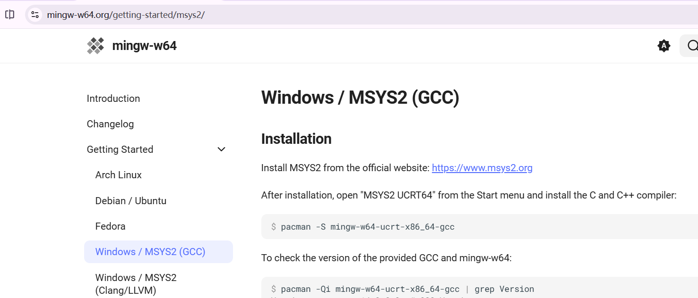
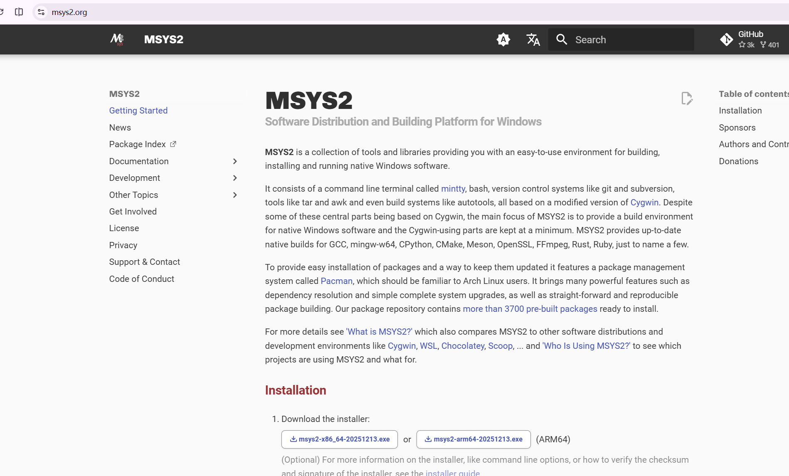
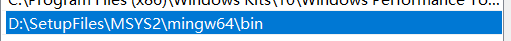
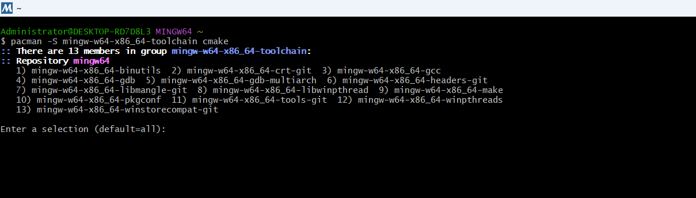
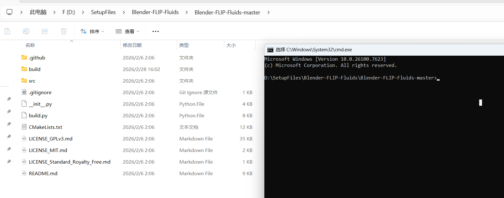

Git安装和获取FLIP FLuids插件源码略过。

# 1.CMake

安装路径添加到系统变量：C:\Program Files\CMake\bin

 




也可以通过官网下载：https://cmake.org/download/

 

验证：

```cmd
cmake  --version
```


# 2.GNU Make

```cmd
winget install GnuWin32.Make
```

安装路径添加到系统变量：C:\Program Files (x86)\GnuWin32\bin

 

验证：

```powershell
make --version
```


# 3.Alembic

 在**MinG编译器**中安装和编译，可以不用单独操作。

# 4.python 

直接下载安装最新的就OK,注意添加环境变量.

验证：

```cmd
python --version
```

# MinGW编译器

官网：https://www.mingw-w64.org/



跳转：https://www.msys2.org/



下载： 

一开始，所有的bin路径都是空的，如图：


需要执行如下命令：

```
pacman -S mingw-w64-x86_64-toolchain cmake
```

### 第一步：在 MSYS2 中安装编译器

添加环境变量： 

由于你的 `mingw64/bin` 是空的，你需要运行 MSYS2 来下载它。

1. 打开你的安装目录 `F:\SetupFiles\MSYS2\`。

2. 双击运行 **`mingw64.exe`**（这会打开一个蓝色的终端窗口）。

3. 在窗口中输入以下命令并回车（如果提示确认，输入 `y`）：

   ```bash
   pacman -S mingw-w64-x86_64-toolchain cmake
   ```

   

   ### 1. 完成工具安装（在当前蓝色终端）

   1. **直接按下回车键（Enter）**：屏幕提示 `Enter a selection (default=all)`，直接回车会默认选择安装全部 13 个工具，包括你需要的编译器和 `make` 工具。

   2. **确认安装**：随后系统会列出安装包大小并询问 `Proceed with installation? [Y/n]`，输入 **`y`** 并回车。

   3. **安装 Alembic 库**：等上面进度条跑完后，输入以下命令并回车，直接一键补齐插件最核心的依赖库：

      Bash

      ```
      pacman -S mingw-w64-x86_64-alembic
      ```

   ### 2. 刷新环境变量（非常重要）

   安装完成后，由于你之前的 `bin` 文件夹是空的，现在的文件夹里已经填满了工具。

   1. **确认路径**：再次检查 `F:\SetupFiles\MSYS2\mingw64\bin` 文件夹，现在里面应该有 `gcc.exe`、`mingw32-make.exe` 以及各种 `.dll` 文件了。
   2. **添加 Path**：如果还没加过，请务必将这个 `bin` 路径添加到 Windows 的 **系统环境变量 Path** 中。
   3. **重启 PowerShell**：**必须关闭并重新打开一个新的 PowerShell 窗口**，否则它不认识新安装的工具。

# 最后编译



cmd插件根目录中执行如下命令：

```cmd
python build.py -make-path "F:\SetupFiles\MSYS2\mingw64\bin\mingw32-make.exe"
```

