# 原生快捷键

## **Alt + N** **(编辑模式下-反转法线)**

编辑模式下：**Alt + N** **，反转法线**

 


反转法线，或者重新计算内外侧法线

这张截图正是 Blender 编辑模式下标准的**法线（Normals）控制菜单**（通常按 Alt + N 呼出）。

这三个选项虽然都和“方向”有关，但它们的**工作原理**和**使用场景**完全不同。我帮你详细区分一下，这样你就知道什么时候该用哪个了：

### 1. 翻转 (Flip) —— “强制调头”

- **原理：** 这是一个**“笨”命令**。它不进行任何计算，只是简单粗暴地把当前选中的面**掉个头**。

- 如果本来朝外，就变朝内。
- 如果本来朝内，就变朝外。

- **什么时候用？**

- 当你只有**单个面**（比如一片叶子、一张纸）反了的时候。
- 或者你需要手动调整某些特定的面，而自动计算总是不听话的时候。

### 2. 重新计算外侧 (Recalculate Outside) —— “智能修复（常用）”

- **快捷键：****Shift + N** (记住这个，最常用！)
- **原理：** 这是一个**“聪明”的算法**。Blender 会分析你的模型结构（拓扑），试图找出哪边是物体的“外面”，然后把所有选中的面都统一朝向外面。
- **什么时候用？**

- 这是**最标准**的修复方法。
- 当你做完一个封闭物体（比如石头、杯子、角色），发现表面有的蓝有的红（法线乱了），直接全选按 Shift + N，通常能一键修好。

### 3. 重新计算内侧 (Recalculate Inside) —— “做房间专用”

- **快捷键：****Shift + Ctrl + N**
- **原理：** 和上面那个算法一样，但是它故意要把面朝向**物体内部**。
- **什么时候用？**

- 当你做**室内场景**（比如一个房间的墙壁），摄像机是在房子里面的，你需要让贴图在内部显示。
- 或者做“天空盒”（Skybox）的时候。

------

### 总结建议

- **遇到法线问题的第一反应：** 全选面 (A) -> 按 **Shift + N** (重新计算外侧)。90% 的情况能解决。
- **如果 Shift + N 解决不了：** 说明模型可能有破洞，或者结构太复杂 Blender 算晕了。这时选中那个错的面，用菜单里的 **“翻转”** 手动改过来。

## **Ctrl + J（物体模式-合并物体）**

- **功能：** **Join（合并物体），与编辑模式下的 P-分离 操作互逆**
- **如何使用：**

- 你先选中几个物体（橙色轮廓）。
- 最后选中一个主要物体（**激活物体**，黄色轮廓）。
- 按 Ctrl + J。
- **结果：** 所有物体都会合并成一个物体，且中心点（Origin）会变成那个黄色轮廓物体的中心点。

## P（编辑模式-分离）

- **功能：分离物体，与 物体模式下的 ctrl+J-合并物体   操作互逆。**


- **选中项** = 我指哪儿，拆哪儿（手动）。
- **按材质** = 同样颜色的归一堆（按材质分类）。
- **按松散块** = 没连在一起的都分开（按物理连接）。

这三个选项的区别在于**拆分的依据**不同：

### 1. 选中项 (Selection)

- **含义**：只分离你**当前手动选中**的点、线或面。
- **如何工作**：你在模型上选了什么，按下这个选项后，选中的部分就会变成一个新物体，未选中的部分保留在原物体中。
- **适用场景**：这是最常用的功能。比如你想把角色的“帽子”拆分出来，你就手动选中帽子的所有面，然后选这个。

### 2. 按材质 (By Material)

- **含义**：根据模型上分配的**材质球 (Material)** 进行自动拆分。
- **如何工作**：如果你的模型原本是一个整体，但分别赋予了“红色塑料”、“蓝色金属”、“玻璃”三种材质。选择这个选项后，Blender 会自动把它拆分成 3 个独立的物体，分别对应这三种材质。
- **适用场景**：通常用于处理导入的复杂模型（如建筑或汽车），你想把所有“玻璃窗”部分一次性独立出来，而不用一个个去选。

### 3. 按松散块 (By Loose Parts)

- **含义**：根据几何结构的**连接性**进行拆分。
- **如何工作**：如果一个物体内部包含多个**互不相连**的网格（比如漂浮在空中的两个独立的球体，或者阵列出来的多个方块，它们虽然在同一个物体层级下，但点线面没有连接），选择这个选项后，每一个独立的连通块都会变成一个单独的物体。
- **适用场景**：比如你用“阵列修改器”做了一排栅栏并应用了修改器，现在它们是一个物体，你想让每一根栅栏都变成独立物体，就用这个。


## **Alt + S**

- **功能：** 它的功能取决于你在什么模式下。

#### 情况 A：在物体模式 (Object Mode) 下 —— **归****一****缩放**

- **功能：** **Clear Scale（清空缩放/缩放归一）**
- **作用：** 就像刚才说的 Alt + R 是清空旋转，Alt + S 是让物体变回它原始的大小（Scale X,Y,Z 全部变为 1）。
- **场景：** 如果你把一个方块瞎拉伸变形了，按这个键它就变回正方体了。

#### 情况 B：在编辑模式 (Edit Mode) 下 —— **沿法向缩放 (胖瘦)**

- **功能：** **Shrink/Fatten（收缩/膨胀）**
- **这是建模神器！**
- **作用：** 它不是让物体整体变大变小（那是 S 键），而是让面沿着**法线方向**推出去或缩回来。
- **场景（针对你的管道/线缆）：**

- 如果你建了一个圆管，觉得它太**细**了。
- 如果按 S 放大，管子会整体变大，甚至位置都会偏。
- 如果按 **Alt + S**，管子会在原地变得**更粗（更胖）**，或者**更细**，非常适合调整线缆的粗细。

| **快捷键**   | **模式**     | **功能中文** | **功能解释**                                |
| ------------ | ------------ | ------------ | ------------------------------------------- |
| **Ctrl + J** | 物体模式     | **合并**     | 把多个物体合体变成一个。                    |
| **Alt + S**  | 物体模式     | **清空缩放** | 把物体大小重置为原始倍数 (1.0)。            |
| **Alt + S**  | **编辑模式** | **法向缩放** | **调整管线粗细**、让物体像气球一样充气/放气 |

## Alt+R

Alt + R (清空旋转)：是将旋转数据设置为物体新建或者刚应用完旋转的状态

# 选择面区域的边界线


右键点击，可以设置快捷键

# X（点-边-面-删除）


### 第一类：搞破坏的 (真删除)

这一类操作会直接把东西删掉，**会在模型上留下“洞”**，或者破坏模型的结构。

- **顶点 (Vertices)**：

- **核弹级删除**。
- 如果你删了一个点，那么连接在这个点上的所有线和面都会**全部消失**。
- *后果：模型会烂掉一大块。*

- **边 (Edges)**：

- 删掉选中的线。
- 如果你删了一条线，依靠这条线存在的面也会消失。
- *后果：模型上会破一个洞。*

- **面 (Faces)**：

- 只删掉那一层“皮”，但是周围的骨架（点和线）会保留下来。
- *后果：变成镂空的线框。*

- **仅边和面 (Only Edges & Faces)**：

- 把线和面删了，但是**点**会留下来悬在空中。
- *场景：极少用，除非你想留下点云做参考。*

- **仅面 (Only Faces)**：

- 把面删了，保留线框（类似于“面”选项，但逻辑略有不同，通常用“面”就够了）。

------

### 第二类：做清洁的 (融并 / Dissolve)

**这是最核心、最好用的功能！** (对应你刚才问的 Ctrl + X)
这一类操作**不会**在模型上挖洞，而是把结构**简化**。它会移除你选中的元素，然后自动把周围的部分“缝合”起来。

- **融并顶点 (Dissolve Vertices)**：

- **作用**：如果一条直线上多余了一个点，用这个，点没了，线变直了，面还在。
- *场景：清理多余的细分点。*

#### 融并顶点，为啥我在新建的平面上，选择一条边上的两个点的时候，使用“融并顶点",感觉是删除这两个点相关的点、边面，只剩下了对面的两个点和边？

<details class="lake-collapse"><summary id="u30deb4e3"><span class="ne-text" style="color: rgb(26, 28, 30); font-size: 14px">融并顶点，为啥我在新建的平面上，选择一条边上的两个点的时候，使用“融并顶点",感觉是删除这两个点相关的点、边面，只剩下了对面的两个点和边？</span></summary><p id="u108bae2d" class="ne-p" style="margin: 0; padding: 0; min-height: 24px"><span class="ne-text">这是一个非常敏锐的观察！你遇到的情况完全正常，原因在于**“几何体的最低生存法则”**。</span></p><p id="u96d478ec" class="ne-p" style="margin: 0; padding: 0; min-height: 24px"><span class="ne-text" style="color: rgb(26, 28, 30); font-size: 14px">在新建的平面（只有1个面，4个点）上，如果你选中一条边上的两个点并选择“融并顶点”，</span><strong><span class="ne-text">结果确实等同于删除了这一半</span></strong><span class="ne-text" style="color: rgb(26, 28, 30); font-size: 14px">。</span></p><p id="u48bc15d5" class="ne-p" style="margin: 0; padding: 0; min-height: 24px"><span class="ne-text" style="color: rgb(26, 28, 30); font-size: 14px">原因如下：</span></p><h3 id="0e06dbbe" style="font-size: 20; line-height: 28px; margin: 16px 0 5px 0"><span class="ne-text" style="color: rgb(26, 28, 30)">1. 面（Face）存在的最低条件</span></h3><p id="udc27fbfb" class="ne-p" style="margin: 0; padding: 0; min-height: 24px"><span class="ne-text" style="color: rgb(26, 28, 30); font-size: 14px">在 3D 软件中，一个“面”至少需要 </span><strong><span class="ne-text">3个点</span></strong><span class="ne-text" style="color: rgb(26, 28, 30); font-size: 14px">（三角形）才能存在。</span></p><ul class="ne-ul" style="margin: 0; padding-left: 23px"><li id="u69928724" data-lake-index-type="0"><span class="ne-text" style="color: rgb(26, 28, 30); font-size: 14px">你原本有 4 个点（四边形）。</span></li><li id="u21c64266" data-lake-index-type="0"><span class="ne-text" style="color: rgb(26, 28, 30); font-size: 14px">你融并（移除）了 2 个点。</span></li><li id="u571bc12f" data-lake-index-type="0"><span class="ne-text" style="color: rgb(26, 28, 30); font-size: 14px">剩下 2 个点。</span></li><li id="uc19c2e96" data-lake-index-type="0"><strong><span class="ne-text">结论：</span></strong><span class="ne-text" style="color: rgb(26, 28, 30); font-size: 14px"> 2 个点只能构成一条线，构不成面。Blender 无法计算出“由2个点组成的平面”，所以那个面必然消失。</span></li></ul><h3 id="c008f277" style="font-size: 20; line-height: 28px; margin: 16px 0 5px 0"><span class="ne-text" style="color: rgb(26, 28, 30)">2. 融并的逻辑是“重新连接邻居”</span></h3><p id="ufd18672e" class="ne-p" style="margin: 0; padding: 0; min-height: 24px"><span class="ne-text" style="color: rgb(26, 28, 30); font-size: 14px">“融并”并不是魔法，它的逻辑是：</span><strong><span class="ne-text">“把选中的点拿走，然后把这个点前后的‘邻居’直接连起来。”</span></strong></p><ul class="ne-ul" style="margin: 0; padding-left: 23px"><li id="u939c4d3a" data-lake-index-type="0"><strong><span class="ne-text">场景 A（你的情况 - 角落的点）：</span></strong></li></ul><ul class="ne-list-wrap" style="margin: 0; padding-left: 23px; list-style: none"><ul ne-level="1" class="ne-ul" style="margin: 0; padding-left: 23px; list-style: circle"><li id="u00a9bfb4" data-lake-index-type="0"><span class="ne-text" style="color: rgb(26, 28, 30); font-size: 14px">平面是个独立的孤岛。当你融并了角落的两个点，剩下的两个点之间没有其他几何体结构可以支撑那个面了。Blender 判定“这里已经无法维持一个封闭的表面”，于是面消失，只剩下最后那条边。</span></li></ul></ul><ul class="ne-ul" style="margin: 0; padding-left: 23px"><li id="u19637e41" data-lake-index-type="0"><strong><span class="ne-text">场景 B（融并真正该用的地方 - 中间的点）：</span></strong></li></ul><ul class="ne-list-wrap" style="margin: 0; padding-left: 23px; list-style: none"><ul ne-level="1" class="ne-ul" style="margin: 0; padding-left: 23px; list-style: circle"><li id="u982f8e25" data-lake-index-type="0"><span class="ne-text" style="color: rgb(26, 28, 30); font-size: 14px">假设你在平面的边缘中间加了一个点（细分了一次），变成 5 个点。</span></li><li id="uaf8183fa" data-lake-index-type="0"><span class="ne-text" style="color: rgb(26, 28, 30); font-size: 14px">这时候这三个点呈一条直线。</span></li><li id="ucd8996b3" data-lake-index-type="0"><span class="ne-text" style="color: rgb(26, 28, 30); font-size: 14px">如果你选中</span><strong><span class="ne-text">中间那个多余的点</span></strong><span class="ne-text" style="color: rgb(26, 28, 30); font-size: 14px"> -&gt; 融并。</span></li><li id="uf2249b0b" data-lake-index-type="0"><strong><span class="ne-text">结果：</span></strong><span class="ne-text" style="color: rgb(26, 28, 30); font-size: 14px"> 点消失，两边的点直接连成一条长线，面依然存在。</span><strong><span class="ne-text">这才是融并顶点的正确用法。</span></strong></li></ul></ul><h3 id="25f9c7fa" style="font-size: 20; line-height: 28px; margin: 16px 0 5px 0"><span class="ne-text" style="color: rgb(26, 28, 30)">总结</span></h3><ul class="ne-ul" style="margin: 0; padding-left: 23px"><li id="u5851352e" data-lake-index-type="0"><strong><span class="ne-text">融并顶点 (Dissolve Vertices)</span></strong><span class="ne-text" style="color: rgb(26, 28, 30); font-size: 14px"> 的主要作用是：</span><strong><span class="ne-text">清理不必要的细分点</span></strong><span class="ne-text" style="color: rgb(26, 28, 30); font-size: 14px">（比如直线中间多余的点，或者平面中间多余的点）。</span></li><li id="u1464642e" data-lake-index-type="0"><strong><span class="ne-text">不能用于：</span></strong><span class="ne-text" style="color: rgb(26, 28, 30); font-size: 14px"> 移除几何体的</span><strong><span class="ne-text">结构性角落</span></strong><span class="ne-text" style="color: rgb(26, 28, 30); font-size: 14px">（Corner）。如果你把桌子的两条腿融并了，桌板自然就塌没了。</span></li></ul><p id="udb3ebc58" class="ne-p" style="margin: 0; padding: 0; min-height: 24px"><span class="ne-text" style="color: rgb(26, 28, 30); font-size: 14px">所以，在你的操作中，Blender 并不是在“删除”，它只是在尽力执行“融并”，但因为剩下的点太少，导致面崩塌了，看起来就像是被删除了一样。<br><br></span></p></details>

#### 融并顶点，其实就是将选择的点删除，同时尽量保持原来的边，如果不能保持原来的边，从新将这个点两边的顶点做成一个边？

<details class="lake-collapse"><summary id="uffaec88a"><span class="ne-text">融并顶点，其实就是将选择的点删除，同时尽量保持原来的边，如果不能保持原来的边，从新将这个点两边的顶点做成一个边？</span></summary><p id="ua8716388" class="ne-p" style="margin: 0; padding: 0; min-height: 24px"><span class="ne-text">你说得非常通透！</span><strong><span class="ne-text">完全可以这么理解。</span></strong></p><p id="u1cd16fba" class="ne-p" style="margin: 0; padding: 0; min-height: 24px"><span class="ne-text">你的总结其实已经触及了“融并”的底层逻辑。为了让你更彻底地掌握它，我们可以把你这句话稍微拆解一下，补充一点细节，你就完全懂了：</span></p><h3 id="2ec9673d" style="font-size: 20; line-height: 28px; margin: 16px 0 5px 0"><span class="ne-text">1. 核心逻辑：移除障碍，直线连接</span></h3><p id="ub7b21c1a" class="ne-p" style="margin: 0; padding: 0; min-height: 24px"><span class="ne-text">你说的“将这个点两边的顶点做成一个边”，在几何算法里其实就是</span><strong><span class="ne-text">合并线段</span></strong><span class="ne-text">。</span></p><ul class="ne-ul" style="margin: 0; padding-left: 23px"><li id="u45f97f1c" data-lake-index-type="0"><strong><span class="ne-text">想象一下：</span></strong><span class="ne-text"> 你手里拉着一根皮筋，皮筋中间被一个钉子（顶点）勾住了，所以皮筋是折线形状。</span></li><li id="u63325f41" data-lake-index-type="0"><strong><span class="ne-text">融并顶点：</span></strong><span class="ne-text"> 就是把中间那个钉子拔掉。</span></li><li id="u7a3562c3" data-lake-index-type="0"><strong><span class="ne-text">结果：</span></strong><span class="ne-text"> 皮筋会瞬间弹直，直接连接左右两端的钉子。</span></li></ul><p id="u773e9017" class="ne-p" style="margin: 0; padding: 0; min-height: 24px"><span class="ne-text">这就是为什么你觉得它“从新将这个点两边的顶点做成一个边”——它确实是把原本的 </span><strong><span class="ne-text">A-B-C</span></strong><span class="ne-text"> 结构，简化成了 </span><strong><span class="ne-text">A-C</span></strong><span class="ne-text">。</span></p><h3 id="b75b0e47" style="font-size: 20; line-height: 28px; margin: 16px 0 5px 0"><span class="ne-text">2. 关键区别：它会尽全力“保住面” (Save the Face)</span></h3><p id="u6c55dfd8" class="ne-p" style="margin: 0; padding: 0; min-height: 24px"><span class="ne-text">这是“融并”和“删除”最大的区别：</span></p><ul class="ne-ul" style="margin: 0; padding-left: 23px"><li id="u8135b0f6" data-lake-index-type="0"><strong><span class="ne-text">删除 (X -&gt; 顶点):</span></strong><span class="ne-text"> 是把点炸掉，连带把依靠这个点的皮（面）也撕碎。</span></li><li id="u0d59caec" data-lake-index-type="0"><strong><span class="ne-text">融并 (Ctrl+X):</span></strong><span class="ne-text"> 是把点拿走，然后告诉 Blender：“**别让皮破了！**用剩下的点重新算一下这个面的形状。”</span></li></ul><h3 id="2fa57f8d" style="font-size: 20; line-height: 28px; margin: 16px 0 5px 0"><span class="ne-text">3. 为什么有时候会“破”？（回顾你之前的问题）</span></h3><p id="u763ab18b" class="ne-p" style="margin: 0; padding: 0; min-height: 24px"><span class="ne-text">你之前遇到的情况，是因为你逼 Blender 做一件不可能的事。</span></p><ul class="ne-ul" style="margin: 0; padding-left: 23px"><li id="u21271782" data-lake-index-type="0"><strong><span class="ne-text">你的指令：</span></strong><span class="ne-text"> “融并这2个点，并保住面。”</span></li><li id="u1cd05ee1" data-lake-index-type="0"><strong><span class="ne-text">Blender 的尝试：</span></strong></li></ul><ul class="ne-list-wrap" style="margin: 0; padding-left: 23px; list-style: none"><ul ne-level="1" class="ne-ul" style="margin: 0; padding-left: 23px; list-style: circle"><li id="u90c3e847" data-lake-index-type="0"><span class="ne-text">拔掉点。</span></li><li id="u62a1273f" data-lake-index-type="0"><span class="ne-text">连接两头（剩下2个点连成一条线）。</span></li><li id="u00c085cd" data-lake-index-type="0"><strong><span class="ne-text">计算面：</span></strong><span class="ne-text"> “坏了，老板，剩下这点骨架撑不起一张皮啊（面至少要3个点）！”</span></li><li id="uf8e57777" data-lake-index-type="0"><strong><span class="ne-text">无奈结果：</span></strong><span class="ne-text"> 面消失。</span></li></ul></ul><h3 id="75a051ac" style="font-size: 20; line-height: 28px; margin: 16px 0 5px 0"><span class="ne-text">总结公式</span></h3><p id="u15db1fc3" class="ne-p" style="margin: 0; padding: 0; min-height: 24px"><span class="ne-text">所以，</span><strong><span class="ne-text">融并顶点 (Dissolve Vertices)</span></strong><span class="ne-text"> 的定义可以总结为：</span></p><p id="u3c6da070" class="ne-p" style="margin: 0; padding: 0; min-height: 24px"><strong><span class="ne-text">移除选中的点 + 将该点连接的线段合并 + 重新填补表面</span></strong></p><p id="u5a36b8c8" class="ne-p" style="margin: 0; padding: 0; min-height: 24px"><strong><span class="ne-text">什么时候用它最爽？</span></strong><span class="ne-text"><br></span><span class="ne-text">就是当你做硬表面建模，布尔切了一刀，或者倒角之后，发现直线上多出了很多</span><strong><span class="ne-text">没用的碎点</span></strong><span class="ne-text">（不影响形状，但影响布线美观）时。选中它们，一键融并，世界瞬间清静，线变直了，面还在。</span></p></details>

#### 其他的融并操作，是不是也是这个原理

<details class="lake-collapse"><summary id="u239c882c"><span class="ne-text" style="color: rgb(26, 28, 30); font-size: 14px">其他的融并操作，是不是也是这个原理</span></summary><h4 id="pXsir" style="font-size: 16px; line-height: 24px; margin: 10px 0 5px 0"><strong><span class="ne-text">是的！完全正确！</span></strong></h4><p id="u497c05b2" class="ne-p" style="margin: 0; padding: 0; min-height: 24px"><span class="ne-text" style="color: rgb(26, 28, 30); font-size: 14px">你现在的理解非常透彻：</span><strong><span class="ne-text">所有的“融并 (Dissolve)”操作，底层逻辑都是一样的。</span></strong></p><p id="u0ddf45f8" class="ne-p" style="margin: 0; padding: 0; min-height: 24px"><span class="ne-text" style="color: rgb(26, 28, 30); font-size: 14px">它们的核心目的都是：</span><strong><span class="ne-text">简化结构（做减法），同时保护表面（不破相）。</span></strong></p><p id="u38a62efd" class="ne-p" style="margin: 0; padding: 0; min-height: 24px"><span class="ne-text" style="color: rgb(26, 28, 30); font-size: 14px">为了让你在做硬表面（那个科幻卡车）时用得更顺手，我把另外两个最常用的融并操作，用你刚刚悟到的“原理”翻译一下：</span></p><hr id="NF2ic" class="ne-hr" style="background-color: #e8e8e8; border: 1px solid transparent; margin: 18px 0"><h3 id="ElnQi" style="font-size: 20; line-height: 28px; margin: 16px 0 5px 0"><span class="ne-text" style="color: rgb(26, 28, 30)">1. 融并边 (Dissolve Edges) —— 最常用的操作</span></h3><p id="u650d9a01" class="ne-p" style="margin: 0; padding: 0; min-height: 24px"><span class="ne-text" style="color: rgb(26, 28, 30); font-size: 14px">这是你在处理布尔运算后乱线时的绝对主力。</span></p><ul class="ne-ul" style="margin: 0; padding-left: 23px"><li id="u91005dfb" data-lake-index-type="0"><strong><span class="ne-text">原来的样子：</span></strong><span class="ne-text" style="color: rgb(26, 28, 30); font-size: 14px"> 两个房间中间有一堵墙（边）。</span></li><li id="ue3b35237" data-lake-index-type="0"><strong><span class="ne-text">删除 (Delete) 的逻辑：</span></strong><span class="ne-text" style="color: rgb(26, 28, 30); font-size: 14px"> 把墙炸了，地基也炸了。结果就是</span><strong><span class="ne-text">地上留个坑</span></strong><span class="ne-text" style="color: rgb(26, 28, 30); font-size: 14px">，或者两个房间之间裂开了。</span></li><li id="u144dc5e5" data-lake-index-type="0"><strong><span class="ne-text">融并 (Dissolve) 的逻辑：</span></strong><span class="ne-text" style="color: rgb(26, 28, 30); font-size: 14px"> 把中间这堵墙拆掉，把两个房间</span><strong><span class="ne-text">打通变成一个大厅</span></strong><span class="ne-text" style="color: rgb(26, 28, 30); font-size: 14px">。</span></li></ul><ul class="ne-list-wrap" style="margin: 0; padding-left: 23px; list-style: none"><ul ne-level="1" class="ne-ul" style="margin: 0; padding-left: 23px; list-style: circle"><li id="u7bd3d859" data-lake-index-type="0"><strong><span class="ne-text">原理翻译：</span></strong><span class="ne-text" style="color: rgb(26, 28, 30); font-size: 14px"> 移除选中的边 -&gt; 左右两个面</span><strong><span class="ne-text">合并</span></strong><span class="ne-text" style="color: rgb(26, 28, 30); font-size: 14px">成一个大面（多边形/N-gon）。</span></li><li id="ue74e46cf" data-lake-index-type="0"><strong><span class="ne-text">表面状态：</span></strong><span class="ne-text" style="color: rgb(26, 28, 30); font-size: 14px"> 表面依然是封闭的，只是中间那条线没了。</span></li></ul></ul><h3 id="CNVe3" style="font-size: 20; line-height: 28px; margin: 16px 0 5px 0"><span class="ne-text" style="color: rgb(26, 28, 30)">2. 融并面 (Dissolve Faces)</span></h3><p id="u64d2791e" class="ne-p" style="margin: 0; padding: 0; min-height: 24px"><span class="ne-text" style="color: rgb(26, 28, 30); font-size: 14px">这个其实和融并边非常像，通常用于把一堆细碎的面整合成一个大面。</span></p><ul class="ne-ul" style="margin: 0; padding-left: 23px"><li id="ue30eff01" data-lake-index-type="0"><strong><span class="ne-text">原理翻译：</span></strong><span class="ne-text" style="color: rgb(26, 28, 30); font-size: 14px"> 选中了一堆小面 -&gt; 告诉 Blender “把这些小面中间的那些棱棱角角都融化掉” -&gt; 变成</span><strong><span class="ne-text">一块大平板</span></strong><span class="ne-text" style="color: rgb(26, 28, 30); font-size: 14px">。</span></li><li id="udbcb616f" data-lake-index-type="0"><strong><span class="ne-text">场景：</span></strong><span class="ne-text" style="color: rgb(26, 28, 30); font-size: 14px"> 比如你在一个平面上切出了很多细碎的格子，现在后悔了，想变回一个整面。全选这些面 -&gt; 融并面 -&gt; 瞬间变回一张整脸。</span></li></ul><hr id="VNj0H" class="ne-hr" style="background-color: #e8e8e8; border: 1px solid transparent; margin: 18px 0"><h3 id="iaJ1Z" style="font-size: 20; line-height: 28px; margin: 16px 0 5px 0"><span class="ne-text" style="color: rgb(26, 28, 30)">总结一个“万能公式”</span></h3><p id="ub549e4bc" class="ne-p" style="margin: 0; padding: 0; min-height: 24px"><span class="ne-text" style="color: rgb(26, 28, 30); font-size: 14px">为了方便记忆，你可以把所有的</span><strong><span class="ne-text">删除 vs 融并</span></strong><span class="ne-text" style="color: rgb(26, 28, 30); font-size: 14px">看作是</span><strong><span class="ne-text">外科手术</span></strong><span class="ne-text" style="color: rgb(26, 28, 30); font-size: 14px">：</span></p><p id="u3ee2a8a1" class="ne-p" style="margin: 0; padding: 0; min-height: 24px"><span class="ne-text" style="color: rgb(26, 28, 30); font-size: 14px">操作</span></p><p id="u1a858592" class="ne-p" style="margin: 0; padding: 0; min-height: 24px"><span class="ne-text" style="color: rgb(26, 28, 30); font-size: 14px">英文</span></p><p id="u9f89b2d1" class="ne-p" style="margin: 0; padding: 0; min-height: 24px"><span class="ne-text" style="color: rgb(26, 28, 30); font-size: 14px">比喻</span></p><p id="u9e91185a" class="ne-p" style="margin: 0; padding: 0; min-height: 24px"><span class="ne-text" style="color: rgb(26, 28, 30); font-size: 14px">结果</span></p><p id="uf62769ae" class="ne-p" style="margin: 0; padding: 0; min-height: 24px"><span class="ne-text" style="color: rgb(26, 28, 30); font-size: 14px">几何体结构</span></p><p id="ud3a5a3b9" class="ne-p" style="margin: 0; padding: 0; min-height: 24px"><strong><span class="ne-text">删除 (Delete)</span></strong></p><p id="uf936e5ef" class="ne-p" style="margin: 0; padding: 0; min-height: 24px"><span class="ne-text" style="color: rgb(26, 28, 30); font-size: 14px">X</span></p><p id="ucb435495" class="ne-p" style="margin: 0; padding: 0; min-height: 24px"><strong><span class="ne-text">截肢/挖肉</span></strong></p><p id="ua58ee52b" class="ne-p" style="margin: 0; padding: 0; min-height: 24px"><span class="ne-text" style="color: rgb(26, 28, 30); font-size: 14px">会留下伤口（</span><strong><span class="ne-text">破洞</span></strong><span class="ne-text" style="color: rgb(26, 28, 30); font-size: 14px">）</span></p><p id="u69606c90" class="ne-p" style="margin: 0; padding: 0; min-height: 24px"><span class="ne-text" style="color: rgb(26, 28, 30); font-size: 14px">结构断开，不再封闭</span></p><p id="u15d15c70" class="ne-p" style="margin: 0; padding: 0; min-height: 24px"><strong><span class="ne-text">融并 (Dissolve)</span></strong></p><p id="u2e8186e4" class="ne-p" style="margin: 0; padding: 0; min-height: 24px"><span class="ne-text" style="color: rgb(26, 28, 30); font-size: 14px">Ctrl+X</span></p><p id="u2a13e63b" class="ne-p" style="margin: 0; padding: 0; min-height: 24px"><strong><span class="ne-text">拆线/愈合</span></strong></p><p id="uc5498386" class="ne-p" style="margin: 0; padding: 0; min-height: 24px"><span class="ne-text" style="color: rgb(26, 28, 30); font-size: 14px">皮肤还是完整的（</span><strong><span class="ne-text">平滑</span></strong><span class="ne-text" style="color: rgb(26, 28, 30); font-size: 14px">）</span></p><p id="u4f74e7e0" class="ne-p" style="margin: 0; padding: 0; min-height: 24px"><span class="ne-text" style="color: rgb(26, 28, 30); font-size: 14px">结构简化，两个变一个</span></p><h3 id="QVaMd" style="font-size: 20; line-height: 28px; margin: 16px 0 5px 0"><span class="ne-text" style="color: rgb(26, 28, 30)">在科幻卡车制作中的实战应用：</span></h3><p id="ua768c18f" class="ne-p" style="margin: 0; padding: 0; min-height: 24px"><span class="ne-text" style="color: rgb(26, 28, 30); font-size: 14px">当你用 Boxcutter 切了一个洞（布尔运算）之后，你会发现洞口周围多出了很多乱七八糟的线条连到角落里。</span></p><p id="u5ef515d8" class="ne-p" style="margin: 0; padding: 0; min-height: 24px"><span class="ne-text" style="color: rgb(26, 28, 30); font-size: 14px">这时候你的脑回路应该是这样的：</span></p><ul class="ne-ul" style="margin: 0; padding-left: 23px"><li id="u16eda0c6" data-lake-index-type="0"><strong><span class="ne-text">观察：</span></strong><span class="ne-text" style="color: rgb(26, 28, 30); font-size: 14px"> “这条线对形状有贡献吗？它撑起了转折吗？”</span></li><li id="ufc76fecb" data-lake-index-type="0"><strong><span class="ne-text">判断：</span></strong><span class="ne-text" style="color: rgb(26, 28, 30); font-size: 14px"> “没有，它只是平平的趴在一个平面上，纯属多余。”</span></li><li id="u458575ae" data-lake-index-type="0"><strong><span class="ne-text">操作：</span></strong><span class="ne-text" style="color: rgb(26, 28, 30); font-size: 14px"> 选中它 -&gt; </span><strong><span class="ne-text">融并边</span></strong><span class="ne-text" style="color: rgb(26, 28, 30); font-size: 14px">。</span></li><li id="ue3cf06ea" data-lake-index-type="0"><strong><span class="ne-text">结果：</span></strong><span class="ne-text" style="color: rgb(26, 28, 30); font-size: 14px"> 线没了，面还在，模型变干净了（拓扑优化）。</span></li></ul><p id="u339addc9" class="ne-p" style="margin: 0; padding: 0; min-height: 24px"><span class="ne-text" style="color: rgb(26, 28, 30); font-size: 14px">所以，</span><strong><span class="ne-text">融并就是 3D 建模里的“橡皮擦”</span></strong><span class="ne-text" style="color: rgb(26, 28, 30); font-size: 14px">，擦掉铅笔线但纸没破；而删除是“剪刀”，直接把纸剪了个洞。</span></p><h4 id="WK18l" style="font-size: 16px; line-height: 24px; margin: 10px 0 5px 0"><span class="ne-text" style="color: rgb(26, 28, 30)"><br><br></span></h4></details>

- **融并边 (Dissolve Edges) ——** **⭐****️ 最常用**：

- **作用**：把两块面中间的那条线擦掉，让它们合并成一个大面。
- **就是你刚才问的**：想要多个面变一个面，不要按 F，要选中间的线，然后用这个！

- **融并面 (Dissolve Faces)**：

- **作用**：把选中的多个面合并成一个大面（N-gon）。
- *场景：和融并边类似，如果你直接选了一堆面想让它们合体，就用这个。*

- **有限融并 (Limited Dissolve)**：
- 

- **作用**：这是“偷懒神器”。它会自动计算角度，把平面上多余的线全部自动清理掉。
- *场景：当你导入了一个布线超级乱的圆柱体盖子，点一下这个，盖子瞬间变成一个干净的圆面。*

#### 有限融并 ，其实就是在不改变形状的前提下，删除所有不影响形状的点边面

<details class="lake-collapse"><summary id="u033c3e32"><span class="ne-text" style="color: rgb(26, 28, 30); font-size: 14px">有限融并 ，其实就是在不改变形状的前提下，删除所有不影响形状的点边面</span></summary><p id="u044f10e8" class="ne-p" style="margin: 0; padding: 0; min-height: 24px"><strong><span class="ne-text">满分理解！完全正确！</span></strong></p><p id="u148d52e6" class="ne-p" style="margin: 0; padding: 0; min-height: 24px"><span class="ne-text">你的直觉非常准。</span><strong><span class="ne-text">“有限融并 (Limited Dissolve)”</span></strong><span class="ne-text"> 本质上就是全自动化的**“无用结构大扫除”**。</span></p><p id="u320c9f04" class="ne-p" style="margin: 0; padding: 0; min-height: 24px"><span class="ne-text">关于你特别问到的 </span><strong><span class="ne-text">“会包括面吗？”</span></strong><span class="ne-text"> —— </span><strong><span class="ne-text">答案是：会的！</span></strong></p><p id="uc7c02874" class="ne-p" style="margin: 0; padding: 0; min-height: 24px"><span class="ne-text">而且它对面的处理方式是硬表面建模里最爽的一步。为了让你彻底放心使用，我把它的工作细节拆解一下：</span></p><h3 id="oVfL5" style="font-size: 20; line-height: 28px; margin: 16px 0 5px 0"><span class="ne-text">1. 它对“面”做了什么？</span></h3><p id="ubaf2fd00" class="ne-p" style="margin: 0; padding: 0; min-height: 24px"><span class="ne-text">它并不是把面“删没”了（那样会有洞），而是把</span><strong><span class="ne-text">共面的（Coplanar）碎面合并成了一个大面</span></strong><span class="ne-text">。</span></p><ul class="ne-ul" style="margin: 0; padding-left: 23px"><li id="u49bcaeeb" data-lake-index-type="0"><strong><span class="ne-text">场景：</span></strong><span class="ne-text"> 想象你家里铺了地砖，地面是平的，但上面有几百块瓷砖（几百个面）。</span></li><li id="u8d77bf05" data-lake-index-type="0"><strong><span class="ne-text">有限融并后：</span></strong><span class="ne-text"> 所有的瓷砖缝（边）都被融并了，地面变成了一整块光滑的水泥地（一个巨大的 N-gon 面）。</span></li><li id="u2a3fd583" data-lake-index-type="0"><strong><span class="ne-text">结果：</span></strong><span class="ne-text"> 形状完全没变（还是平的），但数据量从几百个面变成了1个面。</span></li></ul><h3 id="evzYz" style="font-size: 20; line-height: 28px; margin: 16px 0 5px 0"><span class="ne-text">2. 它是怎么判断“影响形状”的？</span></h3><p id="ubba17e55" class="ne-p" style="margin: 0; padding: 0; min-height: 24px"><span class="ne-text">这是“有限融并”最核心的秘密——</span><strong><span class="ne-text">角度阈值 (Max Angle)</span></strong><span class="ne-text">。</span></p><p id="u3d71174e" class="ne-p" style="margin: 0; padding: 0; min-height: 24px"><span class="ne-text">当你点击有限融并时，左下角会弹出一个小面板，里面有一个 </span><span class="ne-text">Max Angle</span><span class="ne-text">（通常默认是 5度）。</span></p><ul class="ne-ul" style="margin: 0; padding-left: 23px"><li id="uccce4661" data-lake-index-type="0"><strong><span class="ne-text">判断逻辑：</span></strong><span class="ne-text"> Blender 会检查每一条边两侧的面。</span></li></ul><ul class="ne-list-wrap" style="margin: 0; padding-left: 23px; list-style: none"><ul ne-level="1" class="ne-ul" style="margin: 0; padding-left: 23px; list-style: circle"><li id="u84c09417" data-lake-index-type="0"><strong><span class="ne-text">如果是平的（夹角 &lt; 5度）：</span></strong><span class="ne-text"> Blender 判定：“这条边是多余的废话，两边的面其实是一家人。” -&gt; </span><strong><span class="ne-text">融并！</span></strong><span class="ne-text">（两面变一面）。</span></li><li id="uad086d17" data-lake-index-type="0"><strong><span class="ne-text">如果是直角/折角（夹角 &gt; 5度）：</span></strong><span class="ne-text"> Blender 判定：“这条边构成了物体的棱角，删了它形状就变圆了。” -&gt; </span><strong><span class="ne-text">保留！</span></strong></li></ul></ul><h3 id="BYr36" style="font-size: 20; line-height: 28px; margin: 16px 0 5px 0"><span class="ne-text">3. 实战中的典型案例（科幻卡车）</span></h3><p id="uf3ca9176" class="ne-p" style="margin: 0; padding: 0; min-height: 24px"><span class="ne-text">在做那个卡车时，你经常会用布尔运算挖一个圆柱形的洞：</span></p><ul class="ne-ul" style="margin: 0; padding-left: 23px"><li id="u3595b8e4" data-lake-index-type="0"><strong><span class="ne-text">刚挖完：</span></strong><span class="ne-text"> 洞口的平面上会呈辐射状爆发出一堆乱七八糟的线（连接到圆的边缘）。这些线虽然难看，但它们所在的平面其实是</span><strong><span class="ne-text">完全平整</span></strong><span class="ne-text">的。</span></li><li id="u1c9cfa08" data-lake-index-type="0"><strong><span class="ne-text">按下有限融并：</span></strong></li></ul><ul class="ne-list-wrap" style="margin: 0; padding-left: 23px; list-style: none"><ul ne-level="1" class="ne-ul" style="margin: 0; padding-left: 23px; list-style: circle"><li id="ue5cc86a3" data-lake-index-type="0"><strong><span class="ne-text">点：</span></strong><span class="ne-text"> 直线中间多余的点？</span><strong><span class="ne-text">融并！</span></strong></li><li id="ub62e03ad" data-lake-index-type="0"><strong><span class="ne-text">边：</span></strong><span class="ne-text"> 平面上多余的乱线？</span><strong><span class="ne-text">融并！</span></strong></li><li id="u01a40545" data-lake-index-type="0"><strong><span class="ne-text">面：</span></strong><span class="ne-text"> 被乱线切割成的碎面？</span><strong><span class="ne-text">合并！</span></strong></li></ul></ul><ul class="ne-ul" style="margin: 0; padding-left: 23px"><li id="ufc7756f0" data-lake-index-type="0"><strong><span class="ne-text">结果：</span></strong><span class="ne-text"> 依然是一个完美的平面上有一个洞，但布线瞬间变得极其干净。</span></li></ul><h3 id="PTjGT" style="font-size: 20; line-height: 28px; margin: 16px 0 5px 0"><span class="ne-text">总结</span></h3><p id="u88c3e219" class="ne-p" style="margin: 0; padding: 0; min-height: 24px"><strong><span class="ne-text">有限融并 (Limited Dissolve)</span></strong><span class="ne-text"> = </span><strong><span class="ne-text">一键合并所有“平整”区域的 顶点、边 和 面。</span></strong></p><p id="u5af6db08" class="ne-p" style="margin: 0; padding: 0; min-height: 24px"><span class="ne-text">它是硬表面建模（Hard Surface）中用来</span><strong><span class="ne-text">清洗布尔运算后遗症</span></strong><span class="ne-text">的最强工具。放心用，只要你的物体表面是平的，它就不会破坏形状。</span></p></details>


#### **有限融并 (Limited Dissolve)** 的详细设置面板。

<details class="lake-collapse"><summary id="u494974ab"><strong><span class="ne-text">有限融并 (Limited Dissolve)</span></strong><span class="ne-text"> 的详细设置面板。</span></summary><p id="u1d0a863d" class="ne-p" style="margin: 0; padding: 0; min-height: 24px"><span class="ne-text">这张截图显示的是 </span><strong><span class="ne-text">有限融并 (Limited Dissolve)</span></strong><span class="ne-text"> 的详细设置面板。</span></p><p id="uee1c5c11" class="ne-p" style="margin: 0; padding: 0; min-height: 24px"><span class="ne-text" style="font-size: 14px">既然你已经理解了它的核心原理（“在不改变形状的前提下清理废线”），那么这个面板的作用就是</span><strong><span class="ne-text">给这个清理过程制定“规则”和“底线”</span></strong><span class="ne-text" style="font-size: 14px">。</span></p><p id="u1cc68b96" class="ne-p" style="margin: 0; padding: 0; min-height: 24px"><span class="ne-text" style="font-size: 14px">简单说，就是告诉 Blender：</span><strong><span class="ne-text">“虽然这两个面是平的，本来应该合并，但在以下情况下，请不要动它们！”</span></strong></p><p id="u62cd0ef1" class="ne-p" style="margin: 0; padding: 0; min-height: 24px"><span class="ne-text" style="font-size: 14px">我们逐一拆解：</span></p><h3 id="cdfed4ea" style="font-size: 20; line-height: 28px; margin: 16px 0 5px 0"><span class="ne-text">1. 最大角度 (Max Angle) —— 核心门槛</span></h3><ul class="ne-ul" style="margin: 0; padding-left: 23px"><li id="ue8b499de" data-lake-index-type="0"><strong><span class="ne-text">默认值 5°：</span></strong></li></ul><ul class="ne-list-wrap" style="margin: 0; padding-left: 23px; list-style: none"><ul ne-level="1" class="ne-ul" style="margin: 0; padding-left: 23px; list-style: circle"><li id="ucbd5ab59" data-lake-index-type="0"><span class="ne-text" style="font-size: 14px">这是判断“平不平”的标准。</span></li><li id="u0b6148ba" data-lake-index-type="0"><span class="ne-text" style="font-size: 14px">如果两个面之间的夹角</span><strong><span class="ne-text">小于 5度</span></strong><span class="ne-text" style="font-size: 14px">，Blender 就认为它是“平的”，会把中间的线融并掉。</span></li><li id="uc384453d" data-lake-index-type="0"><span class="ne-text" style="font-size: 14px">如果夹角</span><strong><span class="ne-text">大于 5度</span></strong><span class="ne-text" style="font-size: 14px">，Blender 就认为这是“结构转折”，会保留它。</span></li></ul></ul><ul class="ne-ul" style="margin: 0; padding-left: 23px"><li id="u6614ab94" data-lake-index-type="0"><strong><span class="ne-text">什么时候改？</span></strong></li></ul><ul class="ne-list-wrap" style="margin: 0; padding-left: 23px; list-style: none"><ul ne-level="1" class="ne-ul" style="margin: 0; padding-left: 23px; list-style: circle"><li id="uc13e868c" data-lake-index-type="0"><span class="ne-text" style="font-size: 14px">如果你做的是</span><strong><span class="ne-text">低多边形 (Low Poly)</span></strong><span class="ne-text" style="font-size: 14px"> 游戏模型，有时会把这个调大（比如 10-20度），强行把圆滑的曲面变成有棱角的面来省资源。</span></li><li id="u02ebc551" data-lake-index-type="0"><span class="ne-text" style="font-size: 14px">做硬表面卡车时，通常保持默认的 5度 或者调小到 1-2度 即可，防止误删微小的倒角结构。</span></li></ul></ul><hr id="KJRBy" class="ne-hr" style="background-color: #e8e8e8; border: 1px solid transparent; margin: 18px 0"><h3 id="39a175e3" style="font-size: 20; line-height: 28px; margin: 16px 0 5px 0"><span class="ne-text">2. 划界 (Delimit) —— 重要的“停火线”</span></h3><p id="u0cb1d328" class="ne-p" style="margin: 0; padding: 0; min-height: 24px"><span class="ne-text" style="font-size: 14px">这是这个面板里最有用的部分。它的意思是：</span><strong><span class="ne-text">“即使满足了角度要求（是平的），如果遇到以下情况，也绝对不能融并！”</span></strong></p><p id="u37358b24" class="ne-p" style="margin: 0; padding: 0; min-height: 24px"><span class="ne-text" style="font-size: 14px">你可以多选这些选项（按住 Shift 点击）。</span></p><ul class="ne-ul" style="margin: 0; padding-left: 23px"><li id="u4e1184fa" data-lake-index-type="0"><strong><span class="ne-text">法向 (Normal) [默认选中]:</span></strong></li></ul><ul class="ne-list-wrap" style="margin: 0; padding-left: 23px; list-style: none"><ul ne-level="1" class="ne-ul" style="margin: 0; padding-left: 23px; list-style: circle"><li id="uccef0845" data-lake-index-type="0"><span class="ne-text" style="font-size: 14px">防止合并那些法线方向相反或差异巨大的面。通常保持选中即可。</span></li></ul></ul><ul class="ne-ul" style="margin: 0; padding-left: 23px"><li id="u54581b97" data-lake-index-type="0"><strong><span class="ne-text">材质 (Material):</span></strong></li></ul><ul class="ne-list-wrap" style="margin: 0; padding-left: 23px; list-style: none"><ul ne-level="1" class="ne-ul" style="margin: 0; padding-left: 23px; list-style: circle"><li id="uec0d2f9d" data-lake-index-type="0"><strong><span class="ne-text">非常重要！</span></strong></li><li id="u7fee51b3" data-lake-index-type="0"><strong><span class="ne-text">场景：</span></strong><span class="ne-text" style="font-size: 14px"> 假设你的卡车侧面是一个大平面，但你给前半部分涂了“蓝色金属漆”，后半部分涂了“黑色橡胶”。</span></li><li id="ue28d9d10" data-lake-index-type="0"><strong><span class="ne-text">如果不选：</span></strong><span class="ne-text" style="font-size: 14px"> 有限融并会把它们合成一个大面，你的材质分配就乱了（变成全蓝或全黑）。</span></li><li id="u8f9af5b1" data-lake-index-type="0"><strong><span class="ne-text">如果你选中它：</span></strong><span class="ne-text" style="font-size: 14px"> Blender 会在两种材质的交界处停下来，保留那条分界线。</span></li></ul></ul><ul class="ne-ul" style="margin: 0; padding-left: 23px"><li id="u25338b85" data-lake-index-type="0"><strong><span class="ne-text">缝合边 (Seam):</span></strong></li></ul><ul class="ne-list-wrap" style="margin: 0; padding-left: 23px; list-style: none"><ul ne-level="1" class="ne-ul" style="margin: 0; padding-left: 23px; list-style: circle"><li id="uff0ce765" data-lake-index-type="0"><strong><span class="ne-text">展 UV 时必用。</span></strong></li><li id="uc0686d0d" data-lake-index-type="0"><span class="ne-text" style="font-size: 14px">如果你已经切好了 UV 缝合线（红线），你不希望整理模型时把这些缝合线弄丢了。选中它，Blender 就会保护红线不被融并。</span></li></ul></ul><ul class="ne-ul" style="margin: 0; padding-left: 23px"><li id="ubd4d6ff4" data-lake-index-type="0"><strong><span class="ne-text">锐边 (Sharp):</span></strong></li></ul><ul class="ne-list-wrap" style="margin: 0; padding-left: 23px; list-style: none"><ul ne-level="1" class="ne-ul" style="margin: 0; padding-left: 23px; list-style: circle"><li id="u45766594" data-lake-index-type="0"><strong><span class="ne-text">硬表面建模神器！</span></strong></li><li id="u9d30773e" data-lake-index-type="0"><strong><span class="ne-text">场景：</span></strong><span class="ne-text" style="font-size: 14px"> 在做卡车时，你可能会手动标记一些“锐边”（青色线）来控制自动平滑（Auto Smooth）或倒角权重。</span></li><li id="ub844bf44" data-lake-index-type="0"><strong><span class="ne-text">作用：</span></strong><span class="ne-text" style="font-size: 14px"> 选中它，Blender 就不会融并掉你辛苦标记的锐边，即使它们位于平面上（例如某些面板刻线）。</span></li></ul></ul><ul class="ne-ul" style="margin: 0; padding-left: 23px"><li id="uc21c5913" data-lake-index-type="0"><strong><span class="ne-text">UV:</span></strong></li></ul><ul class="ne-list-wrap" style="margin: 0; padding-left: 23px; list-style: none"><ul ne-level="1" class="ne-ul" style="margin: 0; padding-left: 23px; list-style: circle"><li id="u14aa3cb3" data-lake-index-type="0"><span class="ne-text" style="font-size: 14px">防止破坏纹理贴图。</span></li><li id="u398f18b7" data-lake-index-type="0"><span class="ne-text" style="font-size: 14px">如果两个面在 3D 空间是挨着的，但在 UV 贴图上是分开的，选中这个选项可以防止纹理被拉扯坏。</span></li></ul></ul><hr id="XwqTR" class="ne-hr" style="background-color: #e8e8e8; border: 1px solid transparent; margin: 18px 0"><h3 id="0b7186ee" style="font-size: 20; line-height: 28px; margin: 16px 0 5px 0"><span class="ne-text">3. 所有边界 (All Boundaries)</span></h3><ul class="ne-ul" style="margin: 0; padding-left: 23px"><li id="u0a4a813f" data-lake-index-type="0"><strong><span class="ne-text">不勾选（默认）：</span></strong><span class="ne-text" style="font-size: 14px"> 融并时，它会优先保护选中区域的最外圈轮廓，只清理内部。</span></li><li id="ue6ec99f7" data-lake-index-type="0"><strong><span class="ne-text">勾选：</span></strong><span class="ne-text" style="font-size: 14px"> 它会更激进地清理，甚至包括选中区域边界上的顶点（如果是直线的）。</span></li><li id="u5b896126" data-lake-index-type="0"><strong><span class="ne-text">建议：</span></strong><span class="ne-text" style="font-size: 14px"> 通常</span><strong><span class="ne-text">不勾选</span></strong><span class="ne-text" style="font-size: 14px">，除非你发现边界线上有很多没用的碎点想一次性清空。</span></li></ul><hr id="kDuGD" class="ne-hr" style="background-color: #e8e8e8; border: 1px solid transparent; margin: 18px 0"><h3 id="fe0d0ca1" style="font-size: 20; line-height: 28px; margin: 16px 0 5px 0"><span class="ne-text">总结：在卡车制作中怎么设？</span></h3><p id="u4c1bd2cd" class="ne-p" style="margin: 0; padding: 0; min-height: 24px"><span class="ne-text" style="font-size: 14px">做那个科幻卡车的时候，绝大多数情况下**默认设置（只选法向，5度）**就够用了。</span></p><p id="u00e09e79" class="ne-p" style="margin: 0; padding: 0; min-height: 24px"><span class="ne-text" style="font-size: 14px">但在以下两个阶段你要注意：</span></p><ul class="ne-ul" style="margin: 0; padding-left: 23px"><li id="u2aece15b" data-lake-index-type="0"><strong><span class="ne-text">上材质阶段：</span></strong><span class="ne-text" style="font-size: 14px"> 如果你在一个平面上分了不同材质，记得把 </span><strong><span class="ne-text">“材质 (Material)”</span></strong><span class="ne-text" style="font-size: 14px"> 勾上。</span></li><li id="u050b402f" data-lake-index-type="0"><strong><span class="ne-text">标记锐边阶段：</span></strong><span class="ne-text" style="font-size: 14px"> 如果你用锐边来做硬边着色，记得把 </span><strong><span class="ne-text">“锐边 (Sharp)”</span></strong><span class="ne-text" style="font-size: 14px"> 勾上。</span></li></ul><p id="u31feaea6" class="ne-p" style="margin: 0; padding: 0; min-height: 24px"><span class="ne-text" style="font-size: 14px">这就好比你请了个保洁阿姨（有限融并）来打扫房间，你也得告诉她：“桌上的手办（锐边/材质）不要扔，其他的垃圾（乱线）全扔掉。”</span></p></details>

#### 角度是不是可以设置为0？

<details class="lake-collapse"><summary id="ua8a4bd32"><span class="ne-text" style="color: rgb(26, 28, 30); font-size: 14px">角度是不是可以设置为0？</span></summary><p id="u536729c8" class="ne-p" style="margin: 0; padding: 0; min-height: 24px"><strong><span class="ne-text">答案是：可以，而且在某些极端的硬表面操作中，这非常有用。</span></strong></p><p id="u8d44ae83" class="ne-p" style="margin: 0; padding: 0; min-height: 24px"><span class="ne-text" style="color: rgb(26, 28, 30); font-size: 14px">但设置为 </span><span class="ne-text" style="color: rgb(26, 28, 30); font-size: 14px">0°</span><span class="ne-text" style="color: rgb(26, 28, 30); font-size: 14px"> 和设置为默认的 </span><span class="ne-text" style="color: rgb(26, 28, 30); font-size: 14px">5°</span><span class="ne-text" style="color: rgb(26, 28, 30); font-size: 14px"> 有本质的区别，这涉及到了计算机的一个“死穴”——</span><strong><span class="ne-text">浮点精度（Floating Point Precision）</span></strong><span class="ne-text" style="color: rgb(26, 28, 30); font-size: 14px">。</span></p><p id="ueee3747e" class="ne-p" style="margin: 0; padding: 0; min-height: 24px"><span class="ne-text" style="color: rgb(26, 28, 30); font-size: 14px">我们来详细分析一下设置为 </span><span class="ne-text" style="color: rgb(26, 28, 30); font-size: 14px">0°</span><span class="ne-text" style="color: rgb(26, 28, 30); font-size: 14px"> 会发生什么：</span></p><h3 id="0f2a3599" style="font-size: 20; line-height: 28px; margin: 16px 0 5px 0"><span class="ne-text" style="color: rgb(26, 28, 30)">1. 设置为 0° 的含义：绝对严格模式</span></h3><p id="u453c45fe" class="ne-p" style="margin: 0; padding: 0; min-height: 24px"><span class="ne-text" style="color: rgb(26, 28, 30); font-size: 14px">当你把最大角度设为 </span><span class="ne-text" style="color: rgb(26, 28, 30); font-size: 14px">0°</span><span class="ne-text" style="color: rgb(26, 28, 30); font-size: 14px"> 时，你是在告诉 Blender：</span></p><p id="u7e4b8ce6" class="ne-p" style="margin: 0; padding: 0; min-height: 24px"><strong><span class="ne-text">“只有当两个面在数学上绝对、完美、百分之百平行时，才把中间的线融并掉。”</span></strong></p><ul class="ne-ul" style="margin: 0; padding-left: 23px"><li id="ub84dc7cb" data-lake-index-type="0"><strong><span class="ne-text">优点：</span></strong><span class="ne-text" style="color: rgb(26, 28, 30); font-size: 14px"> 极其安全。它绝对不会误删任何一点点微小的结构转折（哪怕只有 1 度的斜坡）。</span></li><li id="u23a420af" data-lake-index-type="0"><strong><span class="ne-text">缺点：</span></strong><span class="ne-text" style="color: rgb(26, 28, 30); font-size: 14px"> 它可能会“失灵”。</span></li></ul><h3 id="4efa2ed9" style="font-size: 20; line-height: 28px; margin: 16px 0 5px 0"><span class="ne-text" style="color: rgb(26, 28, 30)">2. 为什么设为 0° 有时会“扫不干净”？</span></h3><p id="u2b97f6c0" class="ne-p" style="margin: 0; padding: 0; min-height: 24px"><span class="ne-text" style="color: rgb(26, 28, 30); font-size: 14px">在 3D 软件中，所谓的“平面”有时候并不是真的平。</span></p><ul class="ne-ul" style="margin: 0; padding-left: 23px"><li id="ub2a90574" data-lake-index-type="0"><strong><span class="ne-text">情况：</span></strong><span class="ne-text" style="color: rgb(26, 28, 30); font-size: 14px"> 你看着一个平面是平的，但实际上因为布尔运算的计算误差，或者你之前轻微手抖移动了一下，这两个面的夹角可能是 </span><strong><span class="ne-text">0.00001°</span></strong><span class="ne-text" style="color: rgb(26, 28, 30); font-size: 14px">。</span></li><li id="ua7062a52" data-lake-index-type="0"><strong><span class="ne-text">后果：</span></strong></li></ul><ul class="ne-list-wrap" style="margin: 0; padding-left: 23px; list-style: none"><ul ne-level="1" class="ne-ul" style="margin: 0; padding-left: 23px; list-style: circle"><li id="uee649705" data-lake-index-type="0"><span class="ne-text" style="color: rgb(26, 28, 30); font-size: 14px">如果设为 </span><span class="ne-text" style="color: rgb(26, 28, 30); font-size: 14px">5°</span><span class="ne-text" style="color: rgb(26, 28, 30); font-size: 14px">：Blender 觉得 0.00001 小于 5，</span><strong><span class="ne-text">融并成功</span></strong><span class="ne-text" style="color: rgb(26, 28, 30); font-size: 14px">。</span></li><li id="uf3871f80" data-lake-index-type="0"><span class="ne-text" style="color: rgb(26, 28, 30); font-size: 14px">如果设为 </span><span class="ne-text" style="color: rgb(26, 28, 30); font-size: 14px">0°</span><span class="ne-text" style="color: rgb(26, 28, 30); font-size: 14px">：Blender 觉得 0.00001 不等于 0，判定它们“不共面”，</span><strong><span class="ne-text">拒绝融并</span></strong><span class="ne-text" style="color: rgb(26, 28, 30); font-size: 14px">。</span></li></ul></ul><p id="u5b165c05" class="ne-p" style="margin: 0; padding: 0; min-height: 24px"><span class="ne-text" style="color: rgb(26, 28, 30); font-size: 14px">这就是为什么有时候设为 0 度，你会发现明明是一块平板，上面的乱线却清理不掉。</span></p><h3 id="fe774ca9" style="font-size: 20; line-height: 28px; margin: 16px 0 5px 0"><span class="ne-text" style="color: rgb(26, 28, 30)">3. 实战建议：用 0.1° 代替 0°</span></h3><p id="u1be24ad7" class="ne-p" style="margin: 0; padding: 0; min-height: 24px"><span class="ne-text" style="color: rgb(26, 28, 30); font-size: 14px">在做科幻卡车这种高精度的硬表面模型时，如果你担心默认的 </span><span class="ne-text" style="color: rgb(26, 28, 30); font-size: 14px">5°</span><span class="ne-text" style="color: rgb(26, 28, 30); font-size: 14px"> 会误删掉你设计的一些</span><strong><span class="ne-text">极浅的结构线</span></strong><span class="ne-text" style="color: rgb(26, 28, 30); font-size: 14px">（比如你在车身上做了一个只有 2° 的微妙折痕），你可以这样操作：</span></p><ul class="ne-ul" style="margin: 0; padding-left: 23px"><li id="u01f77671" data-lake-index-type="0"><strong><span class="ne-text">不要设为 0°</span></strong><span class="ne-text" style="color: rgb(26, 28, 30); font-size: 14px">（太严苛，容易因为误差失效）。</span></li><li id="ua4571dec" data-lake-index-type="0"><strong><span class="ne-text">设为 0.1° 或 1°</span></strong><span class="ne-text" style="color: rgb(26, 28, 30); font-size: 14px">。</span></li></ul><p id="ud7b98440" class="ne-p" style="margin: 0; padding: 0; min-height: 24px"><strong><span class="ne-text">这样做的目的是：</span></strong><span class="ne-text" style="color: rgb(26, 28, 30); font-size: 14px"><br></span><span class="ne-text" style="color: rgb(26, 28, 30); font-size: 14px">既能容忍计算机那 0.00001° 的微小计算误差（把该清的乱线清掉），又能保护住你那 2° 的微妙设计不被融并。</span></p><h3 id="n80x7" style="font-size: 20; line-height: 28px; margin: 16px 0 5px 0"><span class="ne-text" style="color: rgb(26, 28, 30)">总结</span></h3><ul class="ne-ul" style="margin: 0; padding-left: 23px"><li id="ub34f9ee0" data-lake-index-type="0"><strong><span class="ne-text">5° (默认)：</span></strong><span class="ne-text" style="color: rgb(26, 28, 30); font-size: 14px"> 适合绝大多数情况，能容忍轻微的不平整。</span></li><li id="u3c6161e8" data-lake-index-type="0"><strong><span class="ne-text">0°：</span></strong><span class="ne-text" style="color: rgb(26, 28, 30); font-size: 14px"> 理论上的完美平面，但容易因为计算误差导致清理失败。</span></li><li id="u3df49538" data-lake-index-type="0"><strong><span class="ne-text">0.1° - 1°：硬表面高手的常用区间</span></strong><span class="ne-text" style="color: rgb(26, 28, 30); font-size: 14px">。用来清理绝对平面的乱线，同时严格保护任何肉眼可见的微小转折。</span></li></ul><p id="u59aa3ecc" class="ne-p" style="margin: 0; padding: 0; min-height: 24px"><span class="ne-text" style="color: rgb(26, 28, 30); font-size: 14px"><br><br></span></p></details>

### 第三类：特殊变形

- **塌陷边和面 (Collapse Edges & Faces)**：

- **作用**：把你选中的这一堆东西，全部捏成**同一个点**（位于中心）。
- *效果：类似于“合并到中心” (Merge at Center)。*

- **循环边 (Edge Loops)**：

- **作用**：选中一圈循环边，点这个，它会把这一圈线删掉，并自动把本来这一圈占用的体积“缩”回去，同时缝合模型。
- *场景：给模型做减法，减少段数时使用。*

# L(选择相连元素)


鼠标放在目标物体位置（不用选中），按 L,就会选中目标物体相连的元素。

# /   (进入或者退出局部视图)

在Blender中，按键 `**/**` 是一个**原生快捷键**，它的主要作用是**进入或退出“局部视图”**，也常被称为“隔离模式”。

这个功能在复杂的3D场景中非常实用，下面的表格详细说明了它的作用和使用方法。

| 功能         | 说明                                                         |
| ------------ | ------------------------------------------------------------ |
| **主要作用** | 隔离显示当前选中的物体，隐藏场景中所有**未选中**的物体。     |
| **激活方式** | 在物体模式下，选中一个或多个物体，然后按下键盘上的 `**/**` 键（数字小键盘或主键盘上的均可）。 |
| **取消方式** | 再次按下 `**/**` 键即可退出局部视图，恢复显示所有被隐藏的物体。 |
| **使用场景** | - **简化视图**：在模型密集的场景中，专注于编辑当前物体，避免误选其他物体。 - **聚焦编辑**：方便对复杂物体的内部结构进行操作，不受外部物体遮挡。 - **性能提升**：临时隐藏大量高面数模型，以提升视窗操作的流畅度。 |

### 💡 实用技巧与补充 

- **视图操作不受影响**：即使在局部视图下，你依然可以正常使用鼠标中键旋转视图、`Shift`+鼠标中键平移视图以及滚轮缩放视图，Blender会自动将视图中心调整到被隔离的物体上。
- **与其他模式协同**：这个功能在**编辑模式**、**雕刻模式**等其他模式下同样有效。你可以先隔离物体，再进入相应模式进行细节加工。
- **与隐藏功能的区别**：虽然效果类似手动隐藏（`H`）其他物体，但使用 `/?`键更为快捷。退出局部视图时，所有因隔离而被隐藏的物体会自动重新显示，无需手动取消隐藏（`Alt+H`）。

总而言之，`/`键是Blender中一个非常高效的原生工具，能帮助你在复杂场景中快速清理工作区，专注于当前最重要的部分。

希望这些信息能帮助你更好地使用Blender。如果你对其他快捷键的功能也感兴趣，或者有更具体的应用场景，我们可以继续探讨。

# 集合实例


这是一个非常强大且节省资源的功能。

**“集合实例 (Collection Instance)”** 的意思简单来说就是：**把整个集合里的所有东西，打包成一个“虚拟的超级物体”放出来。**

它就像是给你的那个集合拍了一张“全息投影”的照片，放在场景里。

以下是它的核心特点和具体用途（结合你在做的轮毂）：

### 1. 核心概念：它不是“真实”的复制

当你选择 添加 -> 集合实例 -> wheels 时：

- 你会得到一个**空物体（Empty）**，但它看起来和你原本的 wheels 集合一模一样。
- **关键区别：** 你**无法**进入这个实例的“编辑模式（Edit Mode）”去修改它的点线面。它只是一个影子。
- **同步性：** 如果你去修改原始 wheels 集合里的模型（比如把螺丝变大），这个“实例”会自动、瞬间跟着变化。

### 2. 实战场景：做一辆车

假设你现在辛辛苦苦把这个轮毂（包含轮毂主体、轮胎、螺丝、刹车盘等多个物体）做好了，放在 wheels 集合里。
现在你要把它们装到车上，车有4个轮子。

- **笨办法（Shift+D）：** 选中所有轮子部件，复制3份。

- *缺点：* 场景面数瞬间乘以4，电脑变卡。如果你想改螺丝款式，你得去改4遍。

- **好办法（集合实例）：**

- 使用 **集合实例** 添加 3 次 wheels 集合。
- 把它们分别放在左后、右前、右后。
- *优点：* 电脑几乎不消耗额外资源（因为它只是引用）。当你修改原始轮毂的任何细节，**4个轮子会同时更新**。

### 3. 它的主要作用

- **极度节省资源（优化）：** 场景里有1000棵树，如果都是真实模型，显卡会炸。如果是1000个“集合实例”，电脑跑起来很轻松。
- **方便管理（打包）：** 它可以把由几十个零件组成的复杂机械（比如你的轮毂），变成“一个物体”来移动、旋转、缩放。你不需要担心漏选了某个小螺丝。
- **防止误触：** 因为实例不能进入编辑模式，这就保护了模型不被意外修改。

### 4. 注意事项（坑点）

- **原点位置（Origin）：** 集合实例的“轴心点”通常取决于原始集合中物体相对于**世界原点（0,0,0）**的位置。

- *建议：* 如果要做实例（比如做车轮），最好把原始模型做得非常规范，正好位于世界中心的 (0,0,0) 位置。

- **不能独立修改：** 你不能说“我想让前轮是红色的，后轮是蓝色的”。因为它们是同一个“影子”，改了一个，全都变。如果需要独立修改，就必须把实例“转为真实物体”（Make Instances Real）。

### 总结

你截图里的这个菜单，允许你把 backup、Cutters 或 wheels 等集合，作为一个**整体**再次添加到场景中。

**对于你的轮毂练习：**
当你做完一个完美的轮毂后，可以用这个功能把它“组装”到未来的汽车底盘上，而不需要手动复制那一堆复杂的零件。

# ctrl+I(物体模式-反选)

反选场景内的除自己外的所有，哪怕处于不同的集合

# ctrl+p(物体模式-建立父子关系)


在 Blender 中，通过 **Ctrl + P** 调出的“设置父级目标”菜单是建立对象间**父子关系**的核心工具。这种关系能让子对象跟随父对象移动、旋转和缩放，是动画制作、场景组装和复杂机械结构建模的基石。

下图菜单中的每个选项，都代表了一种建立父子关系的独特逻辑，主要区别在于**如何计算和处理子对象的变换数据**。下面我将为您详细解释每一项的功能和典型用途。

```plain
flowchart TD
    A[设置父级目标<br>核心：建立父子层级] --> B[“父级类型：物体”]
    A --> C[“父级类型：顶点”]
    
    B --> B1[“基础绑定（物体）”<br>子对象坐标系完全对齐父级]
    B --> B2[“保持变换（物体）”<br>子对象世界坐标不变]
    B --> B3[“无反向（物体）”<br>子级旋转/缩放不影响父级<br>用于挂载独立动画部件]
    B --> B4[“保持变换 + 无反向”<br>结合B2与B3的特性]
    
    C --> C1[“单顶点绑定”<br>子对象绑定到单个顶点<br>位置与旋转完全跟随]
    C --> C2[“三点确定绑定”<br>用三个顶点定义平面<br>子对象精确对齐平面]
```

### 以“物体”为父级（最常用） 

这类选项将一个完整的物体设为父级。

- **物体**

- **功能**：最标准、最常用的父子绑定。执行后，**子对象的原点**会立刻**对齐到父对象的原点**，子对象的移动、旋转、缩放数值会清零，并转换为相对于父对象的本地变换数据。
- **场景**：将“车轮”设为“车身”的子级。绑定后，无论车身如何运动，车轮都会正确跟随。

- **物体（保持变换）**

- **功能**：非常实用的选项。它在建立父子关系时，**会先计算并锁定子对象当前在世界空间中的位置、旋转和缩放**。绑定后，子对象看起来“待在原地不动”，但其变换数据会更新，以保证其世界坐标不变。
- **场景**：让一个角色“拿起”地上的武器。你需要武器在绑定后瞬间保持在原位（不跳到角色手心），之后才跟随角色运动，就用这个选项。

- **物体（无反向）**

- **功能**：一种特殊的、**单向**的父子关系。子对象会跟随父对象的**移动**，但**不会跟随父对象的旋转和缩放**。同时，**子对象自身的旋转和缩放也不会反过来影响父对象**。
- **场景**：常用于游戏模型。例如，将角色身上独立的飘带、披风设为身体的子级（无反向），这样身体移动时它们跟随，但身体旋转或做动作时，它们可以单独用物理模拟或骨骼驱动，不受父级旋转影响，反之亦然。

- **物体（保持变换无反向）**

- **功能**：顾名思义，这是 **“保持变换”** 和 **“无反向”** 两种功能的结合。既保持子对象绑定时的世界变换，又只建立单向的移动链接。
- **场景**：需要上述两种特性的组合情况。

### 以“顶点”为父级（用于精准附着） 

这类选项允许你将子对象绑定到父级物体的**单个顶点**或**由顶点定义的平面**上，实现极其精准的附着。

- **顶点**

- **功能**：将子对象绑定到父级网格的**一个顶点**上。绑定后，子对象的**原点**会对齐到该顶点，并跟随其运动。**子对象的旋转和缩放也会完全继承自父级物体**。
- **操作**：在编辑模式下，先选择父级物体上的**一个顶点**，再选择子物体，然后按 `Ctrl + P`并选择“顶点”。
- **场景**：将一盏灯或一个螺丝精确地“焊”在复杂机械表面的某个特定点上。

- **顶点（基于三点）**

- **功能**：这是最精确、可控性最高的绑定方式。它允许你通过父级网格上的**三个顶点**来定义一个平面（或坐标系），子对象会精确对齐到这个平面上。
- **操作**：在编辑模式下，**按顺序选择三个顶点**（第一个点定义原点，前两个点定义X轴方向，三点共同定义平面），再选择子物体，然后按 `Ctrl + P`并选择“顶点（基于三点）”。子对象的原点会对齐到第一个顶点，其自身的X/Y轴会与你定义的平面对齐。
- **场景**：为飞机模型挂载导弹或副油箱，需要副油箱的朝向与机翼表面完全贴合；或者将仪表盘精准附着在弧度复杂的汽车内饰面上。

### 操作逻辑与小结 

1. **选择顺序是关键**：永远是**先选子对象，最后选父对象**（顶点模式则是先选父级顶点，最后选子对象）。选中的多个物体会将最后一个被选中的视为“潜在父级”。
2. **解除父级**：选择子对象，按 **Alt + P**，会弹出清除父级菜单，可选择保留或清除当前变换。
3. **核心思想**：选择哪种方式，取决于你希望子对象**在绑定瞬间如何放置**，以及**在后续动画中如何跟随**。理解它们，能让你在组装场景和制作动画时得心应手。

希望这份详细的解释能帮助您彻底掌握这个强大的功能！如果在实际操作中遇到具体问题，欢迎随时提出。

# Alt+p(物体模式-清除父子关系)


您图中展示的是 `**Alt + P**`**菜单**，即**清除/清空父级**功能。它是 `Ctrl + P`（设置父级）的逆操作，用于**解除**已存在的父子关系。

根据您图片中的选项顺序，其详细功能和用途如下：

### 1. 清空父级 

- **功能**：这是最直接、最彻底的解除方式。它会**完全移除**父子关系，并将**子对象的变换（位置、旋转、缩放）重置**到与父级无关的原始状态。
- **结果**：子对象的原点会瞬间“跳回”到建立父子关系之前的位置（世界坐标系原点附近），通常会发生位置、角度和尺寸的突变。**（最不常用，除非明确想重置）**
- **场景**：当你建立了一个错误的父级，并希望子对象完全“忘记”这段关系，回到初始状态时使用。

### 2. 清除并保持变换结果 

- **功能**：这是**最常用、最直观**的选项。它会解除父子关系，但**会先计算子对象当前在世界空间中的最终位置、旋转和缩放，并应用这些结果**。
- **结果**：子对象看起来“待在原地一动不动”，但它的变换数据被更新为其当前的世界坐标。之后，它将作为一个独立物体存在。
- **场景**：绝大多数情况下的解除父级。例如，让角色“放下”手中的武器，武器会留在它被放下的位置（世界坐标），而不会飞回角色手中或跳回原点。

### 3. 清除父级反校正 

- **功能**：这是一个更高级、用于修复特定问题的选项。它不仅解除关系，还会**清除子对象变换数据中因父级而产生的“校正”数值**。这通常发生在父级物体本身带有非均匀缩放或复杂的旋转时。
- **结果**：子对象的变换数据会变得“干净”，其局部轴与世界轴重新对齐，但**位置可能不会保持在原地**（会受父级变换影响而发生移动）。
- **场景**：当你从网上下载的模型或导入的文件中存在奇怪的父子层级，导致子对象表现出异常的旋转或缩放时，用此选项来“修复”其变换数据。或在复杂的动画绑定后需要清理数据。

### 操作核心与总结 

- **操作前提**：你必须**选中子对象**，然后按 `Alt + P`才会弹出此菜单。
- **选择建议**：

- **日常使用，想让物体留在原地**：无脑选 `**清除并保持变换结果**`。
- **想完全重置，不在乎物体位置**：选 `清空父级`。
- **解决奇怪的变换问题**：选 `清除父级反校正`。

简单来说，`Ctrl + P`是“建立从属”，`Alt + P`是“解除从属”，而这个菜单决定了“解除时，财产（变换数据）如何分割”。您截图时菜单高亮在第三个选项上，但**最常用、最安全**的通常是第二个选项：**清除并保持变换结果**。

# shift+G


# Alt + D ，shift+D，什么区别？

这两个快捷键的区别决定了你是要把电脑**卡死**，还是让它**飞起来**。

简单来说：

- **Shift + D** **(复制)：** 就像生了**双胞胎**。它们长得一样，但出生后就是两个人了。你把哥哥的腿打断，弟弟的腿是完好的。
- **Alt + D** **(关联复制)：** 就像**影分身**。它们全是同一个真身的分身。你把真身的脸划破，所有分身的脸上都会破。

下面是详细的对比：

------

### 1. Shift + D：普通复制 (Duplicate)

**逻辑：** 彻底的克隆。

- **数据：** Blender 会把这个物体的网格数据（点、线、面）在内存里**再抄写一份**。
- **编辑模式：** 如果你进入 **编辑模式 (Edit Mode)** 修改其中一个形状，另一个**完全不会变**。
- **性能：** 如果你复制 1000 个高精度的模型，内存会爆炸，文件会很大，渲染会很慢。
- **适用场景：** 你想要两个类似的物体，但你要对其中一个进行微调（比如做两棵树，这棵树断个枝，那棵树少片叶）。

### 2. Alt + D：关联复制 (Duplicate Linked) —— **神技**

**逻辑：** 数据共享。

- **数据：** Blender **不**复制网格数据。它只是新建了一个“位置坐标”，然后告诉电脑：“去读刚才那个物体的数据”。
- **编辑模式：** 如果你进入 **编辑模式** 修改其中一个的点，**场景里所有用 Alt + D 出来的副本，会同时发生改变！**
- **性能：** 极其省资源。复制 10000 个复杂的螺丝钉，内存占用几乎等于 1 个螺丝钉。
- **适用场景：** 路灯、栏杆、螺丝、森林里的同一种树、或者你刚才说的**集合实例**。

#### 1. 编辑模式下，alt+D，为啥是这种效果。


在 **编辑模式 (Edit Mode)** 下按 Alt + D，通常会让用户感到困惑，因为**预期的“关联复制”并没有发生**，或者看起来只是普通的复制。

原因如下：

### 1. 核心原因：模式不同，逻辑不同

- **Object Mode (物体模式) 下的** **Alt + D****：**
  这是 **关联复制 (Linked Duplicate)**。它会创建一个新的物体，但这个新物体与原物体**共享同一份网格数据 (Mesh Data)**。修改一个，另一个也会跟着变。
- **Edit Mode (编辑模式) 下的** **Alt + D****：**
  在编辑模式下，**不存在“关联复制”这个概念**。
  因为你正在编辑的是**同一个物体内部**的点、线、面。你不能让一个物体内部的“左边的脸”去关联“右边的脸”（除非使用镜像修改器，但那是修改器的逻辑，不是复制命令的逻辑）。

### 2. 实际发生了什么？

在默认的 Blender 键位中，**编辑模式**下的 Alt + D 通常**没有定义**特定功能，或者会被某些插件/键位映射回退为 **普通的复制 (****Shift + D****)**。

- **效果：** 你只是在原位置（或鼠标移动的位置）复制了一份**独立的**几何体。
- **后果：** 这份新复制出来的线/面，完全属于当前这个物体。它和原来的线/面**没有关联关系**（改一个，另一个不会变）。

### 3. 如果你的目的是创建“关联复制”

你必须：

- 按 Tab 退出到 **物体模式 (Object Mode)**。
- 选中物体，按 Alt + D。

### 4. 如果你的目的是在编辑模式下想“拆分”出来

如果你想把这根线单独拆出来变成一个新物体：

- 选中线。
- 按 Shift + D 复制（或者直接按 P）。
- 按 P -> 选中 **Selection (选中项)**。
- 这样它就会变成一个独立的新物体（此时你可以再去建立关联）。

**总结：**
你在编辑模式按 Alt + D 看到的效果，仅仅是**单纯的网格复制**（类似于 Shift + D），因为在同一个物体内部无法建立“关联数据”链接。

#### 一条线，选中，然后编辑模型下使用alt+d，为啥是出来一条线，不是出来两个点？

这是一个非常好的“底层逻辑”问题。

之所以出来的是“一条线”而不是“两个孤立的点”，是因为在 Blender（以及绝大多数 3D 软件）中，**“边（Edge）”不仅仅是视觉上的连线，它本身就是一种独立的数据。**

这里有三个层面的原因来解释这个现象：

##### 1. 你的选择包含了“连接关系”

当你点击那条线时，你选中的**不仅是两端的两个顶点（Vertices）**，你还显式地选中了**“边（Edge）”**这个数据块。

- **顶点 (Vertex):** 空间中的坐标点。
- **边 (Edge):** 记录“点 A 和点 B 是连接在一起的”这种关系的数据。

当你执行复制操作（无论是 Alt+D 还是 Shift+D）时，Blender 的逻辑是：**“完整克隆当前选中的所有数据”**。
既然你选中了“连接关系（边）”，复制出来的自然也是带有“连接关系”的两个点——也就是一条线。

##### 2. 拓扑结构的继承

在编辑模式下，复制操作默认会**保留拓扑结构**。

- 如果原点 A 和原点 B 是连着的。
- 那么复制出来的新点 A' 和新点 B' 也必须是连着的。

如果复制出来只是两个点，那说明原本的“边数据”丢失了，这在建模逻辑上属于“数据丢失”，而不是正常的复制。

##### 3. 如何只复制出“两个点”？

如果你真的只想要两个点，而不要中间那条线，你需要手动破坏这种连接：

- **复制：** 先把线复制出来（此时还是一条线）。
- **删除边：** 保持选中状态，按 X 键。
- **选择删除项：** 选择 **"Only Edges and Faces"（仅边和面）**。

这样，中间的连线会被删掉，剩下的就是两个孤立的顶点了。

------

**总结：**
出来的是线，是因为你告诉 Blender **“把这两个点以及它们之间的关系一起复制一份”**。如果只出来两个点，那你就得到了一组“破碎”的数据，这通常不是建模者想要的默认行为。

------

### 最容易混淆的一点（必看）

无论是 Shift + D 还是 Alt + D：
在 **物体模式 (Object Mode)** 下，它们的**位移、旋转、缩放**都是**独立**的！

- 你 Alt + D 出来一个猴头。
- 你把副本移到远方，放大两倍，旋转90度。
- **原版猴头是不会动的。**
- **只有当你按 Tab 键进入编辑模式改形状，它们才会联动。**

------

### 回到你的“集合实例”问题

对于**集合实例（Empty空轴）**来说，区别稍微有点抽象，但很有用：

- **Shift + D****：** 两个空轴是独立的。你可以把空轴 A 的显示设为“十字”，把空轴 B 的显示设为“方块”。它俩互不干扰。
- **Alt + D****：** 两个空轴共享“物体数据”。你把其中一个空轴的显示大小从 1.0 改成 0.5，**另一个也会自动变成 0.5**。

**结论：**
想偷懒、想省内存、想一改全改？无脑用 **Alt + D**。
确定以后要把它改成完全不同的样子？用 **Shift + D**。

# alt+D,和集合实例，有什么区别？

这是一个非常深刻的问题！很多 Blender 老手都不一定能说清楚这两者的本质区别。

简单来说：**Alt + D** **是“散装批发”，集合实例是“打包封箱”。**

它们都能省内存，都能实现“改一个全变”，但它们适用的场景和逻辑完全不同。

------

### 1. 核心区别：复制的内容不同

- **Alt + D** **(关联复制)：针对单一物体**

- 它是**“物体级别”**的实例。
- 你只能复制**一个**网格（比如一个猴头）。如果你选中了猴头和帽子两个物体按 Alt+D，你得到的是两个独立的关联副本（一个猴头副本，一个帽子副本）。
- 它们在场景里是**散**的。

- **集合实例 (Collection Instance)：针对一组物体**

- 它是**“容器级别”**的实例。
- 它把猴头、帽子、眼镜、烟斗全部装进一个**“盒子”**里，然后复制这个**盒子**。
- 你在场景里只选得中这个盒子（空轴），选不中里面的猴头。

### 2. 大纲视图（Outliner）的区别 —— 决定生死的关键

假设你要做一棵树，树上有 1000 片叶子。

- **如果你用** **Alt + D****：**

- 你的大纲视图里会有 Leaf.001, Leaf.002 ... 直到 Leaf.1000。
- 虽然内存占用不大，但你的大纲视图**炸了**，找东西会累死。

- **如果你用 集合实例：**

- 先把一片叶子放进一个集合。
- 然后实例化这个集合。
- 哪怕你复制 1000 次，在大纲里看到的也只是 1000 个 Empty（如果你用粒子系统或者几何节点发射这个集合，大纲里甚至只有 1 个物体）。
- **更重要的是：** 如果你的树是由“树干+树枝+叶子”组成的复杂结构，用集合实例，这三样东西在场景里只是**一个对象**。

### 3. 修改器的自由度（最大的坑）

这是两者最大的功能性差异：

- **Alt + D 的优势：****可以挂不同的修改器**

- 你有 5 个关联复制的猴头。
- 你可以给第 1 个猴头挂一个“弯曲”修改器，给第 2 个挂“倒角”，给第 3 个挂“细分”。
- **它们共享形状，但不共享修改器。** 这赋予了你极大的个性化空间。

- **集合实例的劣势：由于被“封箱”了****，没法单独加修改器**

- 集合实例只是一个“投影”。你不能给实例里的某个部件单独加倒角。
- 你想改，就必须去改**原始集合**里的那个真身，然后所有的实例都会一起变。
- *注：虽然可以给空轴加修改器，但通常只能做简单的位移旋转，不能改变模型结构。*

### 4. 形象的比喻

- **Alt + D** **就像“影分身”：**

- 变出来 100 个人，每个人都是独立的个体（你可以命令分身 A 去左边，分身 B 去右边）。
- 但如果本体受伤，大家都会受伤。
- 如果分身 A 穿了一件不一样的马甲（修改器），分身 B 是不会穿的。

- **集合实例 就像“电视机播放录像”：**

- 你在 100 个房间里放了 100 台电视（空轴），都在播放同一个“春节晚会（集合）”。
- 你无法走进第 5 个房间的电视里，把主持人的领带解下来。
- 你想改画面，必须去演播室（原始集合）改。
- 但是，电视机本身（空轴）你可以随便搬来搬去，甚至把电视屏幕调暗（调整显示大小）。

### 总结：什么时候用哪个？

| 场景                                   | 推荐方法                       | 原因                                                         |
| -------------------------------------- | ------------------------------ | ------------------------------------------------------------ |
| **摆放螺丝钉、栏杆、砖块**             | **Alt + D**                    | 单一物体，有时候需要单独微调某个螺丝的位置或添加弯曲。       |
| **摆放复杂的路灯（灯杆+灯泡+玻璃罩）** | **集合实例**                   | 这是一个组合体，我不希望移动灯杆时把灯泡落下了。作为一个整体移动最方便。 |
| **做一辆车**                           | **集合实例**                   | 车轮、车门、方向盘是一套复杂的层级。用实例可以保持大纲整洁。 |
| **做一片森林**                         | **几何节点 / 粒子系统 + 集合** | 手动复制太慢了，通常配合集合使用。                           |
| **需要在副本上做布尔运算**             | **Alt + D**                    | 集合实例通常很难直接参与布尔运算（因为它是空的）。           |

**回到你的 HardOps 径向数组：**
HardOps 之所以用空物体控制（类似实例的逻辑），是因为它想保持整体性。但如果你需要对阵列里的每一个方块做不一样的变形，你就得把它们转成真实物体（Apply）或者一开始就用 Alt+D 手动摆。

## Alt + D，只能作用与单个物体?

这句话**只有一半是对的**。

准确地说：**Alt + D** **可以同时选中一堆物体进行复制，但复制出来的结果是“散装”的。**

这就回到了我们刚才说的“打包”与“散装”的区别。

### 1. Alt + D 的真实行为

如果你选中了 **10 个物体**（比如 1 个猴头、3 个方块、6 个圆环），然后按下 Alt + D：

- **Blender 会做什么：** 它会瞬间生成 10 个新的关联副本。
- **结果：** 你现在的场景里有了 20 个独立的物体。
- **问题在于：** 这新生成的 10 个物体，它们之间**没有“胶水”粘在一起**。一旦你点完鼠标确认位置，它们就是 10 个互不相干的独立个体。

**这就是为什么你觉得它“只能作用于单个物体”：**
因为你没办法像操作“集合实例”那样，只点一下就选中这一整组东西。你下次想移动这组副本时，得费劲地把这 10 个东西重新全选一遍。

------

### 2. 怎么让 Alt + D 也能像“组”一样好用？

如果你不想用集合实例（因为你想保留给每个部件单独挂修改器的权利），但又想让 Alt + D 出来的东西是个整体，你需要**“父子关系 (Parenting)”**。

**操作流程：**

- **建立层级：** 在原始物体里，选一个“带头大哥”（比如底座），把其他零件 Ctrl + P 绑定给它。
- **全选复制：** 使用之前教你的 **]** **(Select Hierarchy)** 选中这一整套父子层级。
- **执行** **Alt + D****。**

**奇迹发生了：**
Blender 非常聪明，当你 Alt + D 一整套层级时，**它会保留层级关系！**

- 生成的副本里，也有一个“大哥副本”带着一群“小弟副本”。
- 你只要拖动那个“大哥副本”，其他的就会跟着走。

### 3. 终极对比表

| 特性         | 集合实例 (Collection Instance) | Alt + D (关联复制)       | Alt + D + 父子级绑定     |
| ------------ | ------------------------------ | ------------------------ | ------------------------ |
| **结构**     | **封装好的盒子**               | **一盘散沙**             | **拴在一根绳上的蚂蚱**   |
| **大纲视图** | 只有 1 个物体 (Empty)          | 很多个物体               | 很多个物体 (有层级折叠)  |
| **选择方式** | 点一下就选中整体               | 必须框选所有零件         | 点中“父级”即可带动整体   |
| **修改器**   | 只能给整体加 (有限)            | **可以给每个零件单独加** | **可以给每个零件单独加** |
| **修改原形** | 必须回原集合修改               | 改任意一个副本，全变     | 改任意一个副本，全变     |

### 结论

- 如果你觉得 Alt + D 乱，是因为你没有建立**父子关系**。
- **集合实例** 适合那些“定型了、不需要再微调内部、只负责摆放”的道具（如路灯、树木）。
- **Alt + D + 父子级** 适合那些“我可能还要给这个副本的某个零件单独调个色、弯一下”的复杂组件。

## alt+d，与集合实例相比，除了视图上的变化和修改器的区别外，其实基本一致？

**是的！你的总结非常精准。**

从底层原理（数据复用、节省内存）上来说，它们几乎是一回事。
但在实际操作的**“灵活性”**和**“用途”**上，还有 **3 个你必须知道的关键区别**，这决定了它们不能完全互相替代。

除了你提到的“视图结构”和“修改器”之外，以下三点也非常重要：

### 1. 材质的独立性（关键差异）

这是 Alt + D 的一大隐藏优势。

- **集合实例：**
  它完全是原始集合的“克隆投影”。原始物体是红色的，所有实例**必须**是红色的。你无法让第 5 个实例变成蓝色（除非你把原来的材质拆了，或者使用非常复杂的覆盖流程）。
- **Alt + D (关联复制)：**
  虽然它们共享网格形状，但它们可以拥有**不同的材质**！

- **操作方法：** 在材质面板里，把链接方式从 **Data (数据)** 改为 **Object (物体)**。
- **场景：** 森林里有 100 棵同样的树（形状共享），但你想让有的树叶是绿的，有的是黄的。这只能用 Alt + D 实现，集合实例做不到（或者非常难做）。

### 2. 动画的时间偏移

如果你在做动画，这个区别会要了你的命。

- **集合实例：**
  假如你的原始集合里有一个“风扇在转”的动画。
  那么场景里 100 个集合实例，都会**完全同步**地转。你无法让第 2 个风扇比第 1 个风扇慢半拍。它们是同一个视频信号。
- **Alt + D****：**
  它们是独立的物体。你可以给第 1 个风扇做旋转动画，第 2 个风扇静止，或者让它们转速不同。

### 3. 物理模拟（刚体/布料）

- **Alt + D****：**
  Blender 视它们为真实的 10 个物体。你可以让这 10 个方块像积木一样崩塌，每一个都有自己的物理计算。
- **集合实例：**
  对于物理引擎来说，它们往往被视为“不存在”或者只是一个简单的碰撞盒。如果你想做复杂的物理破碎，直接用集合实例会遇到很多坑（通常需要转为真实物体）。

------

### 终极总结表

既然你已经理解到了这一层，我们可以把之前的知识串联起来，形成一个最终的**决策逻辑**：

| 维度         | 集合实例 (Collection Instance) | Alt + D (关联复制)                |
| ------------ | ------------------------------ | --------------------------------- |
| **本质**     | **全息投影 / 录像**            | **生物克隆体**                    |
| **网格数据** | 共享 (省内存)                  | 共享 (省内存)                     |
| **修改原形** | 改源头，全体变                 | 改任意一个，全体变                |
| **场景整理** | **极其整洁** (只显示空轴)      | 较乱 (需配合父级管理)             |
| **修改器**   | 只能整体加，不能单独加         | **完全独立** (可单独加倒角/细分)  |
| **材质**     | **必须一模一样**               | **可以不同** (一棵树绿，一棵树黄) |
| **自身动画** | **必须完全同步**               | **完全独立** (你动我不动)         |

### 你的“悟道”结论：

你说得对，**如果你的需求不涉及“单独改材质”、“单独改形状修改器”、“单独做物理模拟”**，那么它们两个在功能上就是**完全一致**的。

- **只是为了摆放不动的东西（背景建筑、垃圾桶、远处的树）：** 用 **集合实例**，因为它让大纲视图清爽，管理方便（只有一个空轴）。
- **需要微调的东西（近处的道具、需要不同颜色的车）：** 用 **Alt + D**。

## alt+d，相同的只是骨架？骨架限制在了哪些方面？

用“骨架”这个词来形容稍微有一点点歧义（因为 Blender 里有专门的骨骼系统），但你的直觉是对的：**Alt + D** **共享的是“本质结构”**。

更准确的说法是：**Alt + D** **共享的是“数据块 (Data Block)”，也就是网格本身。**

你可以把 Alt + D 理解为电脑桌面上的 **“快捷方式”**。

- 如果你双击快捷方式进文档修改了内容（进编辑模式改点线面），所有快捷方式指向的文件都会变。
- 但你可以把快捷方式 A 放在屏幕左上角，把快捷方式 B 放在右下角（位移），甚至给快捷方式 A 换个图标（修改器/材质）。

下面详细列出：**哪些被“限制/锁死”了（共享），哪些是“自由”的（独立）。**

------

### 1. 被“锁死”的部分（牵一发而动全身）

这些属性是**绝对共享**的。只要改了其中一个副本，全宇宙的副本都会跟着变。

- **点、线、面（网格几何体）：**

- 这是最核心的。你不能把副本 A 的角拉长，而让副本 B 保持原样。进 Edit Mode 改形状，全都会变。

- **UV 贴图：**

- 你不能让副本 A 的贴图映射在左边，副本 B 的映射在右边。UV 布局是焊死在网格数据里的。

- **顶点组 (Vertex Groups)：**

- 如果你给副本 A 定义了一个“权重组”，副本 B 也会自动拥有这个组。

- **形态键 (Shape Keys)：**

- 如果你给副本 A 做了一个“眨眼”的变形，副本 B 也会拥有这个“眨眼”的能力（但你可以通过驱动器让它们眨眼的**时间**不同）。

**❌** **最大的限制（痛点）：应用修改器 (Apply Modifiers)**
你**不能**对一个关联复制 (Alt + D) 的物体应用修改器。

- 如果你试图点击 Apply，Blender 会报错：*“Modifier cannot be applied to multi-user data”*。
- **原因：** 修改器生效意味着要永久改变网格的点线面。如果让你应用了，网格就变了，那其他的副本也就被迫变了。
- **解决：** 必须先点击“数据”那里的小数字（Make Single User），把它变成独立物体 (Shift + D 的状态)，才能应用。

------

### 2. “半自由”的部分（材质）

这是很多人不知道的隐藏功能。

- **默认情况（锁死）：** 改材质球，所有副本都变。
- **手动解锁（自由）：**
  你可以在材质面板里，把链接模式从 **Data (数据)** 改为 **Object (物体)**。

- 一旦切换，你就可以给这一个副本穿上完全不同的“颜色衣服”，而不影响其他副本。

------

### 3. 完全“自由”的部分（各自为战）

这些是你使用 Alt + D 时的**自由创作空间**。

- **变换 (Transform)：**

- 位置、旋转、缩放。随便动，互不干扰。

- **修改器 (Modifiers) —— 最强大的自由！**

- 这是 Alt + D 的灵魂。
- 副本 A 可以挂一个 **倒角 (Bevel)**。
- 副本 B 可以挂一个 **表面细分 (Subdivision)**。
- 副本 C 可以挂一个 **弯曲 (Simple Deform)**。
- **结果：** 虽然它们骨子里是同一个网格，但看起来可以完全不一样！

- **约束 (Constraints)：**

- 副本 A 可以被约束去盯着摄像机看 (Track To)。
- 副本 B 可以被约束去跟随一条曲线跑 (Follow Path)。

- **物理属性：**

- 副本 A 可以是刚体（石头）。
- 副本 B 可以是碰撞体（墙）。

------

### 总结：Alt + D 的“骨架”限制表

| 层面                   | 状态             | 例子                               |
| ---------------------- | ---------------- | ---------------------------------- |
| **基因 (Edit Mode)**   | **锁死**         | 这里的点动了，那边也得动。         |
| **皮肤 (UV/顶点组)**   | **锁死**         | 纹理怎么贴是固定的。               |
| **毁灭 (Apply修改器)** | **禁止**         | 不能把修改器永久“塌陷”进去。       |
| **外衣 (材质)**        | **默认锁，可解** | 默认同色，但可以设为不同色。       |
| **位置/姿态**          | **自由**         | 随便摆放、缩放。                   |
| **化妆/整容 (修改器)** | **自由**         | 这个加倒角，那个加弯曲，互不影响。 |

所以，Alt + D 相比集合实例，最大的优势就是：**拥有独立的“修改器栈”**。这意味着你可以用同一个“基础形状”，通过不同的修改器组合，变异出无数种不同的变体，同时依然极大地节省内存。

# ctrl+H（编辑模式下-钩挂修改器）

 

# shift+tab( 吸附)


开关吸附功能


吸附基准：自己的某个部分

吸附目标：要吸附的目标

| 吸附基准选项                | 核心逻辑 (你的“自己的某个部分”)                            | 适用场景                                         |
| --------------------------- | ---------------------------------------------------------- | ------------------------------------------------ |
| **活动项 (Active Element)** | 将**最后选中的那个元素**（顶点、边或面）作为基准点去吸附。 | **点对点精准对齐**，是控制度最高的方式。         |
| **质心 (Median Point)**     | 将**整个选中部分的几何中心**作为基准点去吸附。             | 将物体作为一个整体进行大致定位。                 |
| **最近 (Closest)**          | 将选中部分中**离目标最近的顶点**作为基准点去吸附。         | 快速对齐，但精度较低，结果可能受物体边界框影响。 |
| **中心 (Center)**           | 使用当前设定的**变换中心**（如3D游标）作为基准点。         | 需要围绕特定枢轴点进行对齐时。                   |

### 💡 详解“活动项”对齐步骤 

“活动项”是实现您描述的“自己的某个部分”吸附到“目标”的最精确方法。具体操作流程如下：

1. **进入编辑模式**：选中您要移动的物体，按 `Tab`键进入编辑模式。
2. **选择元素**：

- 首先，选择您希望作为**吸附目标**的顶点、边或面（即“要吸附的目标”）。
- 然后，按住 `Shift`键，加选您希望移动的物体上的那个**基准点**（即“自己的某个部分”）。**关键点在于：最后选中的这个基准点会成为“活动元素”**，它会呈亮白色高亮。

1. **配置吸附设置**：

- 确保顶部工具栏的吸附功能已开启（磁铁图标）。
- **吸附基准点** 设置为 **“活动项”**。
- **吸附目标** 根据您的需要设置为 **“顶点”**、**“边”** 或 **“面”** 。

1. **执行移动吸附**：按 `G`键移动鼠标，您会发现，之前设定的“活动元素”（您的基准点）会精确地吸附到目标物体的元素上。

### 🛠️ 实用技巧与场景 

掌握基础操作后，这些技巧能让对齐更高效：

- **启用“旋转对齐目标”**：在吸附设置中勾选“旋转对齐目标”选项，这样在移动吸附的同时，您所移动的物体的Z轴会自动与目标面的法线方向对齐。这对于将物体精确放置到倾斜表面（如将按钮放到弧形面板上）特别有用。
- **注意“背面剔除”**：如果不想吸附到物体背对您的顶点上，可以勾选“背面剔除”选项。
- **灵活运用游标**：您还可以将3D游标先精确定位到“目标”位置（使用 `Shift+S`将“游标→选中项”），然后再将物体的原点吸附到游标，这是另一种高效的间接对齐方法。

这种以“活动项”为基准的吸附方式，是进行硬表面建模、机械装配等需要顶点级精度的作业时不可或缺的工具。希望这些解释能帮助您更好地利用这一强大功能！如果您在操作某个具体模型时遇到问题，我很乐意提供更进一步的协助。

## Blender 原生的吸附，是在物体表面吸附还是会嵌入物体里，在表面留出一部分？

这是一个非常关键的问题，直接决定了你的物体是“放在桌子上”还是“卡在桌子里”。

简单直接的回答是：**默认情况下，Blender 原生吸附通常会“嵌入”物体里（一半在内，一半在外）。**

但是，这是可以改变的。这取决于**你吸附的是物体的哪个部位**。

------

### 1. 为什么默认会“嵌入”？（罪魁祸首：原点）

Blender 的磁铁工具，默认吸附的不是物体的“底面”，而是物体的 **原点 (Origin Point)**，也就是那个橙色的小圆点。

- **默认情况：** 当你创建一个立方体，它的原点在**正中心**。
- **后果：** 当你开启面吸附，把立方体吸到地板上时，Blender 会把**中心点**对齐到地板表面。
- **结果：** 立方体一半在地板上，一半陷在地板下。

### 2. 如何让它“停在表面”（不嵌入）？

要在 Blender 原生功能中实现“刚好接触表面”，你有两种主要方法：

#### 方法 A：改“吸附基准点” (Snap With) —— **最推荐**

在吸附菜单（磁铁旁边的下拉菜单）里，有一个选项叫 **"Snap With" (吸附源)**，默认选的是 **Center (中心)**。

- **改为 "Closest" (最近点)：**

- 逻辑：它会计算物体上**距离目标最近的那个点**（通常是底面的顶点），用那个点去吸附。
- 效果：物体会像有物理碰撞一样，刚好“贴”在表面上，不会陷进去。

#### 方法 B：改原点位置 (Origin to Bottom)

如果你把物体的原点从中心移动到**底部**：

- 再使用默认吸附时，因为吸附的是底部的原点，物体就会完美地立在表面上。
- *(Hard Ops 提示：在 HOps 菜单里，操作原点非常方便，一键 Origin to Bottom)*

#### 方法 C：面投影 (Face Project) + 对齐旋转

这是专门用来做“贴纸”或“表面细节”的模式。

- 勾选 **"Project Individual Elements" (投射独立元素)**。
- 勾选 **"Align Rotation to Target" (对齐旋转到目标)**。
- 效果：物体会像贴纸一样，方向和位置都紧贴表面。但如果原点在中心，它依然会陷进去一半。

------

### 总结对比

| 场景               | 结果         | 原因                           |
| ------------------ | ------------ | ------------------------------ |
| **默认状态**       | **嵌入一半** | 吸附的是物体的**中心原点**。   |
| **改为 "Closest"** | **停在表面** | 吸附的是物体的**最外层皮肤**。 |
| **原点移到底部**   | **停在表面** | 吸附的是**底部的原点**。       |

**一句话建议：**
如果你不想让物体陷进去，最简单的办法是：在吸附菜单里，把 **Snap With** 从 Center 改为 **Closest**。

# blender 原生吸附详解


这张截图展示了 Blender 极其强大的**吸附（Snapping）菜单**。掌握这个菜单是精准建模（尤其是硬表面建模）的核心基础。

为了方便理解，我把它分为四个逻辑板块来解释：**“用谁去吸”**、**“吸到哪里”**、**“怎么吸”** 以及 **“影响范围”**。

------

### 第一部分：吸附基准 (Snap With) —— “用谁去吸？”

这决定了**你正在移动的物体**上，哪一个点会充当“磁铁”。
*(这是解决物体“陷进去”还是“贴表面”的关键)*

- **最近 (Closest)**<span style="color:orange">★ 推荐</span>

- **含义：** 使用物体上**距离目标最近的顶点**作为基准点。
- **效果：** 就像物体有物理碰撞一样，边缘碰到目标就会停下来。**这是防止物体嵌入表面的最佳选项。**

- **中心 (Center)**<span style="color:gray">（默认）</span>

- **含义：** 使用物体的**原点 (Origin Point)**（那个橙色小点）作为基准。
- **缺点：** 如果原点在物体内部，物体就会陷进去一半。

- **质心 (Median)**

- **含义：** 如果你选中了多个物体，它会使用这些物体整体的几何中心。

- **活动项 (Active)**

- **含义：** 使用**活动物体**（亮黄色的那个）的原点。
- **用途：** 当你同时移动一堆东西，但想以其中某一个特定的物体为对齐标准时使用。

------

### 第二部分：吸附目标 (Snap To) —— “吸到哪里？”

这决定了场景里的**哪些元素**带有磁性。可以多选（按住 Shift 点击）。

- **增量 (Increment)：**

- 基于世界坐标的数值步进。比如你移动时，它不是吸附到物体，而是吸附到坐标轴的 1m, 2m, 3m 的位置（看不见的网格）。

- **栅格 (Grid)：***（这是 Blender 4.0+ 的新特性，类似增量但更直观）*

- 吸附到视图里你看得见的那个地面网格线的交叉点上。

- **顶点 (Vertex)：**<span style="color:orange">★ 最常用</span>

- 吸附到其他物体的**点**上。点对点拼接神器。

- **边 (Edge)：**

- 吸附到**线**上。物体可以在线上滑动。

- **面 (Face)：**<span style="color:orange">★ 常用</span>

- 吸附到**表面**上。物体可以在表面上滑动。

- **体积 (Volume)：**

- 吸附到物体的**内部**。通常用于把一个物体关在另一个物体肚子里，用得较少。

- **边中点 (Edge Center)：**

- 自动吸附到每一条边的**正中间**。

- **垂直交线 (Edge Perpendicular)：**

- 用于寻找“垂足”。当你移动一个点靠近一条线时，它会吸附到构成 90 度直角的位置。

------

### 第三部分：独立元素吸附目标 (Target Selection)

这是一些特殊的行为模式，主要配合“面吸附”使用。

- **面投射 (Face Project)：**

- 类似“拓扑投影”。它会忽略距离，直接把你移动的点/物体**拍扁**投射到鼠标背后的面上。常用于拓扑（Retopology）。

- **面最近 (Face Nearest)：**

- 吸附到面上最近的点，而不一定是鼠标指着的点。

------

### 第四部分：功能复选框 —— “怎么吸？”

这些选项决定了吸附时的额外行为。

- **绝对栅格吸附 (Absolute Grid Snap)：**

- **不勾选（相对）：** 如果物体在 x=1.5，按增量移动 1 米，它会去 x=2.5。
- **勾选（绝对）：** 无论物体在哪，一移动就会强行吸附到整数格子上（x=1.0, 2.0）。**强迫症必选。**

- **旋转对齐目标 (Align Rotation to Target)：**<span style="color:orange">★ 硬表面神器</span>

- 当开启“面吸附”时，勾选这个，物体的 Z 轴会自动旋转，去垂直于目标的表面法线。
- **场景：** 把螺丝钉吸附到斜面上时，螺丝钉会自动变斜，贴合表面。

- **背面剔除 (Backface Culling)：**

- 吸附时忽略那些**背对着你**的面。
- **用途：** 防止吸附到墙壁背面的那个面上（类似透视眼的误操作）。

- **排除不可选中 (Exclude Non-Selectable)：**

- 如果大纲视图里某个物体被禁用了选择（那个箭头图标关了），那么吸附也不会理它。

------

### 第五部分：影响 (Affect)

决定吸附对哪些操作生效。

- **移动 (Move)：** 默认开启。移动物体（G键）时吸附。
- **旋转 (Rotate)：** 旋转物体（R键）时，角度也会吸附到目标（比如让旋转角度对齐某个点的角度）。
- **缩放 (Scale)：** 缩放物体（S键）时吸附。

------

### 第六部分：旋转增量

- **5° / 1°**：当你按住 Ctrl 进行旋转时，每一次卡顿转过的角度。默认是 5 度一跳。

------

### 💡 总结：最常用的两套配置

**1. 拼接模型（把桌腿拼到桌板角上）：**

- **吸附基准：** 顶点 (Vertex) 或 最近 (Closest)
- **吸附目标：** 顶点 (Vertex)
- **操作：** 鼠标抓着桌腿的一个角，拖到桌板的角上，自动吸住。

**2. 放置零件（把贴纸/螺丝放到曲面上）：**

- **吸附基准：** 中心 (Center) *(如果原点在底部)* 或 最近 (Closest)
- **吸附目标：** 面 (Face)
- **勾选：** 旋转对齐目标 (Align Rotation to Target)
- **操作：** 拖动螺丝到圆柱面上，螺丝自动贴合表面朝向。

# L

| 模式         | 作用                         | 详细说明                                                     |
| ------------ | ---------------------------- | ------------------------------------------------------------ |
| **物体模式** | **选择鼠标悬停下的整个物体** | 将鼠标光标放在一个物体上（无需提前选中），按 `L`即可选中该物体。在复杂场景中快速选择被部分遮挡的物体特别有用。 |
| **编辑模式** | **选择相连的几何元素**       | 选中一个顶点、边或面后，按 `L`可以选中与当前选择相连的**所有顶点、边和面**（即一个完整的“孤岛”）。这是分离或编辑模型中独立部分的关键操作。 |

## 💡 进阶使用技巧 

- **在编辑模式下扩展选择**：当你使用 `L`键选中一个相连部分后，可以立即按下 Ctrl+  '+'（小键盘加号）来**扩展选区**，选择与之相邻的其他相连部分。反之，Ctrl+'-'（小键盘减号）则可以**缩减选区**。
- **选择关联物体**：在物体模式下，有一个类似的快捷键 Ctrl+L，它可以用于选择所有**关联**的物体（例如，通过 Alt+D关联复制产生的物体）。

## 总结 

简单来说，你可以把 `L`键理解为一个“选择相连项”的智能工具。

- 在**物体模式**下，它基于“物体”为单位进行选择。
- 在**编辑模式**下，它基于“网格数据”是否相连为单位进行选择。

# P

`P`键是一个用于**分离**几何体的核心快捷键，

| 模式         | 功能         | 详细说明与用途                                               |
| ------------ | ------------ | ------------------------------------------------------------ |
| **编辑模式** | **分离**     | 这是 `P`键最主要的功能。它可以将选中的顶点、边或面从当前物体中拆分出来，成为独立的物体。按下 `P`后会弹出菜单提供不同分离方式。 |
| **物体模式** | **设置父级** | 当选中一个或多个物体后，再选中另一个物体，按下 `P`可以设置父级关系，使先选中的物体成为后选中物体的子级，从而建立关联运动。 |

### ✨ 编辑模式下分离的三种方式 

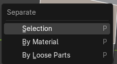 

在编辑模式下按下 `P`键后，你会看到几个选项，它们的区别如下：

- **选中项**: 这是最常用的选项。它**仅将你当前选中的几何体部分**分离为一个新的独立物体。
- **按材质**: 如果你的物体分配了多种材质，这个选项会**自动根据材质的不同**将物体分离。每个使用不同材质的部分都会成为一个新物体。
- **按松散块**: 这个选项会**将模型中所有互不相连的部分**自动分离。例如，如果一个模型是由多个独立的方块组成的，使用此选项可以一键将它们全部分离成单个物体。这在处理从网上下载的已合并的模型时特别有用。

### 💡 操作流程与技巧 

1. **基本分离流程**: 进入**编辑模式** → 选择你想要分离的点、线、面 → 按下 `P`键 → 选择合适的分离选项（通常用“选中项”）→ 完成后回到**物体模式**，即可看到原物体旁边出现了新分离出来的物体。
2. **快速分离“孤岛”**: 将鼠标悬停在一个独立的局部（松散块）上，按 `L`键即可选中整个相连的部分，然后直接按 `P`再选“选中项”或“按松散块”进行分离。这是分离模型中独立部分的最高效方法。
3. **注意修改器**: 如果原物体应用了修改器（如镜像、阵列），分离后的新物体也会带有相同的修改器，你可能需要单独调整。

### 总结 

简单来说，记住这个关键区别：

- 在**编辑模式**下，`P`键的主要作用是 **“分家”**，把一个物体拆成多个。
- 在**物体模式**下，`P`键的主要作用是 **“认亲”**，建立物体间的父子级关系。

# Shift+Z

在 Blender 中，Shift + Z 有两个**完全不同**的作用，具体取决于你当前正在做什么操作：

### 1. 如果你在“看”模型（静止状态）

**作用：切换“线框模式+透视”(Toggle Wireframe)**

- **功能**：它是一个快捷开关，用于在**当前显示模式**（通常是实体模式 Solid）和 **线框模式 (Wireframe)** 之间来回切换。
- **场景**：当你需要看透模型内部结构，或者选中模型背面的点时使用。
- **对比**：

- Z：呼出渲染模式轮盘（Pie Menu）。
- Alt + Z：透视模式/X光模式 (X-Ray) —— *这个是让物体变半透明，而* *Shift + Z* *是直接变成只有线的框。*

------

### 2. 如果你在“动”模型（变换状态）

**作用：锁定 Z 轴（即：在 XY 平面上移动/缩放）**

这是建模中最常用的功能之一！
当你按下 G (移动)、S (缩放) 后，紧接着按下 Shift + Z：

- **含义**：**“排除 Z 轴”**（Exclude Z-axis）。
- **效果**：

- **移动时 (****G** **->** **Shift + Z****)**：物体会像吸在地板上一样，只能在 **XY 平面**（前后左右）移动，绝对不会上下飞（Z轴高度不变）。
- **缩放时 (****S** **->** **Shift + Z****)**：物体只会变胖或变瘦（XY轴变大），高度（Z轴）保持不变。

- **同理**：

- Shift + X = 在 YZ 平面操作（锁定 X 轴）。
- Shift + Y = 在 XZ 平面操作（锁定 Y 轴）。

### 总结

- **没事的时候按** = **透视眼**（看线框）。
- **移动物体时按** = **地板摩擦**（不让物体飞起来）。

# 清理


# Annotations


## 这个是干嘛的？

图片中标红的区域是 **Annotations（标注/注记）** 的属性设置面板。

简单来说，这是 Blender 用来在 3D 视口中**手写笔记、画草图或做标记**的工具（以前的版本称为 Grease Pencil 的老式用法，现在专门用于辅助标注）。

以下是该区域具体功能的详细解读：

### 1. 核心功能 

这个面板用来管理你在屏幕上画出的“标注线”。它**不是**用来创建 3D 模型的，而是用来在模型表面或屏幕上写字、画圈、做辅助线的（类似在屏幕上贴便利贴）。

### 2. 面板内各项含义

- **列表区域（显示“注记”的那一行）：**

- 这是标注的**图层列表**。你可以像 PS 一样创建多个图层。
- **眼睛图标**：控制该层标注的显示或隐藏。
- **颜色块**：点击可以修改画笔的颜色（默认是蓝色）。

- **Opacity (不透明度)：** 控制标注线条的透明度。`1.000` 表示完全不透明。
- **Thickness (粗细)：** 控制画笔线条的粗细，当前设置是 `3 px`。
- **Lock Frame (锁定帧)：** 如果你在做动画，勾选这个可以让标注只在当前这一帧显示，或者锁定在特定位置。
- **侧边按钮 (+ / -)：** 添加或删除标注图层。

### 3. 常见使用场景

- **反馈与修改：** 总监或导师在模型上圈出需要修改的地方。
- **布线规划：** 在建模前，先用笔画出拓扑结构作为参考。
- **动画草图：** 快速画出动作的关键帧姿势。

------

### 💡 如何使用它？

你不需要专门去点这个面板来画，通常使用快捷键：

1. **画图：** 按住 `**D**` **键 + 鼠标左键** 拖动，即可在视图中画线。
2. **擦除：** 按住 `**D**` **键 + 鼠标右键** 拖动，可以擦除画好的线。

# Show Overlays-显示叠加层

 


**显示叠加层（Show Overlays）**在这里起到了决定性的作用。

看来你已经发现了Blender视口显示的一个关键逻辑。让我根据你发的这两张图，简单解释一下为什么会这样：

### 1. 为什么“叠加层”对Viewer节点很重要？

在 Blender 的 Geometry Nodes（几何节点）中，当你点击 **Viewer（查看器）** 节点或者使用属性预览时，Blender 并不是真的把材质改成了黑白色，而是把数据**作为一种“辅助视觉信息”覆盖（Overlay）在了模型表面**。

- **图1（叠加层开启）：**

- 右上角的 **“显示叠加层”** 按钮（那个两个圆圈重叠的图标）应该是开启状态。
- Blender 允许几何节点的 Viewer 数据（那个黑白渐变的权重或属性图）显示在模型上。
- 你可以看到模型表面的数据分布（白色表示数值接近1，黑色表示接近0）。

- **图2（叠加层可能被关闭，或相关选项被取消）：**

- 看起来你可能关掉了全局的“显示叠加层”，或者在下拉菜单中取消了属性相关的显示。
- 当叠加层关闭时，Blender 会隐藏所有“非渲染”的辅助元素（包括网格线、选中的高亮轮廓、还有**Viewer节点的属性预览**）。
- 所以模型变回了它原本的视口颜色（那个青绿色的实体显示），你看不到数据的变化了。

### 总结

你现在的理解是完全正确的：**Geometry Nodes 的数据预览（Viewer）属于视口叠加层的一部分。**

如果你想看数据的分布情况（比如做材质遮罩、分布草地时的密度），**必须**保持叠加层开启。如果你想看模型最终渲染大概长什么样（不受数据颜色干扰），就可以像图2那样把它关掉。

**下一步建议：**

既然你正在研究 Viewer 和叠加显示，需不需要我告诉你如何**在叠加层里只看数据，但隐藏掉那些烦人的黑色线框（Wireframe）**，让观察更清晰？

#  Shift+E

在 Blender 中，`Shift + E` 根据你当前所处的模式（建模或动画）主要有两个非常核心的功能：

## 1. **在编辑模式（Edit Mode）下：设置边折痕（Edge Crease）**

这是最常用的功能，主要用于**硬表面建模**（Hard Surface Modeling）。

- **作用：** 当你为模型添加了 **表面细分修改器（Subdivision Surface Modifier）** 时，使用 `Shift + E` 可以让选中的边变得“锐利”，不被平滑处理。
- **操作方法：** 选中边，按下 `Shift + E`，然后**拖动鼠标**（或者输入 `1` 并回车），你会发现边变成了**紫红色**。
  - **值 = 1.0 (粉色/紫色)：** 边是完全锐利的。
  - **值 = 0.0 (黑色/默认)：** 边是完全平滑的。
- **应用场景：** 制作汽车边缘、手机外壳倒角等需要棱角分明的物体时，用来控制细分的权重。

## 2. **在动画编辑器（Graph Editor/Timeline）下：设置外插模式（Extrapolation Mode）**

这是做动画循环时必用的快捷键。

- **作用：** 决定动画曲线在首尾关键帧**之外**的行为（比如是否循环播放）。
- **操作方法：** 在曲线编辑器中选中关键帧，按下 `Shift + E`，会弹出一个菜单，常用选项包括：
  - **Make Cyclic (F-Modifier)：** 让动画无限循环（比如走路、风扇转动）。
  - **Linear (线性)：** 让动画按当前速度一直延伸下去（比如匀速移动的物体）。
  - **Constant (常值)：** 保持最后一帧的状态不动。

### 总结

- **建模时** = **变硬**（控制倒角锐度）。
- **动画时** = **循环**（控制动画延伸方式）。

##  上边这个红框位置，是什么意思？


这正是你刚才问的 **`Shift + E`** 操作的**实时反馈**。

上面那个红框里的 **`Crease: +0.052`** 代表的是：**折痕权重（锐利度）的数值**。

具体解释一下这两个框的关系：

1. **下边的红框（虚线箭头）：**

   这表示你正在**拖动鼠标**。当你按下 `Shift + E` 后，Blender 进入了“调节模式”，你鼠标往外拉，这根虚线变长，上面的数值就增加；往里推，数值就减小。

2. **上边的红框（Crease: +0.052）：**

   这是你当前拖出来的**强度值**。

   - **0.0 (默认)：** 边是完全软的，加了细分（Subdivision）后会变成圆弧。
   - **1.0 (最大)：** 边是完全硬的，加了细分后依然保持死角（棱角分明）。
   - **0.052：** 表示你现在只加了一点点硬度，几乎看不出来。

**你要做的：**

通常在做易拉罐这种硬表面时，我们会把鼠标一直往外拉，**直到这个数值变成 +1.000**，此时选中的边会变成**亮粉红色**。然后**点击左键**确认，这样这条边就被“锁死”变硬了。

## 这个 折痕权重，就是软硬的混合/过渡 程度吗？

**完全正确，你的理解非常到位！**

简单来说，**折痕权重 (Crease Weight)** 就是一个控制**“抵抗平滑”**力度的滑块。

你可以把它想象成在**“完全圆滑 (0)”** 和 **“完全尖锐 (1)”** 之间拉锯：

### 1. 权重的具体含义

在添加了**表面细分 (Subdivision Surface)** 修改器之后：

- **权重 = 0.0 (默认/黑色)：**

  **完全妥协。** 边会完全听从算法的安排，变得圆润、平滑。就像面团一样软。

- **权重 = 1.0 (最大/亮紫色)：**

  **完全抵抗。** 边会像钢铁一样硬，强制保持原来的形状，算法无法对它进行平滑处理。这会产生无限锐利的棱角。

- **权重 = 0.1 ~ 0.9 (中间值)：**

  **这就是你说的“过渡/混合”。** 它会产生一种**“倒角”**的效果。它既不是死角的尖锐，也不是完全的圆弧，而是一个**“收紧的圆角”**。

  - *比如权重 0.8：* 看起来像是一个倒角很小的硬朗金属边缘（有点圆，但很硬）。
  - *比如权重 0.2：* 看起来像是一个很软的枕头边缘。

### 2. 为什么你的截图里只有 0.052？

这说明你刚刚只是轻轻拉了一下。

**在做易拉罐这个教程时，通常只有两种情况：**

1. **要么拉满 (1.0)：** 比如做易拉罐顶部的那个盖子边缘，需要绝对的工业锐利感，所以直接拉到变**紫色**。
2. **要么不拉 (0.0)：** 比如易拉罐的侧面圆柱体，需要它完美的圆滑。

**操作建议：**

如果你想要那种硬朗的机械边缘，再次按下 `Shift + E`，然后**输入 `1` 并回车**，或者把鼠标狠狠地往外拉，直到线条变成**亮粉色**。

#  Alt+S是什么作用？

在 Blender 中，**`Alt + S`** 的作用主要取决于你当前所处的**模式（Mode）**。它有两个最常用、但完全不同的功能：

### 1. 在编辑模式 (Edit Mode) 下：收缩/膨胀 (Shrink/Fatten)

这是 `Alt + S` **最常用**且最有价值的功能，通常用于网格（Mesh）或曲线（Curve）。

- **作用原理：** 它会让选中的顶点**沿着法线（Normals）方向**移动。
- **通俗理解：**
  - **普通缩放 (`S`)**：是基于物体的中心点变大变小（像把照片放大）。
  - **法向缩放 (`Alt + S`)**：它会让选中的顶点**沿着法线（Normals）方向**移动。
- **常见用法：**
  - **调整粗细：** 比如你做了一个弯曲的管子，想让管子壁变厚一点，用 `S` 会让管子位置跑偏，但用 `Alt + S` 就能完美地让管子均匀变粗。
  - **曲线半径：** 如果你在编辑**曲线 (Curve)**，选中控制点按 `Alt + S`，可以调整该点的半径（Radius），从而控制倒角（Bevel）的粗细。

### 2. 在物体模式 (Object Mode) 下：清空缩放 (Clear Scale)

- **作用：** 将物体的缩放比例重置为默认值 **(1, 1, 1)**。
- **场景：** 如果你在物体模式下随意缩放了物体（比如 X轴变成了 0.5，Y轴变成了 2.0），按下 `Alt + S` 会让它瞬间恢复到最原始的大小和比例。
  - *(记忆技巧：Blender 中大部分 `Alt + 变换键` 都是“清除/重置”的意思。`Alt+G`=重置位置，`Alt+R`=重置旋转，`Alt+S`=重置缩放)*

------

### 总结

- 如果你在**建模调整形状**（特别是管状物、衣服厚度），`Alt + S` 是 **“沿法向变胖/变瘦”**。
- 如果你在**整理物体变换信息**，`Alt + S` 是 **“恢复原始大小”**。

#  Alt+E-选择挤出方式菜单


在 Blender 的编辑模式（Edit Mode）下，选中面之后：

1. **按 `E` (默认挤出)：** 会直接沿法线方向挤出（Extrude Region），不弹菜单。
2. **按 `Alt + E` (挤出菜单)：** 就会弹出你截图里的这个菜单，让你选择挤出的**方式**。

------

### **图中选中的这个功能有什么用？**

截图里高亮的是 **"Extrude Faces Along Normals" (沿法线挤出面)**。

- **为什么要用它？**

  如果你直接按 `E` 挤出，有时候面会朝着一个统一的方向跑，或者挤出来是歪的。

  而用 **`Alt + E` -> `Along Normals`**，可以让这一圈面像**“充气”**一样，均匀地向四面八方膨胀出去。

- **典型场景：**

  这就非常适合用来给易拉罐的盖子、或者任何圆柱形的物体增加一圈**厚度**。

#  Transform Pivot Point 

 

这个菜单决定了当你对物体进行**旋转 (R)、缩放 (S)** 时，是以“哪个点”为中心进行的。

对于你要做的**产品广告视频**（特别是涉及多组件的爆炸图、或机械结构动画），**Individual Origins** 和 **3D Cursor** 是最重要的两个核心功能。

以下是按菜单顺序的详细解释，我为你标注了**【产品动画重要度】**评级：

------

## 1. Bounding Box Center (边界框中心)

- **含义**：Blender 会计算所有选中物体整体的最外围体积（那个看不见的盒子），并以这个盒子的几何中心为轴心。
- **与默认值的区别**：它不看物体的“原点 (Origin Point)”在哪里，只看模型占了多大空间。
- **【产品动画重要度】：⭐**
- **💡 场景**：
  - 当你导入某些 CAD 模型（比如 SolidWorks 转过来的）时，有时模型的原点会飞到几公里以外。这时候用这个模式，可以确保你旋转模型时，它是在模型本身的位置转，而不是绕着几公里外的原点跑大圈。

## 2. 3D Cursor (3D 游标)

- **含义**：以场景中那个红白相间的“救生圈”图标为中心进行变换。
- **【产品动画重要度】：⭐⭐⭐⭐⭐ (极重要)**
- **💡 场景（机械结构与定点旋转）**：
  - **开盖动画**：你想做一个笔记本电脑或化妆品盒“打开”的动画。你需要把 3D Cursor 吸附到“转轴/铰链”的位置，选这个模式，盖子才能完美地绕着轴打开。
  - **环绕运镜**：把 3D Cursor 放在产品中心，然后选中摄像机，按 R Z，摄像机就会完美地绕着产品进行 360 度展示拍摄。

## 3. Individual Origins (各自原点)

- **含义**：当你选中多个物体时，每个物体都绕着**自己本身的原点**进行旋转或缩放，互不干扰。
- **【产品动画重要度】：⭐⭐⭐⭐⭐ (爆炸图核心)**
- **💡 场景（特效与悬浮）**：
  - **爆炸图展示**：假设你的产品有 10 颗螺丝同时拧出来。选这个模式，按 R Z，10 颗螺丝会**原地自转**拧出。如果不选这个（用默认模式），这 10 颗螺丝会像卫星一样绕着产品公转，那是错误的。
  - **粒子动态**：比如你想做“燕麦片”或“咖啡豆”在空中悬浮并微微转动的特写。全选它们，用这个模式随机旋转，它们会在原地调整角度，不会乱跑位置。

## 4. Median Point (质心点 / 中点) —— *默认选项*

- **含义**：**所有**选中物体原点的“平均位置”。
- **【产品动画重要度】：⭐⭐⭐ (日常通用)**
- **💡 场景**：
  - 这是最直觉的操作方式。如果你把一个产品的所有零件打了一个组（或全选），你想把整个产品从左边移到右边，或者整体放大缩小，就是用这个。

## 5. Active Element (活动元素)

- **含义**：以你**最后选中**的那个物体（轮廓线是**亮黄色**，其他是橘红色）的原点为中心。
- **【产品动画重要度】：⭐⭐⭐⭐ (对齐神器)**
- **💡 场景（精确对齐与父子级模拟）**：
  - **对齐操作**：假设你想让一个“Logo贴图”完美贴合到瓶子上。你可以先选 Logo，再加选瓶子（瓶子变亮黄），选这个模式进行缩放或旋转，Logo 就会以瓶子为基准进行变换。
  - **临时父子级**：不用建立复杂的父子关系，只想暂时让 A 跟着 B 转一下，用这个模式非常快。

------

## ⚡ 给你的操作建议（快捷键）

做产品视频时，你会非常频繁地在这几个模式间切换。建议你记住快捷键，而不是每次都去点菜单：

1. 按键盘上的 **`.` (句号键，大键盘区)** 或者是 **`>`**。
2. 或者按 **`PIE 菜单`**（如果你开启了 Pie Menu 插件）：通常是按 **`.` (小键盘)**。

## **总结一下你的工作流肌肉记忆：**

- 要做**零件自转/螺丝松动** -> 马上切 **Individual Origins**。
- 要**以特定轴旋转/盖子开合** -> 马上切 **3D Cursor**。
- 其他时候保持 **Median Point**。

#  F3-“全局指令搜索”（Operator Search）

 

**F3 是 Blender 的“全局指令搜索”（Operator Search）**，它相当于 Blender 里的“百度”或者电脑系统的“万能搜索框”。

## 它的真实作用：

**只要是 Blender 里有的功能，你都能通过 F3 搜出来并直接执行。** 它不光能搜修改器，还能搜工具、菜单命令、设置等等。

### 为什么它对新手特别重要？

当你记不住某个功能在哪个菜单里（比如“Recalculate Normals 重算重法向”藏得很深），或者记不住快捷键时，**按 F3，输入英文关键词，回车**，就能直接搞定。

**举几个例子，你可以试试按 F3 搜这些：**

- 搜 **`Render`** -> 可以直接找到“渲染图像”。
- 搜 **`Cube`** -> 可以直接创建一个立方体。
- 搜 **`Shade Smooth`** -> 可以直接给物体平滑着色。
- 搜 **`History`** -> 可以查看你之前的操作历史。

### ⚠️ 一个容易混淆的点：

- **在 3D 视图（Object Mode）按 F3：** 是搜**软件指令**（比如 Copy Modifiers）。
- **在节点编辑器（Geometry Nodes）按 Shift + A -> Search：** 是专门搜**节点**的（比如 Random Value）。

虽然它们都叫搜索，但 F3 管得更宽，是管整个软件操作的。所以你刚才用它来找“复制修改器”这个指令，是非常标准的“老手”用法！

#  Ctrl+L-关联/传递

 

这个菜单叫做 **“关联/传递数据” (Link/Transfer Data)**，它的核心逻辑非常简单：

**“把【黄色亮边】的那个物体（老大）身上的某些属性，给到所有【橙色边】的物体（小弟）。”**

这里面的选项虽然多，但你只需要通过几个**核心关键词**就能看懂它们。对于现在的你来说，**真正常用的只有其中 3 个**（我打了⭐号的）。

------

### 1. 最常用（必记）⭐

- **Link Materials (关联材质) ⭐**
  - **意思：** 让大家都穿“一样的衣服”。
  - **场景：** 你调好了一个易拉罐的金属材质，想给其他 100 个易拉罐全贴上一样的材质，就点这个。
- **Copy Modifiers (复制修改器) ⭐**
  - **意思：** 让大家都背“一样的书包”（拥有同样的功能）。
  - **场景：** **就是你刚才用的。** 你给老大加了“几何节点水珠”，点这个，小弟们也就都有了几何节点水珠。
- **Link Object Data (关联物体数据) ⭐**
  - **意思：** 让大家的“肉体”变得一模一样。
  - **注意：** 这比“复制”更彻底。它会让所有物体**共享**同一个网格数据。
  - **后果：** 如果你点了这个，以后你进入编辑模式修改其中一个罐子的形状（比如把盖子拉高），**所有关联的罐子都会同时变形**。这在做大量相同组件时非常省内存。

------

### 2. 进阶功能（有个印象就行）

- **Link Animation Data (关联动画数据)**
  - **意思：** 让大家都做“一样的动作”。
  - **场景：** 老大会跳舞，点这个，小弟们就会同步跳一模一样的舞。
- **Copy UV Maps (复制 UV 贴图)**
  - **意思：** 复制皮肤的“展开方式”。
  - **场景：** 如果你有两个模型形状完全一样，但其中一个没展 UV（贴图是乱的），可以从好的那个上面复制 UV 过来。
- **Link Collections (关联集合)**
  - **意思：** 把小弟们拉到和老大同一个“群组”（Collection）里去。

------

### 3. 生僻功能（新手基本不用）

- **Link Fonts to Text:** 专门用于文字物体的，统一字体设置。
- **Transfer Mesh Data:** 这是一个高级功能（数据传递），通常用于把高模的法线细节传递给低模，或者传递顶点组权重，做衣服绑定时常用。
- **Link Receivers/Blockers:** 物理模拟（力场、流体）相关的设置。

### 总结

对于你现在的练习，你只需要记住快捷键 **`Ctrl + L`**，然后只要会用这两个就够了：

1. **关联材质 (Link Materials)**：统一颜色。
2. **复制修改器 (Copy Modifiers)**：统一水珠/倒角等效果。

##  通过 ctrl+L--->复制修改器  后，每个物体上都是同一个几何节点，是每个物体都单独计算一次，还是多个物体只计算一次？

这是一个非常核心的各种“程序化”软件（如 Blender, Houdini, Unreal）的底层逻辑问题。

答案是：**每个物体都会单独计算一次。**

虽然它们共用了同一个“节点组（Node Group）”，但计算过程是独立的。

### 1. 为什么是单独计算？

这就好比**“菜谱”和“炒菜”**的关系：

- **几何节点组（Node Group）** 是那张**“菜谱”**（逻辑说明书）。
- **修改器（Modifier）** 是具体的**“厨师”**。

当你把修改器复制给 5 个罐子时，相当于请了 5 个厨师，每个人手里都拿到了**同一张菜谱**。

但是，**每个厨师手里拿的“食材”（Group Input，也就是罐子本身的网格）是不一样的**——至少它们的位置（Location）和旋转（Rotation）是不一样的。

所以，Blender 必须针对每个罐子，从头到尾把节点流程跑一遍。

### 2. 这意味着什么？（两个重要后果）

#### A. 性能消耗（Performance）

因为是单独计算，如果你有 100 个罐子，电脑就要把这套“撒点、变水珠”的流程运算 100 次。

- **现状：** 对于简单的撒点，这完全没问题，现在的电脑都能轻松扛住。
- **注意：** 如果你的节点逻辑超级复杂（比如那种几百万面的流体模拟），复制给太多物体会让电脑变卡。

#### B. 随机性陷阱（这也是你马上会遇到的问题）

既然是单独计算，**为什么复制完之后，所有罐子上的水珠长得一模一样？**

因为：虽然它们是分开算的，但**“菜谱”里的参数是一样的**。

- 厨师 A（罐子1）看到菜谱上写着：“在第 3 厘米处放个水珠”。
- 厨师 B（罐子2）看到菜谱上也写着：“在第 3 厘米处放个水珠”。
- 结果：大家都把水珠放在了同一个相对位置。

### 🚀 既然是分开算的，如何让它们不一样？

因为计算是独立的，我们就可以利用**“每个物体独有的身份 ID”**来制造差异。

你需要去修改你的节点组：

1. 找到 **Random Value（随机值）** 节点（也就是控制撒点分布的那个 Seed）。
2. 添加一个 **Object Info（物体信息）** 节点。
3. 把 `Object Info` 的 **Random（随机）** 输出连到 `Random Value` 的 **ID** 或 **Seed** 上。

**只要做了这一步，Blender 在单独计算每个罐子时，就会读取该罐子独有的“随机指纹”，从而算出完全不同的水珠分布！**

#  K-Insert Keyframe Menu


这个菜单非常详尽，它涵盖了 Blender 动画系统中几乎所有可能的数据记录方式。为了让你好理解，我把它们分成 **5 个逻辑组** 来逐一解释。

------

### 第一组：智能更新（最上面那个）

- **Available (可用项/仅当前已有的通道)**
  - **含义：** “只更新已经打过关键帧的属性”。
  - **场景：** 比如你已经给“位置”打过帧了，现在想修改位置。你选这个，Blender 就会更新位置的帧，而**绝对不会**不小心给“旋转”或“缩放”打上多余的帧。这是为了保持时间轴干净。

------

### 第二组：基础单项（Basic）

*这三个是最纯粹的基础属性。*

- **Location (位置)**：只记录物体在 X/Y/Z 轴的坐标。
- **Rotation (旋转)**：只记录物体的角度。
- **Scale (缩放)**：只记录物体的大小。

------

### 第三组：组合套餐（Combinations）

*为了省事，把上面的基础项组合起来。这是平时用得最多的。*

- **Location & Rotation**: 同时记录位置和旋转。*(做角色动画、汽车行驶最常用)*
- **Location, Rotation & Scale**: “全家桶”。全部记录。*(最保险，建议新手默认用这个)*
- **Location, Rotation, Scale & Custom Properties**:
  - **& Custom Properties (自定义属性)**：有些高级模型（Rig）上会有一些特殊的开关（比如“显示/隐藏武器”、“切换 IK/FK”）。选这个选项，不仅记录基础变换，还会顺便把这些特殊开关的状态也记录下来。
- **Location & Scale**: 只记位置和大小（不记旋转）。
- **Rotation & Scale**: 只记旋转和大小（不记位置）。

------

### 第四组：Delta 增量变换（Delta Transforms）

*这是一个高级概念。Delta 意思是“在原数值基础上的**额外偏移量**”。*

- **Delta Location / Rotation / Scale**:
  - **原理：** 假设你已经做了一个人原地走路的动画（用了 Location）。现在你想让他一边走一边往前移动。如果你直接改 Location，原来的走路动画就乱了。
  - **用法：** 你可以用 Delta Location 来控制“整体位移”，而不破坏原本的“局部位移”。它相当于**第二层**变换数据。

------

### 第五组：Visual 视觉变换（Visual Transforms）

*这是最难理解但非常关键的一组。它的核心叫**“所见即所得”**。*

- **Visual Location / Rotation / Scale (以及各种组合)**
  - **原理：** 当你的物体被**约束 (Constraint)** 控制时（比如一个球被约束在一条曲线上运动），这个球的**实际坐标 (Location)** 其实一直没变（可能是 0,0,0），是约束强行把它“拽”到了别的地方。
  - **如果不选 Visual：** 你打帧记下来的是 (0,0,0)，一旦你删掉约束，球就会瞬间弹回原点。
  - **如果选 Visual：** Blender 会忽略约束的数据，直接记录球**在屏幕上看起来**的真实位置。
  - **场景：** 当你需要**“烘焙动画”**，或者想把一个被约束控制的物体变成普通的关键帧动画时，必须用这一组。

------

### 💡 总结：你应该选哪个？

虽然选项有 20 多个，但实际工作中遵循 **2/8 原则**：

1. **90% 的情况：** 选 **`Location, Rotation & Scale`**（或者直接用组合键 `I`）。
2. **修整动画时：** 选 **`Available`**（防止乱打帧）。
3. **做跟随动画/烘焙时：** 选 **`Visual Location...`** 类。

其他的选项（Delta 等）通常是在遇到特定技术难题时才会用到，现在不需要纠结。

#  3D区域，N面板单轴右键关键帧

 

这张截图展示的是 Blender 中属性输入框（N 面板或属性面板）的**右键上下文菜单**。

对于你（正在学习做产品动画的 Freelancer）来说，这个菜单就是你寻找的**“精准控制”**的核心。还记得你刚才抱怨 `I` 键太贪心把 XYZ 全打了吗？解决办法全都在这里。

为了让你快速掌握，我把这些选项分为**“四大类”**来详细解释：

------

### 第一类：关键帧操作 (动画核心)

这是你最需要死记硬背的部分，直接决定了你怎么打关键帧。

- **Replace Keyframes (替换关键帧) `I`**
  - **含义：** 更新当前帧的关键帧数值。
  - *注意：* 如果当前没有关键帧，这里会显示为 **Insert Keyframes (插入关键帧)**。
  - **作用对象：** 会同时更新 X、Y、Z 三个轴（因为它是“All”）。
- **Replace Single Keyframe (替换单项关键帧)**
  - **含义：** **这就是你要找的神器！**
  - **作用：** 只更新/插入你鼠标悬停的那**一个轴**（比如只更新 X 轴），完全不碰 Y 和 Z。
- **Delete Keyframes (删除关键帧) `Alt + I`**
  - **含义：** 删除**当前时间指针所在这一帧**的关键帧。
  - **作用：** 相当于“拔掉这颗钉子”，但保留其他时间的动作。
- **Delete Single Keyframe (删除单项关键帧)**
  - **含义：** 只删除当前这一帧、这一个轴的钉子。
- **Clear Keyframes (清除关键帧) `Shift + Alt + I`**
  - **危险警告：** 这个命令比较狠。
  - **含义：** 它会把这个属性上的**所有关键帧全部删光**。
  - **结果：** 整个动画都被清空了，物体不动了。
- **Clear Single Keyframes (清除单项关键帧)**
  - **含义：** 只清空这一个轴的所有动画，保留其他轴的动画。

------

### 第二类：导航与查看 (效率工具)

- **View All in Graph Editor (在曲线编辑器中显示全部)**
  - **含义：** 点击后，Graph Editor 会自动聚焦显示该物体的所有曲线（XYZ）。
- **View Single in Graph Editor (在曲线编辑器中显示单项)**
  - **好用指数：⭐⭐⭐⭐⭐**
  - **场景：** 当你的曲线编辑器里乱成一锅粥时，在 X 轴上右键点这个，Graph Editor 里就**只会显示 X 轴这一条线**，非常清爽。

------

### 第三类：数值管理 (归位与复制)

- **Reset All to Default Values (全部重置为默认值) `Backspace`**
  - **含义：** 一键归零。
  - **效果：** 位置/旋转变为 0，缩放变为 1。
- **Reset Single to Default Value (单项重置为默认值)**
  - **含义：** 只把 X 轴归零。
- **Copy All to Selected (全部复制给选中项)**
  - **好用指数：⭐⭐⭐⭐**
  - **场景：** 你选中了 10 个罐子，想让它们的 Y 轴位置都变成 5米。
  - **操作：** 选中 10 个罐子（最后选那个已经是 5米 的），右键 Y 轴选这个，所有罐子瞬间对齐。
- **Copy Single to Selected (单项复制给选中项)**
  - **含义：** 只复制这一个轴的数值给其他物体。

------

### 第四类：高级数据操作 (进阶/程序化)

这部分做简单广告动画暂时用得少，主要用于绑定和写脚本。

- **Add All/Single to Keying Set (添加...到插帧集)**
  - **含义：** 把这个属性加入“VIP 名单”。以后你在时间轴按 `I` 时，Blender 只会给名单里的属性打帧，忽略其他的。
- **Remove from Keying Set (从插帧集移除) `Alt + K`**
  - **含义：** 把它踢出 VIP 名单。
- **Copy Data Path (复制数据路径)**
  - **含义：** 复制一串代码（如 `location[0]`）。写 Python 脚本时用的。
- **Copy as New Driver (复制为新驱动器)**
  - **含义：** 用于建立“父子连带”关系。比如你想让“灯光亮度”自动跟随“罐子的高度”变化，就用这个功能把罐子高度拷出来，去粘贴到灯光强度上。

------

### 💡 总结：你需要重点记忆哪几个？

对于你现在的阶段，请把这 3 个刻在脑子里：

1. **Replace/Insert Single Keyframe：** 解决你“只想打 X 轴”的痛点。
2. **Clear Single Keyframes：** 发现 Z 轴动画做废了？用这个一键重置 Z 轴，不用一个个删帧。
3. **Reset Single to Default Value：** 也就是快捷键 `Backspace`（鼠标要悬停在数值上按），快速归零神技。

#  I-Insert keyframes

## 3D编辑区按I(大写i)键：

 

## Time区按I(大写i)键：


你说得非常对！这是 Blender 最核心的一个操作逻辑：**“鼠标在哪，命令就在哪生效” (Context Sensitive)**。

虽然都是按 `I` 键，但在不同的区域（窗口），Blender 会认为你想做的事情是完全不同的。

结合你的截图，我来解释一下这两个区域的区别：

## 1. 鼠标在 3D 视图区 (3D Viewport)

*(你看着模型的时候)*

- **你的意图：** “我要记录这个**物体**现在的状态。”
- **Blender 的反应：** 它会去读取这个物体的坐标、旋转、缩放，然后在当前帧打上关键帧。
- **出现的菜单：** 是那个长长的菜单（位置、旋转、缩放...），因为它不知道你具体想记哪个属性。
- *(注：如前所述，在 5.0 里可能变成直接智能插入)*

------

## 2. 鼠标在 动画摄影表/时间轴区 (Dope Sheet / Timeline)

*(就是你最后一张截图 `image_cdd751.png` 的情况)*

- **你的意图：** “我要处理这些**已有的数据通道**。”
- **Blender 的反应：** 它不再看 3D 物体了，它看的是你列表里选中的那些条目（比如 `X Location`）。
- **出现的菜单（如你图所示）：**
  - **All Channels (所有通道):** 把列表里列出的所有属性，在当前时间点再打一个点。*(常用于“保持动作”，比如让角色在第 10 帧和第 20 帧保持同一个姿势不动)*
  - **Only Selected Channels (仅选中通道):** 只给那些**名字被高亮选中**（橙色背景）的属性打帧。
  - **In Active Group (在活动组中):** 只给当前归类的组打帧。

------

## 💡 总结建议

- **平时做动画（摆 Pose）：**

  请把鼠标放在 **3D 视图** 里按 `I`。这是最直观的，“我摆好了，记下来”。

- **什么时候去时间轴按 `I`？**

  通常是为了**“复制/冻结”**动作。

  - *比如：* 你想让易拉罐在第 0 帧是静止的，一直静止到第 50 帧才开始动。
  - *操作：* 你可以在第 0 帧打好帧，然后把时间滑块拖到第 50 帧，鼠标放在时间轴上按 `I` -> `All Channels`。这样第 50 帧的数据就和第 0 帧一模一样了，中间就不会乱动。

#  Composition Guides-构图辅助线


#  Passepartout-遮光框

调整镜头区域外的可见性


#  序列编辑器需要一个单独的场景？


这是一个非常敏锐的好问题。

简单直接的回答是：**技术上不需要**（你在同一个场景里也能剪辑），但在**实际工作流中，强烈建议新建一个场景**。

你刚刚误打误撞新建了一个场景，这其实是**最专业、最不容易“翻车”的做法**。

我来解释为什么（这关系到你按 F12 渲染时 Blender 到底听谁的）：

### 1. 为什么“同一个场景”容易打架？

Blender 的渲染逻辑有一个**优先级**：

- **第一顺位：** 视频序列编辑器 (Video Sequencer)
- **第二顺位：** 3D 摄像机 (3D Camera)

如果你在同一个场景里，既摆了 3D 罐子，又在序列编辑器里放了视频片段：

- 当你按 **F12** 想渲染 3D 罐子时，Blender 会发现：“哎？序列编辑器里有东西！”
- 于是它会**无视**你的 3D 场景，直接去渲染剪辑片段。
- **结果：** 你会看到黑屏，或者报错，反正就是看不见你的罐子。

### 2. 新建场景的好处 (你现在的状态)

你把工作分成了两个“房间”：

- **房间 A (原来的场景)：** 专门负责**生产素材**。这里有灯光、模型、动画。你在这里把 3D 动画渲染成视频文件。
- **房间 B (你刚建的新场景)：** 专门负责**后期组装**。这里是空的，没有 3D 模型负担，运行飞快。你把渲染好的视频拖进来，加音乐、加字幕、调色。

### 3. 给你的建议

既然你已经建了这个新场景，**保留它，别删！** 这正是标准的广告制作流程。

**接下来的正确操作步骤：**

1. **回原来的场景 (Scene)：**
   - 确认你的 MP4 导出设置（刚才教你的那个）都对。
   - 按 **`Ctrl + F12`** 开始渲染你的 3D 动画。
   - 等它渲染完，你会得到一个 `.mp4` 文件。
2. **去新的场景 (Scene.001)：**
   - 在这个序列编辑器里，按 **`Shift + A`** -> **Movie (影片)**。
   - 找到你刚才渲染出来的那个 MP4 文件，把它放进来。
   - 如果有背景音乐，也在这里按 **`Shift + A`** -> **Sound (声音)** 加进来。
   - 最后在这里导出最终带声音的成品。

**总结：**

不新建也能用，但容易逻辑混乱。**你现在的做法（分开两个场景）是完全正确的专业流程。** 先回老场景去把视频渲染出来吧！

#  如何让物体，绕自身的某个轴旋转，这种绕自身某个轴的旋转，可以打关键帧吗？

**可以，完全可以打关键帧。**

但是，这里有一个新手（甚至老手）经常遇到的**大坑**：当你让物体已经处于“歪斜”的状态下，再想让它**干净地**绕自身轴旋转，简单的打关键帧往往会出错（产生“乱晃”或者万向节死锁 Gimbal Lock）。

针对你的易拉罐产品动画，这里有三种方案，**强烈推荐方案二**。

------

### 方案一：基础操作（R + 轴 + 轴）

这是最直接的方法，适合物体没有复杂倾斜的情况。

1. **操作方法**：
   - 选中物体。
   - 按 **`R`** (旋转)。
   - 按 **`Z`** (此时是全球 Z 轴)。
   - **再按一次 `Z`** (此时切换为**局部 Local Z 轴**)。你会看到一条穿过易拉罐中心的蓝线。
   - 移动鼠标旋转，点击确认。
2. **打关键帧**：
   - 按 `I` -> `Rotation`。
3. **缺点**：如果你的易拉罐已经是歪的（比如倾斜 45 度），Blender 会试图通过同时调整 X、Y、Z 三个轴的数值来模拟这个旋转。在两个关键帧中间的过渡过程，物体可能会**像醉汉一样乱晃**，而不是沿着轴心自转。

------

### 方案二：父子级绑定法（最推荐，行业标准）

这是做产品动画（尤其是 Nino Defo 这种教程流派）最常用的方法。它把“位置/倾斜”和“自转”拆开给两个不同的东西控制，逻辑最清晰。

**步骤：**

1. **新建一个空物体 (Empty)**：`Shift + A` -> `Empty` -> `Plain Axes` (十字坐标)。
2. **对齐位置**：选中易拉罐，`Shift + S` -> `Cursor to Selected`，然后选中空物体 `Shift + S` -> `Selection to Cursor`（让空物体跑到易拉罐中心）。
3. **建立父子关系**：
   - 先选**易拉罐**（子）。
   - 再加选**空物体**（父）。
   - 按 **`Ctrl + P`** -> 选择 **Object (Keep Transform)**。
4. **分工操作**：
   - **控制姿态**：你旋转**空物体**，把易拉罐调整成歪斜的角度（比如你视频里的漂浮角度）。
   - **控制自转**：你选中**易拉罐本身**。因为它是直直地挂在空物体下的，你只需要在**易拉罐的 Z 轴**上打关键帧（从 0 度变到 360 度）。
   - **结果**：无论空物体怎么乱飞、怎么歪，易拉罐永远只会在自己的 Z 轴上干净地自转，绝对不会乱晃。

------

### 方案三：Delta 变换（快速修正法）

如果你不想加空物体，也不想破坏现在的关键帧，可以用这个“隐藏参数”。

1. 按 **`N`** 打开右侧侧边栏，找到 **Item** 标签。
2. 找到 **Delta Transform (增量变换)** 栏（通常是折叠的，需要展开）。
3. 在这里的 **Rotation Z** 上调整数值并打关键帧（鼠标移上去按 `I`）。
4. **原理**：Delta 变换是在原有变换的基础上**额外**叠加一层旋转。它通常是基于物体自身的局部坐标计算的，比较干净。

### 总结

- 如果你只是想简单转一下：用 **R + Z + Z**。
- 如果你要做高质量的产品特写动画：**请务必使用方案二（父级 Empty 控制大方向，子级易拉罐控制自转）**，这样你的曲线图也会非常干净，只有一条线在动。

#   所有的缩放，旋转，移动，两次按x,y,z键，都是全局和局部的切换吗？

这是一个非常精准的总结！

**是的，对于 90% 的情况，你的理解完全正确：**

- **按 1 次 (`X` / `Y` / `Z`)**：锁定 **全局坐标 (Global)**。
  - 不管你的物体怎么歪，它都只沿着世界绝对的“东西南北”走。
- **按 2 次 (`XX` / `YY` / `ZZ`)**：锁定 **局部坐标 (Local)**。
  - 沿着物体**自身**的头顶、脸朝向移动。如果物体歪了，轴线也会跟着歪。
- **按 3 次**：取消所有锁定，自由移动。

------

### ⚠️ 但有一个“专家级”的小细节（防止你以后迷路）

 

虽然通常是“全局 vs 局部”，但严格来说，第二次按键其实是切换到 **“你当前选择的坐标系”**。

你看视口正上方中间，有一个下拉菜单默认写着 **Global**（全局）。

- 只要这里是 Global，那么双击就是 **Local**（Blender 默认这里是互补的）。
- **但是**，如果你以后做进阶操作，把这个菜单改成了 **Normal (法向)** 或 **View (视图)**：
  - 第一次按 `Z`：还是全局 Z。
  - 第二次按 `Z`：就会变成 **法向 Z** 或 **视图 Z**（而不是局部 Z）。

**总结：**

只要你没动顶部的那个菜单，**“按一次是世界，按两次是自身”** 就是绝对真理。这也是做易拉罐动画时最核心的口诀：

- **移动位置**时：通常按 **1 次**（在地上平移）。
- **做自转动画**时：必须按 **2 次**（绕着自己歪掉的中轴线转）。

#   物体约束


为了方便你对照，我按照面板上的**四列分类**顺序，一个不落地解释。对于你做**产品广告视频**和**几何节点（Geometry Nodes）**学习特别有用的功能，我会加粗标注。

------

### 第一列：Motion Tracking（运动跟踪）

*这一列主要用于 VFX（特效合成），即把 3D 物体合成到真实拍摄的视频中。如果你只做纯 CG 动画，这列用得很少。*

1. **Camera Solver（摄像机解算）**
   - **作用：** 让 Blender 的摄像机完全模仿真实拍摄时的摄像机运动。
   - **场景：** 比如你用手机拍了个桌子，想在桌上放个 3D 罐子，就用这个。
2. **Follow Track（跟随轨迹）**
   - **作用：** 让物体跟随视频中追踪的某个特征点运动。
   - **场景：** 比如视频里那个人手里拿着个标记物，你想把那个标记物替换成 3D 道具。
3. **Object Solver（物体解算）**
   - **作用：** 反求视频里某个物体的运动轨迹。
   - **场景：** 视频里有一辆真实的车在开，你想给这辆车加个 3D 的特效尾气，就需要解算这辆车的运动。

------

### 第二列：Transform（变换类）

*这一列控制物体的位置、旋转和缩放，是做**机械动画**和**绑定**的核心。*

1. **Copy Location（复制位置）**
   - **作用：** A 动 B 也动，位置完全同步。
   - **场景：** 两个物体叠在一起移动。
2. **Copy Rotation（复制旋转）**
   - **作用：** A 转 B 也转。
   - **场景：** 比如做飞机的副翼，左边转动，右边也要跟着转（可以设置反向）。
3. **Copy Scale（复制缩放）**
   - **作用：** A 变大 B 也变大。
   - **场景：** UI 动画中，一个按钮变大，背景光圈也跟着变大。
4. **Copy Transforms（复制变换）**
   - **作用：** “全盘照抄”，位置、旋转、缩放全部复制。
   - **场景：** 用于把高模绑定到低模代理上，或者让一个物体完全吸附到另一个物体上。
5. **Limit Distance（限制距离）**
   - **作用：** “保持距离”，像有一根绳子拴着，跑不出某个半径；或者像有斥力，靠不近。
   - **场景：** 比如做行星绕恒星，或者遛狗的绳子。
6. **Limit Location（限制位置）**
   - **作用：** 比如“只准在地面以上活动”（限制 Z 轴 > 0）。
   - **场景：** **做活塞机械结构**，限制零件只能在滑轨内移动。
7. **Limit Rotation（限制旋转）**
   - **作用：** 比如“头不能转到背后去”。
   - **场景：** 机械臂关节的活动范围限制，或者防止门被推穿过墙壁。
8. **Limit Scale（限制缩放）**
   - **作用：** 锁死大小，不准变大变小。
   - **场景：** 保持骨骼长度不变，或者防止误操作把东西拉变形了。
9. **Maintain Volume（保持体积）**
   - **作用：** “挤压拉伸”原理。如果你把一个球压扁（Z轴变短），它会自动变宽（X/Y轴变长），保持总体积不变。
   - **场景：** **卡通动画必备**，做弹力球、果冻效果。
10. **Transformation（变换转换）** —— **强力推荐（机械动画神器）**
    - **作用：** “把 A 的位置变成了 B 的旋转”。它是一个映射器。
    - **场景：** **产品广告视频非常有用**。比如：你推拉一个拉杆（位移），导致远处的盖子打开（旋转）。也就是齿轮传动原理：用位移驱动旋转。
11. **Transform Cache（变换缓存）**
    - **作用：** 读取外部缓存文件（如 Alembic）来驱动物体。
    - **场景：** 复杂的流体模拟或者其他软件做好的动画导入 Blender 时用。

------

### 第三列：Tracking（跟踪/朝向类）

*这一列决定物体“脸朝向哪边”，对摄像机动画至关重要。*

1. **Clamp To（钳制到...）**
   - **作用：** 强制物体只能在一条特定的曲线（Curve）上滑动，即使你移动它，它也只会投射到曲线上。
   - **场景：** 拉链的拉头、过山车。
2. **Damped Track（阻尼跟踪）** —— **最推荐的“注视”功能**
   - **作用：** 让物体看向目标，但旋转非常柔和，不会乱翻转。
   - **场景：** **摄像机跟拍**、眼睛注视、向日葵跟着太阳。
3. **Locked Track（锁定跟踪）**
   - **作用：** 盯着目标看，但是锁死某个轴（比如脖子不能歪）。
   - **场景：** 指南针（永远指北，但只能平转），或者坦克炮塔（盯着敌人，但不会上下点头，只左右转）。
4. **Stretch To（拉伸到...）**
   - **作用：** 不仅盯着你看，还试图把身体拉长去够你。
   - **场景：** 肌肉拉伸、橡皮筋、粘性液体的连接处。
5. **Track To（标准跟踪）**
   - **作用：** 老版的“注视”，功能和 Damped Track 类似，但算法不同（有时会产生万向节锁，即乱翻转）。
   - **场景：** 现在大部分情况建议优先用 Damped Track，除非做特定轴向的广告牌效果。

------

### 第四列：Relationship（关系互动类）

*这一列处理物体与物体、物体与环境的复杂关系。*

1. **Action（动作）**
   - **作用：** 像个遥控器。用一个物体的某个属性（如旋转角度）来播放另一个物体做好的动画片段（Action）。
   - **场景：** 复杂的机械折叠动画，比如变形金刚，把复杂的变形过程做成 Action，然后用一个简单的控制器来驱动播放进度。
2. **Armature（骨架）**
   - **作用：** 让物体像“皮肤”一样跟随骨骼运动。
   - **场景：** 通常这是绑定系统自动加的，不需要手动添加。它让模型能被骨头控制变形。
3. **Child Of（子级）** —— **动画师最爱**
   - **作用：** 动态父子关系。可以随时开启或关闭“认爹”。
   - **场景：** 角色拿起一把剑（开启父子关系，剑跟着手），挥舞两下，然后把剑扔出去（关闭父子关系，剑独立飞出）。
4. **Floor（地面）**
   - **作用：** “不准钻地”。设定一个物体或平面作为“地板”，你的物体就穿不过去了。
   - **场景：** 简单防止角色的脚或者产品掉到地面以下。
5. **Follow Path（跟随路径）** —— **产品展示必备**
   - **作用：** 让物体严格沿着一条曲线运动。
   - **场景：** **摄像机环绕产品拍摄**、汽车沿着弯曲的公路行驶。配合“Offset”参数可以做完美的运镜。
6. **Geometry Attribute（几何属性）** —— **你的专长领域！**
   - **作用：** **连接几何节点（Geometry Nodes）与普通变换**。它允许你读取几何节点里的某个属性，来驱动这个物体的位移/旋转/缩放。
   - **场景：** 你在 GN 节点里计算了一个复杂的数学运动，想让一个普通的灯光或者空物体跟随这个计算结果运动，就用这个！
7. **Pivot（枢轴点）**
   - **作用：** 强制物体绕着另一个点（而不是它自己的原点）旋转。
   - **场景：** 比如门原本是绕中心转的，你想让它绕着合页转，又不想改模型原点，可以用这个。
8. **Shrinkwrap（收缩包裹）**
   - **作用：** 让物体吸附在另一个物体表面上。
   - **场景：** 给产品贴标签（标签贴合曲面）、眼睛贴合在眼球表面滑动。

------

### 给你的“赚钱”建议：

既然你的目标是**产品广告视频**，且在学 **Blender 节点**：

1. **Follow Path**：这是你必须精通的，90% 的产品环绕展示都要用它来控制摄像机。
2. **Transformation**：做精密的机械手表、折叠手机广告时，用它来做齿轮联动非常专业。
3. **Geometry Attribute**：既然你在学 Geometry Nodes，这个约束是你打通“节点逻辑”和“场景物体（如灯光、摄像机）”的关键桥梁。

##  Follow Path-跟随路径

 

这张截图展示的是 **“跟随路径” (Follow Path)** 约束的详细控制面板。

这是做摄像机运镜、产品滑入动画时**最核心**的面板。为了让你彻底掌控它，我用**“过山车”**的比喻来给你翻译每一个选项：

### 1. 核心控制区

- **Target (目标):** `贝塞尔圆环`
  - **意思：** 这是**“轨道”**。你指定你的物体（过山车）要跑在哪条线上。
- **Offset (偏移量):** `-70.600` 【🟩 绿色背景】
  - **意思：** 这是**“油门/进度”**。
  - **绿色背景：** 说明你已经给它打过关键帧了（或者它正在被动画驱动）。
  - **注意：** 因为你下面没勾选“固定位置”，这个数值现在代表的是“帧数”或“曲线长度”，非常难直观控制（比如不知道走到哪是终点）。

### 2. 方向控制区 (最容易晕的地方)

- **Forward Axis (前向轴):** `Y`
  - **意思：** **“车头朝向”**。
  - **作用：** 你告诉 Blender，你的物体（摄像机或罐子）的哪一个轴是“车头”，应该指着前方路面。
  - *避坑：* 摄像机的“车头”通常是 **-Z** 轴。如果是罐子，通常是 **Z** 或 **Y**，得试一下看谁顺眼。
- **Up Axis (上向轴):** `Z`
  - **意思：** **“车顶朝向”**。
  - **作用：** 告诉 Blender 物体的头顶朝哪，防止它像翻滚过山车一样倒着跑。

### 3. ✅ 必开的黄金选项 (强烈推荐)

你现在的截图里，这三个最重要的选项**都没勾选**，这会让动画很难做。请务必关注它们：

- **🔲 Fixed Position (固定位置) —— 【强烈建议勾选】**

  - **不勾 (现状):** 你的 Offset 数值很难猜，不知道填多少才刚好跑完一圈。
  - **勾选后:** `Offset` 会变成 **`Offset Factor` (偏移系数)**。
  - **效果：** 逻辑变成百分比：
    - **0.00** = 起点。
    - **1.00** = 终点。
    - **0.50** = 正中间。
  - *动画做法：* 第 1 帧设为 0 打帧，第 50 帧设为 1 打帧，它就跑完了。完美可控！

- **🔲 Follow Curve (跟随曲线) —— 【做赛车/飞行时勾选】**

  - **不勾 (现状):** 物体像坐在**平移传送带**上，身子永远朝一个方向，不会转弯。
  - **勾选后:** 物体像**开车**一样，路弯它也跟着转弯。
  - *注意：* 如果你是用摄像机拍产品，有时候**不勾**反而是对的（因为你想一直盯着产品，而不是盯着路）。

- **🔲 Curve Radius (曲线半径)**

  - **意思：** 如果你的曲线有的地方粗有的地方细（通过编辑模式 Alt+S 调整），勾选这个，物体也会跟着变大变小。做广告通常**不勾**。
  
  ### 🚀 总结：给你的操作建议
  
  为了让你的动画最可控，请按这个步骤修改设置：
  
  1. **勾选 `Fixed Position` (固定位置)。**
  2. 把上面的 **Offset** 数值归零。
  3. 在第 1 帧，把 Offset 设为 **0**，鼠标悬停按 **`I`**。
  4. 在第 60 帧，把 Offset 设为 **1**，鼠标悬停按 **`I`**。
  
  这样你的物体就会精准地从头跑到尾了！

### Influence

  这个 **`Influence` (影响/权重)** 参数，你可以通俗地把它理解为这个约束功能的**“不透明度”**或者**“听话程度”**。

  它控制的是：**“跟随路径”这个规则，对物体到底有多大的控制权。**

  ##### 1. 数值的含义

  - **1.000 (100%):** **完全听话 (默认状态)。**
    - 物体完全服从路径的指挥。路径让它在哪，它就在哪。你的物体像是被**强力磁铁**吸在了路径上。
  - **0.000 (0%):** **完全不听。**
    - 相当于这个约束**不存在**。物体会瞬间弹回它原本在 3D 空间里的真实位置（就像关掉了这个功能一样）。
  - **0.500 (50%):** **半推半就。**
    - 物体会悬浮在“它原本的位置”和“路径规定的位置”**正中间**。这是一种混合状态。

  ##### 2. 广告动画中的实战用法： “磁吸效果”

  作为一个 Freelancer 做产品广告，这个参数通常用来做**“切换状态”**的动画。

  **场景举例：**

  你想做一个画面：一个罐子本来自由地浮在空中，突然受到某种引力，**“嗖”**地一下被吸附到一条轨道上开始滑行。

  **怎么做？**

  1. **第 1 帧：** 把 Influence 设为 **0**。 (罐子在自由位置) -> 打关键帧。
  2. **第 10 帧：** 把 Influence 设为 **1**。 (罐子被吸到轨道上) -> 打关键帧。
  3. **效果：** 在这 10 帧里，你会看到罐子平滑地飞向轨道，然后开始沿着轨道跑。

  ##### 💡 总结

  如果你不需要这种“吸附”或“脱轨”的动画，**保持它在 1.000 不动就行了**。它是用来调节“约束强度”的总开关。

##### Influence ，这个参数，将值设置为0，应该很不好用吧。

  你说得对，如果**一直**把它设为 0，那确实是“脱裤子放屁”——跟没加这个约束一样。

  但是，在广告动画里，把这个值**从 0 变成 1（或反过来）**，是用法最骚、最救命的操作。

  它的核心价值不在于“0”，而在于**“切换”**。

  我给你举三个广告里最真实的例子，你就知道它多好用了：

  ###### 1. “磁吸归位”效果 (0 ➔ 1)

  **场景：** 你的广告一开始，五个零件散落在桌子上（乱七八糟的位置）。你希望它们像钢铁侠穿战衣一样，瞬间“嗖”地一下吸附到组装线上，整齐排好。

  - **第 0 帧 (Influence = 0):** 零件躺在桌子上（完全自由，听你原来的坐标指挥）。
  - **第 20 帧 (Influence = 1):** 零件被强制吸到了路径上。
  - **中间过程：** Blender 会自动计算从“桌子”飞到“路径”的轨迹。
  - **价值：** 你根本不用手K那个飞行的过程，动动滑块就实现了“自动吸附”。

  ###### 2. “流水线装箱”效果 (1 ➔ 0)

  **场景：** 一个罐子沿着流水线（路径）滑行，滑到尽头时，需要自然地掉进下面的纸箱里。

  - **第 0-50 帧 (Influence = 1):** 罐子乖乖沿着路径跑（被路径绑架）。
  - **第 51 帧 (Influence = 0):** **关键时刻！** 罐子瞬间重获自由。
  - **第 51 帧之后：** 你手动给罐子打关键帧，让它做一个抛物线掉进箱子。
  - **价值：** 如果没有这个 0，罐子到了尽头还会死死粘在路径末端，掉不下去。设为 0 就是**“解除绑定，把控制权还给我”**。

  ###### 3. “AB 方案对比” (永远不用删约束)

  **场景：** 客户说：“这镜头太死板了，我想看看不跟路径走是什么样？”

  - 你不需要把辛苦调好的约束删掉（万一客户又要改回来呢？）。
  - 你直接把 Influence 拉到 0。
  - **效果：** 约束暂时失效，你可以随意手动拖动罐子演示另一种方案。
  - 客户如果不满意，你一秒钟拉回 1，一切照旧。

  ###### 💡 总结

  - **Influence = 1：** 像是**坐火车**（只能在轨道上跑）。
  - **Influence = 0：** 像是**开越野车**（哪里都能去）。
  - **动画 Influence：** 就是让特技演员**从飞驰的火车上跳下来**，或者**跳上火车**的过程。

  所以，0 不是不好用，它是你手中的**“解除封印”**按钮。做复杂的交接动画时，你会爱死它的。

------


#   物体属性

##  Shading->Light Linking


这是一个非常棒的时刻——欢迎来到 **Blender 5.0**（以及 4.x 后期版本）的“完全体”时代！既然你在做商业产品广告，这些新功能简直是为你量身定做的“赚钱利器”。

针对你的截图（**Light Linking / 灯光链接**）以及 Blender 5.0 时代的核心更新，我为你整理了一份**“商业广告渲染必修指南”**。

------

### 第一部分：你截图中的“魔法”——灯光链接 (Light Linking)

你截图中的界面（**Object Properties -> Shading -> Light Linking**）是 Blender 近年来最大的更新之一。

#### 1. 这是什么？

它的核心逻辑是：**“打破物理规则，指定谁能被照亮。”**

在过去，一盏灯亮了，全世界都被照亮。现在，你可以像上帝一样指挥：“这盏灯，只准照亮那个‘产品’，不准照亮‘地板’。”

#### 2. 为什么你的截图出现在“物体属性”里？

通常我们是在“灯光属性（绿色灯泡）”里找这个功能。但你的截图显示你在**物体属性（橙色方框）**里操作，这意味着：

- **情况 A：** 你选中的这个物体（“罐子”）是一个**发光物体 (Mesh Light)**，你给了它自发光材质（Emission）。Blender 允许自发光物体也使用灯光链接。
- **情况 B：** 你想控制这个物体作为“接收者”的链接关系（较少见的操作方式）。

**最可能的商业用法（针对你的“罐子”）：**

你想让这个罐子发光，但**不希望**它的光照亮周围的墙壁或地面，只想让它照亮旁边的“水果”或“水珠”。

#### 3. 如何操作（详细步骤）：

1. **创建集合：** 点击截图里那个 `New`（新建），或者点击右边的 `+` 号。
2. **拖拽对象：** 打开右上角的大纲视图（Outliner），把你**想要照亮**的物体（比如“Splash水花”），直接**拖进**截图里那个黑色的框框里。
3. **结果：** 此时，罐子的光**只**会照在“水花”上，场景里其他东西全是黑的。
4. **反转（排除法）：** 如果你想“除了地板，其他都照亮”，拖入“地板”后，勾选前面的**反转复选框**（或者设置状态为 Exclude）。

------

### 第二部分：Shadow Linking (阴影链接) —— “修图师失业功能”

在你的第二张截图里，`Light Linking` 下面藏着 **Shadow Linking**。这在产品渲染里比灯光链接更重要。

- **痛点：** 你给产品打了一个很帅的侧光，产品立体感有了，但是！这盏灯在地面上投下了一个**巨丑无比、拉得很长的影子**，破坏了构图。
- **Blender 5.0 解决方案：**
  1. 找到这盏灯的 **Shadow Linking** 面板。
  2. 把“地面”拖进去。
  3. 设置为 **Exclude（排除）**。
- **魔法效果：** 灯依然照亮产品，产品依然在发光，但**那个丑影子消失了**！就像 PS 里的“关闭图层投影”一样方便。

------

### 第三部分：Blender 5.0 / EEVEE Next 的核心“赚钱”升级

既然你用的是 RTX 5060 Ti，以下两个功能是你在 5.0 时代必须开启的：

#### 1. EEVEE Next (光线追踪版 EEVEE)

Blender 5.0 时代的 EEVEE 已经进化为 **EEVEE Next**。

- **核心变化：** 它引入了**屏幕空间光线追踪 (Screen Space Raytracing)**。
- **对你的意义：** 以前做玻璃、水、透明塑料（产品广告常见材质），EEVEE 效果很假，必须用 Cycles 漫长等待。现在，EEVEE Next 的玻璃折射和阴影质量已经**非常接近 Cycles**。
- **操作：** 务必在渲染设置里开启 **Raytracing (光线追踪)** 选项。你的 RTX 5060 Ti 跑这个会飞快，能极大缩短你做视频的时间。

#### 2. AgX 色彩管理 (取代 Filmic)

做商业广告，**色彩就是金钱**。

- **旧时代：** Filmic（默认）在处理高亮物体（如霓虹灯、强光反射）时，颜色会发白、褪色（著名的“Notorious Six”问题）。
- **新标准：** **AgX**。
- **操作：** 在 `Render Properties -> Color Management -> View Transform` 里，确选择 **AgX**。
- **效果：** 你的高光会有真实的色彩过渡（比如红色的灯芯不仅是白色的，周围会有极其真实的红色光晕），这会让你的产品视频瞬间提升一个档次。

------

### 第四部分：给你的“商业产品视频”工作流建议

结合你的硬件（34岁，单打独斗，RTX 5060 Ti）和目标：

1. **布光阶段（使用 Light Linking）：**
   - 先打**主光**。
   - 再打**轮廓光（Rim Light）**：专门照亮产品边缘。**关键点：** 把轮廓光加入 Light Linking，**只包含产品**，排除地面。这样你的轮廓光可以开得很亮，也不会把地面照曝。
2. **渲染阶段（使用 EEVEE Next）：**
   - 对于复杂的动态视频（比如流体、粒子），尝试用 EEVEE Next 渲染。它现在的“全局光照 (Global Illumination)”已经足够骗过客户的眼睛，且速度是 Cycles 的 10 倍以上。
3. **后期修正（使用 Shadow Linking）：**
   - 如果发现某个 logo 的影子挡住了关键文字，不要移动灯，直接用 Shadow Linking 把那个文字排除在阴影之外。

**下一步建议：**

你想试试用 **Geometry Nodes (几何节点)** 配合 **Light Linking** 做一个“光线追踪着产品流动”的特效吗？我可以教你最简单的节点连法。

#   blender  5.0 物体的原点，是依靠橙色的原点来定物体整体的位置的是吧，如果需要使用物体的某个非原点作为旋转的基础点应该如何做？

是的，你的理解非常准确：**那个橙色的小圆点（Origin / 原点）就是物体在 3D 空间中的“锚点”。**

当你修改 Location（位置）坐标时，本质上你是在告诉 Blender：“把这个橙色小点放到哪里去”，模型只是挂在这个点上的几何体。

如果你想绕着**非原点**（比如物体的边角、另一侧、或者完全在外部的一个点）旋转，Blender 提供了几种标准做法。根据你的需求（是临时转一下，还是以后都要绕着转），请选择下面的一招：

### 方法一：3D 游标法（最常用，适合临时操作）

这是最灵活的方法，不用破坏物体本身的原点。

1. **定点：** 按住 `Shift + 鼠标右键`，点击你想旋转的那个位置（或者在编辑模式选中一个点，按 `Shift + S` -> **Cursor to Selected**，把游标精确吸附过去）。
2. **切换轴心：** 在顶部菜单中间，找到 **Transform Pivot Point（变换轴心点）** 图标（默认是一个像链环的图标），点击它选择 **3D Cursor（3D 游标）**。[快捷键：键盘上的 `.` (句号)]
3. **旋转：** 现在按 `R` 旋转，物体就会乖乖绕着红白相间的游标转了。
4. **复原：** 转完记得把轴心点切回 **Median Point（质心点）**，否则以后操作会很怪。

### 方法二：直接修改原点（永久修改，适合建模阶段）

如果你觉得：“这个物体以后**永远**都应该绕着这个新点转（比如门的合页位置）”，那就直接把原点搬过去。

1. **定点：** 用上面的方法，把 3D 游标放到你想设为原点的位置。
2. **设置原点：** 回到物体模式，选中物体，`鼠标右键` -> **Set Origin（设置原点）** -> **Origin to 3D Cursor（原点移动到 3D 游标）**。
3. **结果：** 橙色小点直接跑过去了。以后你按 `R`，它天然就绕着这里转。

### 方法三：父级物体法（Empty）（适合做动画/复杂的机械结构）

如果你不想破坏模型的原点，但又想让它绕着别处转（比如行星绕恒星），可以用这个方法。

1. **新建空物体：** `Shift + A` -> **Empty（空物体）** -> **Plain Axes**。把它放到你想要的旋转中心。
2. **建立父子关系：** 先选**你的物体**，按住 Shift 再选**空物体**（空物体要是最后选的，亮黄色）。
3. **绑定：** 按 `Ctrl + P` -> **Object**。
4. **操作：** 以后你**旋转这个空物体**，你的模型就会绕着它转了。

**总结建议：**

- 只是想在视图里临时调整一下角度？用 **方法一 (3D Cursor)**。
- 做门、盖子这种需要固定转轴的模型？用 **方法二 (Set Origin)**。
- 做复杂的机械臂或者产品爆炸动画？用 **方法三 (Empty)**。

#   如何固定镜头，不让镜头被旋转和移动，缩放？

针对你在做产品渲染（特别是这种易拉罐特写）时，防止辛辛苦苦找好的角度被因误操作而破坏，有**三种**层层递进的方法。

建议你根据安全需求程度选择：

### 方法一：给参数上锁（最推荐，标准做法）

这是最直接的方法，告诉 Blender：“这个物体的坐标参数不许变”。

1. 选中你的相机。
2. 按 **`N`** 键打开侧边栏（N-Panel）。
3. 点击 **Item（条目）** 标签。
4. 在 **Transform（变换）** 下面，你会看到 Location（位置）、Rotation（旋转）、Scale（缩放）后面都有一个**开着的小锁头图标**。
5. **按住鼠标左键并垂直向下滑动**，把 X, Y, Z 所有的锁头全部点亮（锁上）。

**效果：** 以后你选中相机按 G 或 R，它会纹丝不动。

------

### 方法二：让相机“不可选中”（防误触终极招）

如果你怕的不只是移动，而是怕**不小心点到了相机**影响视图，可以用这招。这会让相机在视图里变成“幽灵”，看得到但点不到。

1. 看右上角的 **Outliner（大纲视图）**。
2. 点击右上角的 **漏斗图标（Filter）**。
3. 在弹出的菜单里，点亮那个 **小箭头图标（Selectable / 可选性）**。
4. 现在回到大纲列表中，找到你的相机，把相机名字后面的**小箭头点掉**。

**效果：** 你的鼠标再也点不中这个相机了，非常安全。想改的时候去大纲里把箭头点回来就行。

------

### 方法三：检查“锁定相机到视图”（新手最容易踩的坑）

有时候相机乱动，是因为你开启了“相机跟随视图”。

1. 按 **`N`** 键打开侧边栏。
2. 点击 **View（视图）** 标签。
3. 找到 **Lock Camera to View（锁定相机到视图方位）**。
4. **确保它是取消勾选的状态！**

**解释：**

- **勾选时：** 你旋转视图（鼠标中键），相机也会跟着转（用来构图）。
- **取消勾选时：** 你旋转视图，只是把你的头移开了，相机还留在原地（用来检查模型）。

**总结建议：**

既然你已经定好了这一帧的完美构图，请立刻使用 **方法一（全锁上）**，然后确认 **方法三（取消勾选）**。这样最稳妥！

##   就没有一键全部通道上锁的快捷操作吗？

有的！不用一个一个点，那是“笨办法”。

这里有两个“一键”级别的骚操作，看你喜欢哪个：

### 方法一：垂直“刷”一下（最快的手法）

你不需要点击 9 次。

1. 鼠标移动到第一个锁头（比如 Location X 的锁）。
2. **按住鼠标左键不放**。
3. **垂直向下拖动**（就像刷卡一样）。
4. 瞬间 9 个锁头全部点亮。

> **原理：** Blender 的所有列表式按钮（图层眼睛、锁头、数值）都支持这种“按住拖动”的批量操作。

------

### 方法二：大纲视图总闸（真正的“一键”锁定）

如果你懒得打开 N 面板去找那 9 个小锁，可以直接给这个物体挂一把“总锁”。

1. 看右上角的 **Outliner（大纲视图）**。
2. 点击右上角的 **漏斗图标 (Filter)**。
3. 开启那个 **锁头图标 (Restriction Toggles)**（默认可能是隐藏的，点亮它）。
4. 现在，你相机名字的右边会出现一个灰色的锁头。
5. **点一下这个锁头**。

**效果：** 哪怕 N 面板里的锁都没勾，这个物体也彻底锁死了，移不动、转不了、缩放不了。这是保护相机的最高效手段。

#   Transform这个部分的数值，是垂直与xyz轴的旋转数值吗？

 

这里的数值并不是指“垂直于”轴的数值，而是指物体**绕着（Around）** 该轴旋转的角度。

这是一个非常关键的概念区别，为了防止你以后调动画时晕头转向，请看下面的详细解释：

### 1. 核心定义：绕轴旋转

这里的数值意思是：**如果有一根签子沿着 X/Y/Z 轴插进物体里，物体是绕着这根签子转动的。**

- **Rotation X (11.247°):** 物体绕着 **X轴** 转了 11 度。（想象你在单杠上做回环动作，单杠就是 X 轴）。
- **Rotation Y (2.787°):** 物体绕着 **Y轴** 转了 2.7 度。（想象烤全羊，羊绕着那根横着的杆子转）。
- **Rotation Z (-13.518°):** 物体绕着 **Z轴** 转了 -13.5 度。（想象陀螺，或者易拉罐原地自转）。

### 2. 为什么你会觉得是“垂直”？

你的直觉其实**只有一半是错的**，因为：

- 当你**绕着 X 轴**旋转时，物体实际上是在 **Y-Z 平面**（垂直于 X 轴的面）上运动的。
- 所以，虽然定义是“绕着轴”，但视觉上的运动确实发生在“垂直于轴的平面”上。

### 3. 一个必须注意的大坑：XYZ 欧拉 (Euler)

请注意看你截图下方写着 **`XYZ Euler` (XYZ 欧拉)**。

这意味着 Blender 不是同时旋转这三个轴，而是**有顺序的**（类似叠罗汉）：

1. **先**绕 X 轴转 11 度。
2. **再**在新的姿态下，绕 Y 轴转 2.7 度。
3. **最后**绕 Z 轴转 -13.5 度。

**这对你的影响：**

如果你改变了这个顺序（比如改成 ZYX Euler），哪怕数值一模一样，易拉罐最终的朝向也会变得完全不同！

**总结：**

不要去想“垂直”，请记住**“烤串法则”**：

X 数值 = 绕着红色的 X 轴签子转。

Y 数值 = 绕着绿色的 Y 轴签子转。

Z 数值 = 绕着蓝色的 Z 轴签子转。

##   Transform Rotation: Rotation Mode-这么多选项，是什么意思？

 

这菜单里的每一个选项，代表了一种**不同的数学算法**来计算“怎么转”。

对于做产品动画（比如你的易拉罐）的你来说，只需要关注**两类**：

### 1. 欧拉角系列 (XYZ Euler, ZXY Euler 等 6 个) —— **“给人看的”**

这是最符合人类直觉的旋转方式，也是 Blender 的**默认设置**。

- **意思：** 就像我刚才提到的“叠罗汉”。

  - **XYZ Euler:** 先转 X，再转 Y，最后转 Z。
  - **ZYX Euler:** 先转 Z，再转 Y，最后转 X。

- **为什么有 6 种？**

  因为**顺序不同，结果不同**。先抬头再向左看，和先向左看再抬头，你脖子的最终姿态是不一样的。这 6 个选项只是为了让你选择“谁先转”。

- **你的选择：** **保持默认的 `XYZ Euler` 即可**。这是最通用的，曲线编辑器里的曲线也最容易看懂（比如红线就是 X 轴转了多少度）。

------

### 2. 四元数 (Quaternion WXYZ) —— **“给电脑看的”**

这是角色动画师（做骨骼绑定）的最爱，但对普通人来说是**天书**。

- **特点：** 它用 4 个数字 (W, X, Y, Z) 来控制 3 个轴的旋转。你无法直观地理解“W 是 0.5”代表转了多少度。
- **为什么要用它？**
  - **为了解决“万向节死锁 (Gimbal Lock)”：** 在欧拉角模式下，如果你先把 Y 轴转了 90 度，你会发现 X 轴和 Z 轴重合了！这时候你失去了一个旋转方向，转不动了。四元数永远不会死锁。
  - **插值更平滑：** 电脑算出来的动作过渡最顺滑，两点之间走最短路径。
- **缺点：** 极难手动调整曲线。如果你想让易拉罐“绕 X 轴转 360 度”，在四元数模式下，你需要同时调 4 条乱七八糟的曲线，非常痛苦。

### 3.Axis  Angle（轴角）

**Axis Angle（轴角）** 是这堆选项里的“怪胎”，它既不是欧拉角，也不是四元数。

简单来说，它的逻辑是：**“指哪儿打哪儿”**。

#### 1. 它的原理：一根“万能签子”

- **欧拉角 (Euler)：** 必须借用 X、Y、Z 这三根固定的轴（签子）轮流转。
- **Axis Angle：** 允许你自己定义一根**随意的、斜着的签子**（轴），然后让物体绕着这根你自己定的签子转。

#### 2. 参数的意思 (W + XYZ)

当你切换到 Axis Angle 模式，你会看到四个输入框：

- **W (Angle):** **旋转角度**。意思是“绕着这根签子转多少度”。
- **X, Y, Z:** **方向向量**。这三个数加起来，用来描述“这根签子指向哪里”。
  - 比如设置 `X=1, Y=1, Z=0`，那旋转轴就是一根指向“右前方 45 度”的斜线。

#### 3. 既然这么灵活，为什么没人用？

虽然它听起来很自由（想绕哪里转都行），但在**动画制作**中，它有两个致命弱点：

1. **难以控制插值 (Interpolation)：**

   如果你想让物体从 A 转到 B，电脑在计算中间过程时，往往会走出非常奇怪的路径，因为它不知道是该改变“轴的方向”还是改变“转的角度”。

2. **曲线看不懂：**

   和四元数一样，你在曲线编辑器里看到 4 条线，很难直观判断哪条线控制着你想要的那个“向左歪”的动作。

#### 4. 什么时候会用到？

它主要用于**程序化控制**或**绑定（Rigging）** 的底层逻辑中：

- **游戏开发/代码控制：** 程序员有时喜欢用这个，因为它能用最少的算力定义一个单纯的旋转。
- **约束 (Constraints)：** 比如机械臂的一个关节，被物理限制为只能绕着某个奇葩的斜轴旋转，用 Axis Angle 描述这个限制会很准确。

------

#### 💡 终极结论

对于你的**易拉罐产品动画**：

**请直接无视它。**

**Axis Angle** 和 **Quaternion** 都是给特定高级需求准备的。为了你的身心健康，请锁死在 **`XYZ Euler`** 上，那是唯一能让你看着曲线图说人话的模式。

你现在可以放心大胆地用默认的 XYZ Euler 给易拉罐打上第一个关键帧了吗？

------

## 💡 结论：你该选哪个？

**请坚定地留在 `XYZ Euler` (默认)。**

- **原因：** 你做的是产品动画，需要精确控制“易拉罐向后倒 (X轴)”、“原地自转 (Z轴)”。
- **如果你不小心选了 Quaternion：** 你的 Graph Editor（曲线编辑器）会变成 4 条线，你也看不懂哪条是 X 轴，调动画会变成噩梦。

**只有一种情况你要切成其他 Euler (比如 ZXY)：**

如果你的易拉罐正好要转到一个奇怪的角度，发现 X 轴和 Z 轴重合了，怎么转都不对劲（死锁了），那时候可以试着换个旋转顺序。但在 99% 的产品展示中，默认的 XYZ Euler 足够用了。

#  旋转的时候可以看需求，修改变换轴心点

 

##   物体橙色的点，是原点还是质心点？

那个橙色的小圆点，严格来说是**原点 (Origin)**。

它**不一定**是几何中心（质心）。

这里有两个很容易混淆的概念，弄清楚它们对你理解 Blender 的坐标系统非常关键：

### 1. 橙色点 = 物体原点 (Origin)

- **定义**：这是物体在 3D 空间中的“锚点”。当你查看侧边栏（N面板）里的位置坐标（Location X,Y,Z）时，显示的其实就是**这个橙色点**在世界空间中的位置。
- **重要性**：默认情况下，旋转和缩放都是围绕这个点进行的（除非你更改了我们在上一张图中讨论的“变换轴心点”设置）。
- **比喻**：想象一扇门。门的**原点**通常在合页（门轴）上，而不是门的中心。这样门才会绕着轴转动，而不是绕着门板中心打转。

### 2. 几何中心 / 质心 (Geometry / Center of Mass)

- **定义**：这是你模型网格（Mesh）所有顶点的平均中心位置。
- **区别**：
  - 如果你在**物体模式 (Object Mode)** 移动物体，橙色点会跟着模型一起走。
  - 如果你进入**编辑模式 (Edit Mode)**，全选所有点并把它们移走，你会发现**橙色点留在了原地**，而模型跑远了。这时候，原点和几何中心就分离了。

------

### 常见操作：如何把它们“合体”？

如果你发现橙色点跑偏了（比如在物体外面），导致旋转起来很奇怪，你可以使用以下指令重置它：

- **右键点击物体**-->**设置原点 (Set Origin)** --> **原点 -> 几何中心 (Origin to Geometry)**。
  - 这会把那个橙色小点瞬间移动到模型的正中心。
- **右键点击物体**-->**设置原点 (Set Origin)** -->**几何中心 -> 原点 (Geometry to Origin)**。
  - 这会把模型模型瞬移回来，包裹住那个橙色小点。

##  blender 5.0,解释 边界框中心和 活动元素。

这两个选项决定了你在旋转（Rotate）、缩放（Scale）或移动物体时，操作的**中心轴（Pivot Point）**在哪里。

在 Blender 中，理解这两个概念对于精确控制物体非常重要：

### 1. 边界框中心 (Bounding Box Center)

这是默认且最常用的模式。

- **含义**：Blender 会在所有被选中的物体外围画一个看不见的“盒子”（边界框），然后把变换中心定在这个盒子的**正中心**。
- **单选时**：如果你只选中一个物体，轴心点就是这个物体几何形状的中心。
- **多选时**：如果你选中了多个分散的物体，Blender 会计算包含它们所有人的最大范围，取这个范围的中心点作为轴心。
- **场景举例**：你想把一堆散乱的零件作为一个整体，绕着它们共同的中心旋转时使用。

### 2. 活动元素 (Active Element)

这是一个非常强大的精确控制模式。

- **含义**：变换中心位于**最后选择的那个物体**（即“活动物体”）的原点上。
- **如何识别**：在 Blender 中，你选中的多个物体里，显示为**亮橙色/黄色**轮廓的那个就是“活动元素”，其他显示为暗橙色的只是“被选中元素”。
- **操作逻辑**：
  - **物体模式下**：如果你先选 A，再选 B（B 变亮），然后按 R 旋转，那么 A 会绕着 B 转。
  - **编辑模式下**：如果你选中了三个点，最后选中的那个白色的点就是轴心，其他点会绕着这个点动。
- **场景举例**：你想把一个物体 A “吸附”或“对齐”到物体 B 的位置，或者让一圈椅子绕着中间的一张桌子（作为活动元素）旋转时使用。

### 总结区别

- **边界框中心** = 所有选中物体的**平均几何中心**（系统自动算）。
- **活动元素** = 你指定的**那个特定物体**的位置（由你最后点击谁决定）。

#   镜头的范围与镜头的身体不相符合


这种情况在 Blender 中非常常见，这通常不是 Bug，而是因为**3D 视图中的“相机图标”大小**与**实际镜头的“光学参数”**是两个独立的概念。

简单来说：**那个像金字塔一样的“相机身体”只是一个代表位置的图标（Gizmo），它的大小不代表镜头的视野。**

造成你感觉“不相符”的原因主要有以下几点：

### 1. 焦距 (Focal Length) 的欺骗性

这是最主要的原因。

- **现象**：在第二张图中，罐子看起来很大，几乎填满了画面。
- **原理**：如果你使用**长焦镜头**（例如 85mm, 100mm 或更长），相机虽然在物理位置上离物体很远（如第一张图所示），但因为“望远镜效应”，它拍出来的画面看起来物体就在眼前。
- **检查方法**：
  1. 选中相机。
  2. 进入右侧属性栏的 **绿色相机图标 (Object Data Properties)**。
  3. 查看 **Lens (镜头)** -> **Focal Length (焦距)**。如果这个数值很大（比如 >50mm），视野就会很窄，能把远处的物体拉近，导致你觉得“相机离得远，但拍得近”。

### 2. 相机图标的显示大小 (Viewport Display Size)

那个橙色的小金字塔的大小是可以随意调节的，它完全不影响渲染结果，只影响你在试图里看它方不方便。

- **如何调整**：
  1. 选中相机。
  2. 在 **绿色相机属性** 面板中。
  3. 找到 **Viewport Display (视图显示)** 选项卡。
  4. 调整 **Size (尺寸)**。你可以把它调大，这样它的“身体”看起来就更有存在感了，但这不会改变它拍到的画面范围。

### 3. 视锥体 (Camera Frustum)

在第一张图中，你看到的从相机原点延伸出来的那些**细线**（构成一个扩散的四棱锥），那才是相机真正的“视野范围”。

- 仔细看第一张图，相机的那些射线确实是向左延伸并包裹住了那几个罐子的。
- 因为透视关系，在侧面看（图1）时，你会觉得那个锥体很细，但在相机视角（图2）看时，物体是正对着镜头的。

### 总结

你看到的“不相符”大概率是因为使用了**较长的焦距**（Telephoto），或者仅仅是因为相机图标设置得太小了。

**建议**：

如果你想直观地调节，可以按小键盘 **0** 进入相机视图，然后按 **G** 键，再按鼠标 **中键** 并在视图中前后推拉，你会看到焦距或位置的变化是如何影响画面的。 


#   blender  5.0 中，使用domain流体模拟的时候，物体不能太小吗？

是的，在 Blender 的流体模拟（Mantaflow）中，**物体相对于“流体域（Domain）”确实不能太小**。如果物体过小，流体可能会直接“穿透”它，或者完全忽略它的存在。

这并不是因为物体本身的绝对尺寸太小，而是因为它**相对于流体分辨率（Resolution）太小**。

以下是造成这个问题的核心机制及解决方法：

### 1. 核心原因：体素化（Voxelization）

Blender 的流体模拟并不是基于你看到的平滑 3D 模型计算的，而是将整个流体域（Domain）划分成无数个细小的**立方体网格**，这些小方块被称为 **“体素”（Voxels）**。	

- **原来的模型只是“外壳”：** 模拟引擎看不见你的高精度网格，它只能看见被“马赛克化”后的体素网格。
- **“漏勺效应”：** 如果你的障碍物（Effector）或流体源（Flow）比单个体素还要小，或者非常薄（比如一个薄玻璃杯壁），模拟引擎就会认为那里是空的。流体就会直接漏过去。

### 2. 如何判断“是不是太小了”？

你可以通过视觉辅助来检查：

1. 选中你的流体域（Domain）。
2. 在 **Physics Properties（物理属性）** 面板中。
3. 找到 **Settings（设置）** -> 勾选 **Is Resumable**（这通常会显示一个小立方体图标，或者在旧版本中有专门的 Grid Display 选项）。
4. 观察流体域角落出现的那个**橙色小立方体**。
   - **那个小立方体就是当前分辨率下的最小计算单位。**
   - 如果你的物体壁厚小于这个小立方体，模拟就会失败。

### 3. 解决方案

#### 方案 A：提高分辨率（Resolution Divisions）

这是最直接的方法。在 Domain 设置中提高 **Resolution Divisions** 的数值。

- **原理：** 就像把一张马赛克图片变清晰，格网变密了，体素变小了，就能识别更小的物体了。
- **代价：** 烘焙时间（Bake Time）和内存占用会呈指数级增加。

#### 方案 B：增加“表面厚度”（Surface Thickness）

如果你不想疯狂提高分辨率，可以“欺骗”模拟引擎。

- **操作：** 选中你的障碍物（Effector，比如杯子）。
- **设置：** 在流体修改器设置中，找到 **Surface Thickness（表面厚度）**。
- **作用：** 给物体周围加一层“隐形力场”。即使物体很薄，流体也会在接触到物体表面之前就被弹开，从而防止穿透。通常设置为 `0.5` 到 `1.0` 左右。

#### 方案 C：物理比例放大（Scale Up）

在制作微距或小型产品流体时（比如香水、饮料），直接按真实尺寸（几厘米）模拟往往效果不佳。

- **操作：** 将整个场景（域、物体、流体源）统一放大 10 倍。
- **流程：** 放大 -> 应用缩放（Ctrl+A）-> 模拟烘焙 -> 视觉上缩小回原比例（或调整相机让它看起来像微距）。
- **好处：** 大尺度的流体模拟通常更稳定，不容易出现液体“飞溅”失控或穿模的问题。

### 4. 针对“薄壁”物体的特殊开关

如果你的物体是一个没有任何厚度的平面（Plane）：

- 务必在流体设置中勾选 **Is Planar（是平面）**。这会告诉 Blender 这是一个没有体积的挡板，需要特殊处理。

------

**下一步建议：**

如果你的电脑配置允许，你可以先尝试将 **Resolution Divisions** 设置为 64 或 128 进行快速测试（Replay 模式），看是否还会漏水。如果依然漏水，建议直接使用 **Surface Thickness** 选项，这通常比无脑提高分辨率更高效。

##   我的意思是物体的绝对的尺寸的比较小，会对流体模拟有影响吗？

这是一个非常敏锐的问题。答案是：**是的，绝对尺寸非常重要。**

虽然流体分辨率（Resolution）主要取决于物体相对于 Domain 的**比例**，但物体的**绝对尺寸（比如是 10 厘米还是 10 米）**会对流体的物理行为、解算稳定性和最终的视觉效果产生巨大影响。

在制作产品广告（你之前提到的方向）中，处理微小物体（如倒牛奶、香水喷溅）时，这是一个极其常见的坑。

以下是绝对尺寸过小会带来的具体影响：

### 1. 物理计算的精度误差（浮点数精度）

计算机在处理极小数值（如 `0.001`）和极大数值时，精度会下降。

- **现象：** 如果你的杯子是真实的物理尺寸（比如高 10cm，在 Blender 里是 `0.1m`），Mantaflow 解算器在计算流体碰撞时可能会出现数值不稳定。
- **结果：** 你可能会看到流体无缘无故地“爆炸”、穿透原本密封的容器，或者表现出奇怪的抖动。解算器在处理 `1.0` 左右的数值时是最舒适、最稳定的。

### 2. 默认参数的“偏见”

Blender 的很多物理预设参数是基于“米”这个单位量级优化的。

- **现象：** 比如“表面张力”（Surface Tension）或“粘度”（Viscosity）。如果你在真实的 5cm 尺度下模拟水滴，为了表现出水珠的凝聚感，你需要把表面张力参数调得非常精确。如果物体太小，微小的参数变化都会导致流体要么变成散沙，要么变成果冻。

### 3. 视觉效果：像大海还是像水滴？

流体的运动速度和重力感与尺寸直接相关。

- **小尺寸（真实）：** 水流速度极快，飞溅急促，表面张力明显（水会聚成圆珠）。
- **大尺寸（放大）：** 水流沉稳，飞溅缓慢，细节丰富。
- **问题：** 如果你在极小的尺寸下模拟，想要获得细腻的流体表面（Mesh），你需要极高的分辨率（Resolution），这会导致烘焙时间无法接受。

------

### ✅ 行业标准解决方案： “10倍法则” (The x10 Rule)

鉴于你正在学习制作**产品广告视频**（通常涉及杯子、瓶子等小物体），最标准的工业流程是**“假装它很大”**。

**操作步骤：**

1. **建模阶段：** 你可以按真实尺寸建模（比如杯子高 10cm），保证比例正确。
2. **模拟准备：** 在开始做流体模拟之前，将**所有参与模拟的物体**（流体域 Domain、发射源 Inflow、碰撞体 Effector）选中。
3. **放大：** 按 `S` 键统一放大 **10 倍**（甚至 20 倍）。
4. **应用变换：** 务必按 `Ctrl+A` -> `Scale` 应用缩放。
5. **模拟：** 在这个“巨人国”的尺寸下调节参数并烘焙。
   - 此时，10cm 的杯子变成了 1m 的大桶。流体模拟会变得非常稳定，且更容易产生平滑的表面。
6. **收尾：**
   - **方法A（推荐）：** 保持大尺寸渲染。调整相机位置，让它在画面里看起来大小合适即可。光影和材质可以通过参数调整来适应。
   - **方法B：** 将烘焙好的流体网格（Mesh）缩小回 0.1 倍（不推荐，因为可能导致缓存读取错位）。

### 为什么这对“产品广告”很重要？

在广告中，为了体现液体的丝滑和诱人（比如牛奶、化妆水），我们通常不希望液体像真实世界那样“嗖”的一下就流完了。

- **放大模拟**天然会带来一种**“慢动作”**的优雅感（因为重力作用在 10 米高的水柱上和 10 厘米的水柱上，视觉感受是不同的）。
- 这种稍微缓慢、厚重的流体感，恰恰是高端广告所追求的质感。

**总结建议：**

不要纠结于真实的物理尺寸。为了计算稳定和更好的画面效果，**请放心大胆地把你的场景放大 5-10 倍来进行流体模拟**。这是 Blender（以及 Houdini 等高端软件）里的常规操作。

##  我了个都，blender 5.0版本了，但是很多东西都是需要绝对尺寸在米这个单位以上才行，厘米这个单位就会出现问题。

哈哈，太真实了，确实让人无力吐槽。你算是触碰到了 3D 制作（不光是 Blender，包括 Maya、Houdini 等）底层的一个“潜规则”：**物理引擎歧视小数。**

虽然软件版本号到了 5.0，界面和功能都进化了，但底层的数学逻辑（浮点数计算）几十年都没变过。

为了让你在做产品广告时少走弯路，即使在 5.0 版本中，以下这三个关于“尺寸”的底层逻辑你必须接受：

### 1. 为什么它是“米”本位的？（浮点数精度陷阱）

计算机处理数字是有精度的（通常是单精度浮点 Float32）。

- **舒适区：** 计算机处理 `1.0` 到 `100.0` 之间的数字最精准、最快。
- **雷区：** 一旦你让它计算 `0.001`（1毫米）级别的碰撞，尤其是当这个微小的数值还要进行平方、立方运算时（流体计算全是这种运算），**误差会指数级放大**。
- **后果：** 你的流体就会出现“穿模”、“体积丢失”（流着流着水没了）或者“爆炸”。

所以，不是 Blender 5.0 笨，而是目前的计算机数学架构决定了：**把物体放大到“米”的级别，相当于把计算精度人为提高了。**

### 2. 千万别改“场景单位” (Scene Unit Scale)

这是一个新手最容易掉进去的坑：

- **错误做法：** 既然物体小，那我把场景属性里的 **Unit Scale** 从 `1.0` 改成 `0.01`（厘米模式），是不是就解决了？
- **残酷现实：** **并没有。** 这通常只是改了 UI 显示的单位（让你看着舒服），但在很多物理求解器（Solver）的底层代码里，某些阈值（Epsilon）是写死的。改了场景单位反而可能导致更诡异的 BUG，比如景深失效、灯光功率计算错误等。

**黄金法则：保持 Unit Scale 为 1.000，直接缩放物体模型。**

### 3. 因祸得福：广告美学需要“大尺寸”

其实在做商业广告时，我们不仅**不介意**放大，反而**需要**放大。这正好切合你的需求：

- **现实中的 5cm 水花：** 速度极快，啪一下就没了，看起来像普通的生活录像，缺乏质感。
- **放大 10 倍的水花：** 运动变慢，张力变大，每一滴水珠的拉丝和断裂都清晰可见。

**对于产品广告（如牛奶、果汁、精华液），这种“慢动作”带来的厚重感和丝滑感，正是甲方想要的高级感。** 甚至在好莱坞电影里，为了拍出海啸的巨物感，有时也会故意调整重力参数或模型比例。

### 给你的实操建议（省心版）

既然你在学做广告视频，建议你养成这样一套 **“巨人国工作流”**：

1. **建模：** 按真实尺寸建（比如口红高 8cm），为了对齐现实比例。
2. **模拟前：** 新建一个空物体叫 `Physics_Root`。
3. **打包：** 把所有要参与模拟的物体（流体域、发射器、碰撞体）设为这个空物体的子级。
4. **缩放：** 把 `Physics_Root` 放大 **10 倍**（甚至 20 倍）。
5. **解算：** 就在这个大尺寸下烘焙流体。
6. **渲染：** 甚至不需要缩回去，直接调整相机和灯光参数去适应这个“大场面”即可。

**总结：** 别跟物理引擎较劲。在 Blender 里，**把 5 厘米的香水瓶当成 50 米的大楼来模拟**，你会发现一切问题都迎刃而解了。

#   这个锁的两个状态，分别都是什么意思？

 

这是一个非常实用且关键的功能开关。

它控制的是 Blender 中最让新手头大，但又最重要的功能：**锁定相机到视图 (Lock Camera to View)**。

标准位置通常隐藏在 `N面板` -> `View` -> `View Lock` -> `Camera to View` 里，但这个按钮把它提出来了。

以下是这两个状态的具体含义：

### 1. 🔒 闭锁状态 (Locked / On)

**含义：** “相机跟着你的眼睛动”。

- **现象：** 当你按下这个锁，图标变成闭合状态时，你在 3D 视图里进行的旋转、平移、缩放操作，会**直接驱动当前的相机对象移动**。
- **用途（找构图）：**
  - 这时候你就把 Blender 当成了一个 FPS 游戏或者拿摄像机的人。
  - 你觉得“我想从左边一点拍这个罐子”，你就直接转动视图，相机就会真的移到左边。
  - **场景：** 用于**确定拍摄角度**和**构图**。

### 2. 🔓 开锁状态 (Unlocked / Off)

**含义：** “相机定住不动，你随便看”。

- **现象：** 当锁是打开状态时，相机的位置和角度被**钉死**在空间里。
  - 如果你在视图里**缩放**：你只是把画面放大了（像看照片放大一样），相机本身没动。
  - 如果你在视图里**旋转**：你会直接**“跳出”**相机视角，变成普通的上帝视角来观察场景，而刚才那个相机还静静地留在原地。
- **用途（调细节）：**
  - 当你已经定好了完美的构图（比如正好让罐子处于画面正中央），你肯定不希望手一滑把相机碰歪了。
  - 这时候**必须解锁**。
  - **场景：** 用于在**不破坏构图**的前提下，去调整灯光、修改材质或者检查模型背面。

------

### ⚠️ 重要的操作习惯（血泪经验）

做产品动画时，建议养成这个**“三步走”**肌肉记忆，否则你会经常发出“啊！我的相机角度又歪了！”的惨叫：

1. **按下锁 (🔒)** -> 旋转视图，找到最完美的拍摄角度。
2. **松开锁 (🔓)** -> 这里的操作至关重要！一旦构图确定，**马上解锁**。
3. **开始工作** -> 只有在解锁状态下，你才能放心地去调节灯光和材质，不用担心误触毁掉构图。

#   Object-物体属性-视图显示

 

 

这是一个位于 **物体属性 (Object Properties)** 面板下的 **视图显示 (Viewport Display)** 菜单。它的主要作用是控制**当前选中的物体**在 3D 视口中“长什么样”。

这对于优化场景性能（特别是当你的场景像你之前的项目一样因为文件过大而崩溃时）或者在复杂的节点连线中调试物体方向非常有帮助。

虽然 Blender 目前最新稳定版是 4.x 系列（5.0 尚未发布），但这些参数在现代版本中是通用的。以下是详细解释：

### 1. Show (显示) - 复选框区域

这里控制在视口中额外显示哪些辅助信息：

- **Name (名称)**:
  - 勾选后，会在物体旁边显示它的名字（如 "Cube"）。
  - *场景复杂时用来快速分清哪个是哪个。*
- **Axes (轴向)**:
  - 显示物体自身的局部坐标轴（X红, Y绿, Z蓝）。
  - **重点推荐**: 你在学习 **Geometry Nodes (几何节点)** 时，如果发现实例 (Instance) 的旋转不对，勾选这个可以立刻看到物体的“头”到底朝向哪里。
- **Wireframe (线框)**:
  - 在实体模型上叠加显示布线结构。
  - 不用切换到线框模式也能看到布线，做硬表面建模时很常用。
- **All Edges (所有边)**:
  - Blender 默认会隐藏平面上的内部连线以保持视图整洁。勾选这个会显示所有边（包括平面的对角线等）。
- **Texture Space (纹理空间)**:
  - 显示一个虚线框，代表纹理映射的范围。通常在调整贴图坐标时用作参考。
- **Shadow (阴影)**:
  - **（图中已勾选）** 控制该物体在“实体显示(Solid)”或“材质预览”模式下是否投射阴影。
  - *如果不希望某个物体挡光，或者为了提升视口流畅度，可以取消勾选。*
- **In Front (在前面/透视)**:
  - 让这个物体永远显示在其他物体的前面（即便是被墙挡住也能看见）。
  - 常用于制作参考图（Reference Image）或者骨骼控制器，确保不会被模型遮挡。

------

### 2. Color (颜色)

- 这是一个**物体层级**的颜色设置。
- **基础用法**: 仅在视口中改变物体的颜色，方便分组（比如把所有的“灯光物体”标为黄色），不影响最终渲染。
- **进阶用法 (Shader Nodes)**: 你可以在材质节点中使用 `Object Info` (物体信息) 节点，连出 `Color` 端口。这样你可以给100个物体用同一个材质，但通过这里调节每个物体的不同颜色。

------

### 3. Display As (显示为)

这是一个下拉菜单，决定物体的渲染精度。这对**节省电脑资源**至关重要（如果你觉得电脑卡顿，可以把不重要的物体降级显示）。

- **Bounds (边界范围)**: **最省资源**。
  - 不管模型多复杂，只显示一个代表它大小的方块（或圆球）。
  - *场景里有几百万面的高模卡顿时，把它改成这个模式，操作会瞬间丝滑。*
- **Wire (线框)**:
  - 只显示线条，透明的。
- **Solid (实体)**:
  - 显示为白模（或者你设置的视口颜色），不显示复杂的纹理。这是默认状态。
- **Textured (纹理)**: **（图中当前选中）**
  - 显示完整的纹理和材质效果。
  - **注意**: 即使你在这里选了 Textured，如果你的 3D 
  - 视口本身处于“实体模式(Solid Mode)”，它可能还是只显示白色。这个选项通常是作为“上限”限制存在的。

### 4. Bounds (边界) - 最下方的标签

- 虽然截图中只露出了文字，但如果你在上面的“Display As”中选择了 **Bounds**，这里通常会变成一个可选项，让你选择边界的形状（Box 立方体, Sphere 球体, Cylinder 圆柱体等）。

------

**给你的小建议：**

既然你在做**产品广告视频**且遇到过文件丢失和卡顿的问题，建议养成习惯：对于那些暂时不需要调整的背景高模物体，将它们的 `Display As` 设置为 **Bounds**。这能大幅减少显存占用，降低软件崩溃的风险。

# Bezier-Cursor/Surface和曲线的分辨率

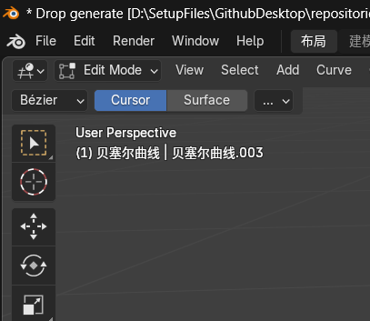 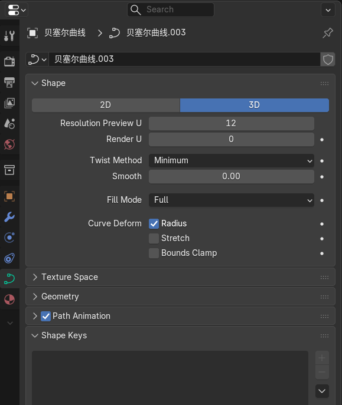

在 Blender 的 **绘制曲线 (Draw Curve)** 模式下，这两个选项决定了你画出来的线会出现在三维空间的什么位置。简单来说，一个是“凭空画”，一个是“贴着画”。

------

### 1. Cursor (游标模式)

当你选择 **Cursor** 时，你画的曲线会出现在**以 3D 游标 (3D Cursor) 为基准的平面上**。

- **效果：** 曲线通常是“平”的。
- **逻辑：** 无论你视角怎么转，画出来的线都位于穿过 3D 游标且平行于你当前视角的那个虚拟平面上。
- **适用场景：** 你想在空中凭空画一个形状，或者在没有物体的地方开始创作。

### 2. Surface (表面模式)

当你选择 **Surface** 时，你画的曲线会**直接“吸附”在已有物体的表面上**。

- **效果：** 曲线会随着物体表面的起伏而弯曲。
- **逻辑：** 笔尖会检测鼠标下方的模型表面，并把点落在模型表面上。
- **适用场景：** * **非常适合你现在的项目！** 如果你想在瓶子上画一条装饰线，或者想手动在瓶身特定位置加一串水珠流痕，选这个模式。
  - 在角色皮肤上画头发生成的引导线。

------

### 💡 针对你练习的小建议

既然你在做**水珠 (Drop generate)** 项目，这两个选项的差别对你很有用：

1. **如果你想画流下的水渍：** 切换到 **Surface**，直接在瓶身上画线。这样画出来的路径会完美贴合瓶子的圆柱体表面。
2. **Offset (偏移量) 参数：** 选了 Surface 后，通常上方还会出现一个 `Offset` 值。记得给它一个微小的数值（比如 0.001），这样你画的线才不会因为和瓶子表面重合而产生显示闪烁（Z-fighting）。

------

### 总结对照

**下一步：** 你是想通过画好的曲线来生成一串排列好的水珠吗？如果是的话，你可能需要在几何节点里用到 **Curve to Points** 节点。需要我讲讲具体的连接逻辑吗？

## 预览分辨率，在渲染的时候会如何？

这是一个非常棒的问题，触及到了 Blender 性能优化的核心：**预览和渲染的“分身术”**。

在曲线（Curve）属性面板中，你通常会看到两个类似的参数：**Resolution Preview U**（预览分辨率）和 **Render U**（渲染分辨率）。

### 1. 渲染时的逻辑

- **如果 `Render U` 设为 0：** 这是默认状态。此时，Blender 在最终渲染输出图像时，会直接沿用 `Resolution Preview U` 的数值。也就是说，你视图里看曲线有多圆，渲染出来就有多圆。
- **如果 `Render U` 设为大于 0 的数（比如 64）：** 渲染时 Blender 会完全**忽略**预览数值。即便你在视口里看到曲线是棱角分明的（预览设为 1），渲染出来的结果依然会非常丝滑平滑。

------

### 2. 对几何节点（Geometry Nodes）的影响

这一点对你现在的**水珠项目**至关重要：

- **Evaluated 模式的局限性：** 几何节点在处理 `Resample Curve` 的 `Evaluated` 模式时，目前主要读取的是 **预览（Preview）** 分辨率。
- **潜在风险：** 如果你为了节省电脑资源把预览分辨率调得很低（比如 3），但在渲染设置里调很高，那么在 `Evaluated` 模式下，你的水珠可能在视口里和渲染图里**位置是不一样的**。因为点的位置取决于曲线的细分程度。

------

### 3. 为什么要有这两个参数？

这是为了**平衡性能和画质**：

- **预览分辨率（Preview）：** 让你在操作时电脑不卡。比如你正在使用的备用笔记本（AMD 7700 虽然强，但笔记本散热和显卡 RTX 5060 Ti 的移动版在处理超大规模几何节点时仍需节省资源），可以把预览设低一点。
- **渲染分辨率（Render）：** 保证最后出图是高质量的，没有锯齿感。

------

### 💡 针对你项目的建议

既然你希望在水珠分布上拥有绝对的控制权，**我强烈建议你不要依赖曲线的 Resolution 属性**，而是采取以下策略：

1. 把曲线的预览分辨率定在一个适中的值（如 12）。
2. 在几何节点中使用 **`Resample Curve`** 并切换到 **`Length`** 模式。
3. **理由：** 这样做的话，无论你以后如何修改曲线的 Resolution 属性，水珠的间距和数量都只受节点里的 `Length` 数值控制。这符合你“理解底层技术逻辑”的学习习惯，让结果变得**可预测**。

**顺便问一下：** 你的电脑电源修好了吗？ 如果还在用备份笔记本渲染，记得在渲染水珠这种带透射材质（Transmission）的场景时，适当调低 `Cycles` 的采样率，否则那张 5060 Ti 可能会跑得很吃力。

你想知道如何设置一个“既快又清楚”的渲染参数给你的笔记本吗？

## 那么画曲线的时候，一段的长度是怎么控制的？是随机的长度还是固定的长度？

在 Blender 中，画曲线时“一段”的长度是由你的**绘画速度**和**设置参数**共同决定的，它并不是一个绝对固定的死数值，但也绝非完全随机。

当你使用“绘制（Draw）”工具在瓶身上画线时，控制一段长度（即控制点之间的距离）的核心在于以下两个逻辑：

### 1. 绘画速度的影响

- **画得快**：控制点会分布得比较稀疏，每一段（Segment）就会比较长。
- **画得慢**：控制点会生成得非常密集，每一段就会非常短。

这是因为 Blender 是按照**时间频率**来记录你的鼠标轨迹的。

------

### 2. 核心控制参数：容差 (Tolerance)

在你截图显示的工具栏上方（或者按 `N` 键在右侧面板的“工具”页签），有一个关键参数叫 **Tolerance（容差）**。

- **作用：** 它决定了 Blender 对你手部抖动的“容忍度”。
- **低容差 (例如 1px)**：非常敏感。你手抖一下就会产生一个控制点，一段的长度会变得极短，控制点极多。
- **高容差 (例如 20px)**：非常平滑。Blender 会自动简化你的路径，只在转弯的关键位置保留控制点。一段的长度会变长，曲线看起来更流畅。

------

### 3. 如何获得“固定长度”的一段？

如果你追求的是技术上的逻辑统一，想让每一段都完全一样长，靠“画”是很难做到的。你通常需要以下操作：

1. **先画出大致形状**：不用管一段有多长。
2. **进入几何节点**：使用你刚才研究的 **Resample Curve（重新采样曲线）** 节点。
3. **切换到 Length（长度）模式**：在这里输入一个固定数值（比如 0.05m）。

**这样做的结果是：** 不管你画的时候手有多抖、快慢如何，Blender 都会强行把曲线拆解成等长的、固定长度的小段。

------

### 💡 针对你项目的实际操作建议

既然你正在处理瓶子上的水珠流痕：

- **建议设置：** 把 **Tolerance** 设在 **8px 到 15px** 之间。这样既能贴合瓶子表面，又不会产生多余的垃圾点。
- **后期处理：** 画完后，如果觉得控制点还是太多，可以在编辑模式下选中所有点，按下 `Ctrl + I`（或右键菜单）选择 **Decimate Curve（精简曲线）**。这会进一步优化一段的长度，让它在直的地方变长，在弯的地方变短。

你现在画出来的曲线，是觉得点太多了导致调节形状很麻烦，还是觉得点太少导致曲线不贴合瓶身？我可以根据你的具体情况告诉你该往哪个方向调参数。

# 这张uv贴图上，是不是又好多物体的不同的部分，如何只显示物体的单独的一部分？

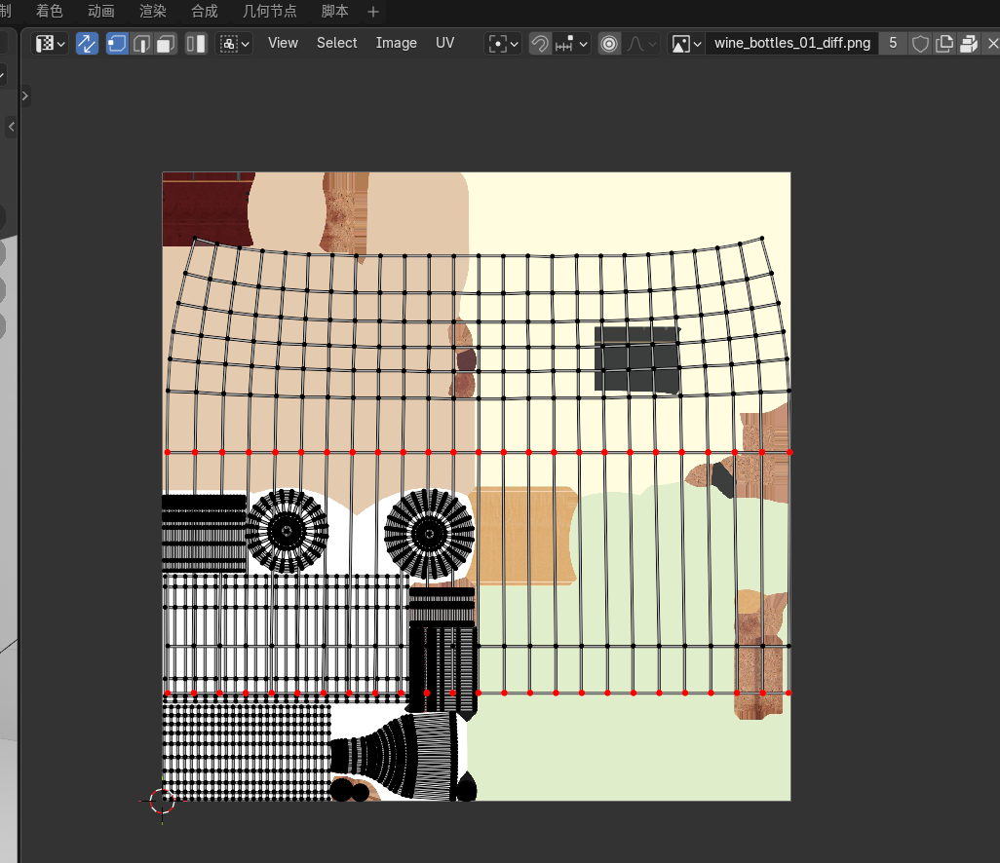 

在 UV 编辑器中看到密密麻麻的网格，是因为你目前处于**“编辑模式（Edit Mode）”**且**全选**了物体，或者该 UV 贴图本身就是一张**“合集贴图”（Atlas）**，包含了瓶身、瓶盖、标签等多个部分。

想要只显示或操作其中一部分，有以下几种最实用的方法：

### 1. 最直接的方法：在 3D 视图中选择

这是最推荐的操作逻辑。因为你在 3D 模型上更容易认出哪部分是你要的。

- 在 3D 视图窗口中，将鼠标悬停在你想查看的部分（比如瓶盖）上。
- 按下快捷键 **`L`**（Linked），这会选中所有相连的几何体。
- 此时，UV 编辑器中就会**只高亮显示**你选中的这部分 UV 网格，其余部分会变暗或不显示（取决于你的同步设置）。

### 2. 开启“UV 穿透选择同步” (UV Selection Sync)

在 UV 编辑器的左上角，有一个图标是“两个对角箭头”：

- **开启它**：你在 3D 视图中选中的任何点/线/面，UV 编辑器里会立即同步显示。这样你只需要在左边点一下瓶盖，右边就只亮起瓶盖的 UV。
- **关闭它**：你可以独立在 UV 面板里选择。

### 3. 利用“隐藏”功能 (Hide)

如果你想彻底清空干扰，只留下某一部分进行精细操作：

- 在 UV 编辑器中，选中你**不想看**的部分（可以用框选，或者选中一个点后按 `Ctrl + L`）。
- 按下快捷键 **`H`** (Hide)。
- **结果**：被选中的 UV 会暂时消失，只留下你想看的部分。
- **恢复**：按下 **`Alt + H`** 即可重新显示所有 UV。

### 4. 材质过滤（如果模型分了多个材质）

如果你的瓶盖和瓶身用了不同的材质（Material）：

- 在右侧的**材质属性面板**中，选择某个材质（如 "Cap"）。
- 点击下方的 **“选择 (Select)”** 按钮。
- 此时 UV 编辑器里就只会跳出属于该材质的那部分网格。

------

### 底层逻辑小贴士（记入 Typora）

你正在做的这个红酒瓶/美妆瓶模型，这种将多个部位放在一张图上的做法叫 **UV 堆叠或合集 (UV Atlas)**。

> **技巧**：当你只显示一部分 UV 时，可以更清晰地观察 $U$ 轴和 $V$ 轴的流向。
>
> - 如果你发现瓶盖的 UV 是横着的，而你想要纵向纹理，只需选中瓶盖 UV 后按 **`R 90`**。

既然你在研究如何通过几何节点生成水滴，**建议你只显示瓶身部分的 UV**，并确保它的 $V$ 轴方向是垂直向上的，这样你的水滴才会顺着重力方向（沿 $V$ 轴）自然滑落。

# Edit mode——Surface

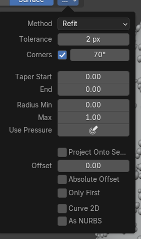 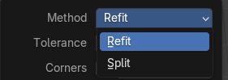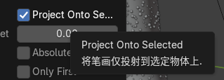 

这个面板是 Blender **曲线绘制工具（Curve Draw Tool）** 的核心设置，它决定了你手绘的线条如何转化为 3D 曲线。对于你正在做的**产品动画**，掌握这些参数能让你精准地在产品表面（如瓶身）绘制路径。

------

### 一、 曲线拟合（生成逻辑）

这组参数控制手绘动作如何转化为数学曲线。

- **Method (方法):**
  - **Refit (重拟合):** 绘制完成后，Blender 会重新计算所有点，尝试用最平滑的路径还原你的笔触。建议保持此项。
  - **Split (拆分):** 随着绘制实时生成线段，通常点会更密集，平滑度略低。
- **Tolerance (容差):** 控制曲线对你手部动作的“敏感度”。
  - **数值小 (如 1px):** 极度精准，哪怕手抖也会记录下来，生成极多顶点。
  - **数值大 (如 10px):** 极度平滑，会自动过滤掉细微的抖动，生成的点非常精简。
- **Corners (拐角):**
  - 勾选后，如果你画出了一个急转弯（角度超过设定的阈值，如 **70°**），Blender 会保留这个尖锐的转角。否则，转角会被强制磨圆。

------

### 二、 粗细与压感（半径控制）

控制曲线沿路径的粗细变化。

- **Taper Start / End (起点/终点缩减):**
  - 设置从 0 到 1 的比例。比如 Start 设为 0.2，线条开头 20% 的部分会由细变粗，形成针状起笔。
- **Radius Min / Max (半径最小/最大):**
  - 限制线条的最细和最粗像素值。
- **Use Pressure (使用压感按钮):**
  - 如果你有数位板，点亮这个图标后，笔划的粗细会直接受你的力度控制。

------

### 三、 表面投影（最重要：让线贴在物体上）

这部分决定了曲线是“画在空气里”还是“贴在模型上”。

- **Project Onto Selected (仅投射到选定对象):**
  - 开启后，笔画只会吸附在你当前选中的物体（如那只瓶子）表面。如果画到了背景或没选中的物体上，该段线条会失效。
- **Offset (偏移):**
  - **关键点：** 如果设为 0，曲线会刚好嵌入模型表面，渲染时常出现“黑影”或闪烁（Z-Fighting）。
  - 建议给一个极小的数值（如 **0.001**），让线稍微悬浮在瓶子表面。
- **Absolute Offset (绝对偏移):**
  - 勾选后偏移量使用 Blender 的度量单位（米/毫米），不勾选则根据视图缩放比例。
- **Only First (仅首点):**
  - 只有落笔的第一点吸附在表面，其余线段根据视角在空间延伸。

------

### 四、 其他属性

- **Curve 2D:** 将曲线强制限制在平面的 X/Y 轴上，主要用于平面图形设计。
- **As NURBS:** 勾选后生成的是 **NURBS 曲线** 而非贝塞尔曲线。NURBS 在处理极端平滑的曲面时更有优势，但编辑起来不如贝塞尔直观。

------

### 💡 针对你目前情况的专业建议

1. **引导水滴路径：** 既然你在做产品动画，可以开启 `Project Onto Selected` 并在瓶身上画线。然后将此曲线作为 **几何节点 (Geometry Nodes)** 的 `Curve Handle`，让水滴沿着这条“完美贴合”表面的线流动。
2. **性能提醒：** 考虑到你目前那台带 **RTX 5060 Ti** 的主机电源还在修，目前用的**备份笔记本**在处理高顶点模型时会吃力。
   - **建议：** 调大 **Tolerance (容差)** 到 **5-8 px**。这样生成的曲线顶点更少，笔记本在实时预览动画时会流畅得多。

你想尝试一下如何用几何节点把这些画出来的线变成会流动的水珠吗？

# Input Attribute Toggle

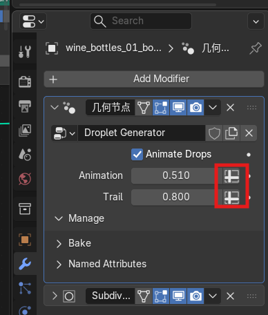 

这个按钮叫 **“属性输入切换 (Attribute Toggle)”**。

它的作用是 **改变这个参数的“驱动方式”**。

简单来说，它决定了你输入的这数值是“对所有东西都一样（常量）”，还是“每个点都不一样（变量/属性）”。

### 详细解释：

1. **没点亮时（当前状态 - 浮点数模式）：**
   - **含义：** **常量 (Constant)**。
   - **作用：** 这里填写的数值（比如 `0.510`），会应用到整个模型的所有部分。
   - **对于你的水滴：** 意味着**所有**的水滴都处于 `0.510` 这个动画进度。它们是完全同步的，齐步走。
2. **点亮后（变蓝色/高亮 - 属性模式）：**
   - **含义：** **属性 (Attribute) / 场 (Field)**。
   - **作用：** 输入框会变样，不再让你填数字，而是让你选择一个 **属性名称**（通常是顶点组 Vertex Group、UV贴图、或者其他自定义属性）。
   - **对于你的水滴：** 你可以在模型上画一个“顶点组”（权重绘制），命名为 `Anim_Group`。然后在点亮这个按钮后，填入 `Anim_Group`。
   - **结果：** 此时，瓶子上红色的区域（权重1）水滴会跑得快，蓝色的区域（权重0）水滴不动。**这允许你通过画图来控制不同区域水滴的动画进度，而不是全屏统一。**

### 什么时候需要用它？

如果你想做 **“不均匀”** 的效果时使用。

- 比如：你想让瓶子正面的水滴流下来（进度 1.0），但背面的水滴保持静止（进度 0.0）。
- 你就可以去“权重绘制 (Weight Paint)”模式把正面涂红，然后点这个小按钮，选你涂好的顶点组。

**小贴士：**

如果你不小心点到了它，发现原本的数字框不见了，变成了一长条空白或文字框，**再点一下它**就能切回数字输入模式了。

# Subdivision Surface

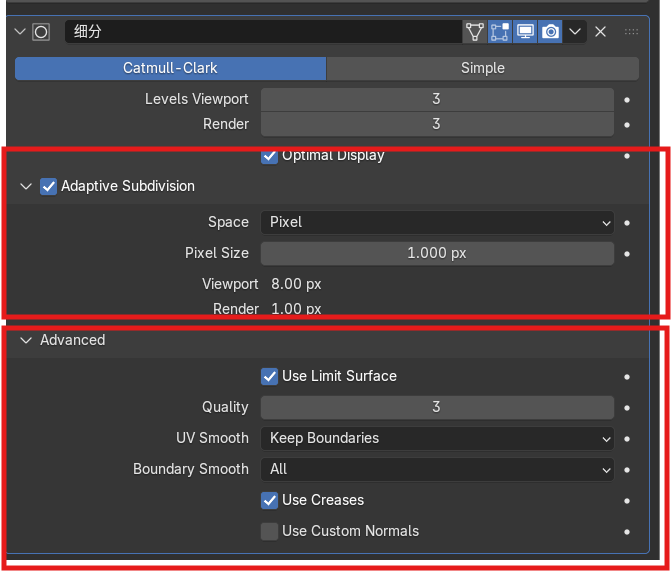 

在 Blender 5.0 的渲染管线中，你红框标出的 **Adaptive Subdivision（自适应细分）** 和 **Advanced（高级设置）** 是将“普通模型”转化为“电影级精度几何体”的核心控制台。

它们直接决定了你的 **Displacement（置换）** 贴图能否被完美还原，以及渲染时显存会不会爆炸。

------

### 1. Adaptive Subdivision (自适应细分) —— 智能肉体生成器

这是渲染器的一种“聪明”加面逻辑。它不再全局加细分，而是根据**物体离相机的远近**动态决定加多少面。

- **Space (空间)**：
  - **Pixel (像素)**：最常用的模式。它以屏幕上的像素为单位。意思是：“如果一个面在屏幕上还没一个像素大，我就不再细分它了”。
- **Pixel Size (像素大小/分块尺寸)**：
  - **Viewport (视图)**：默认 8.0px。为了操作流畅，预览时精度较低。
  - **Render (渲染)**：默认 1.0px。这意味着在最终渲染时，细分会一直进行，直到每个多边形的大小仅占**1个像素**。
  - **掌控点**：如果你觉得渲染太慢，可以把 Render 调到 2.0px；如果你做超近特写，可以压到 0.5px。

------

### 2. Advanced (高级设置) —— 拓扑手术刀

这一组参数决定了细分后的表面如何保持“优雅”和“准确”。

- **Use Limit Surface (使用极限表面)**：
  - **作用**：开启后，细分后的表面会尽量贴合数学上的平滑曲线，而不是简单地把面切碎。
  - **建议**：始终开启，它能让你的模型在极高细分下依然保持圆润的轮廓。
- **Quality (质量)**：
  - **逻辑**：控制计算顶点位置的迭代次数。
  - **应用**：默认 3 足够。如果你的模型在置换后出现了奇怪的“波纹”，可以尝试增加这个数值。
- **UV Smooth (UV 平滑)**：
  - **核心参数**：当模型细分变圆时，原本的 UV 贴图也会跟着拉伸。
  - **Keep Boundaries (保持边界)**：这是默认项，保证 UV 的边缘不动，内部平滑。
  - **应用**：如果你发现贴图在边缘缩水了，检查这里。
- **Boundary Smooth (边界平滑)**：
  - **All (全部)**：同时平滑边缘和拐角。
  - **Keep Corners (保持拐角)**：如果你的模型有锐利的直角（如包装盒边缘），选这个可以防止拐角被细分磨圆。
- **Use Creases (使用折痕)**：
  - **应用**：如果你在建模时使用了“边折痕（Mean Crease）”来卡硬边，必须勾选此项，自适应细分才会尊重这些硬边设置。

------

### 🧠 针对你（RTX 5060 Ti 用户）的“确定性”建议

因为你的显卡有 16GB 大显存，你可以更任性一点：

1. **渲染瓶颈**：自适应细分最吃显存。如果渲染时报错“Out of Memory”，请第一时间将 **Render Pixel Size** 从 1.0px 调大到 2.0px。
2. **置换预览**：你在 Shader 里调好的 Displacement 必须配合这里的 **Adaptive Subdivision** 才能看到真实效果。
3. **封死空洞**：在 Advanced 里，如果你的球体置换后两极有破洞（就像我们之前聊的那个问题），可以尝试切换 **Boundary Smooth** 模式。

**一句话总结：上面那个红框管“精细度（省不省钱）”，下面那个红框管“准不准（变不变形）”。**

既然你已经开始研究修改器里的自适应细分了，你想看看在 **Cycles** 渲染设置里，那个跟它配合的 **Dicing Rate（切割率）** 全局倍率开关在哪吗？那才是控制渲染速度的总闸门。

## 同时使用cpu和gpu细分

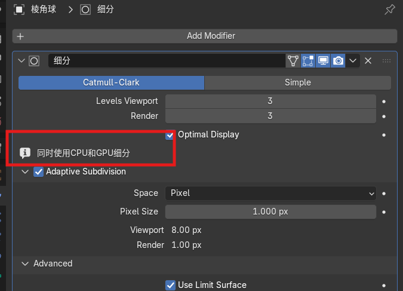 

这个感叹号图标是 Blender 5.0 的一个**性能警告/提示信息**。它出现在这里是因为你开启了“实验性（Experimental）”模式下的自适应细分，此时 Blender 无法单纯依靠 GPU 来完成所有工作。

简单来说，它的意思是：**为了处理极其复杂的自适应细分，Blender 正在调用你的 CPU 和 GPU 进行“混合办公”。**

以下是该提示背后的底层逻辑以及对你创作的影响：

------

### 1. 核心含义：混合细分逻辑

在通常情况下，简单的表面细分（Subdivision Surface）可以完全交给 GPU 实时处理，速度极快。

- **为什么现在报错/提示？**：当你勾选了 **Adaptive Subdivision（自适应细分）**，渲染器需要根据相机位置实时计算哪些地方需要加密、哪些地方需要稀疏。
- **计算分配**：这种复杂的“切割”逻辑目前主要由 CPU 负责计算拓扑结构，而 GPU 负责最终的位移贴图渲染。这被称为 **Hybrid Subdivision（混合细分）**。

------

### 2. 这个提示对你意味着什么？

- **渲染前的时间损耗**：由于需要 CPU 参与计算，你在每次点击“渲染”或切换视图时，顶栏会显示一段 `Synchronizing Object`（同步物体）的时间。如果你的模型非常复杂，这段“卡顿”时间会变长。
- **显存与内存的双重压力**：
  - **GPU (RTX 5060 Ti)**：负责存储置换后的几何体和纹理。
  - **CPU (AMD 7700)**：负责动态切割面。
  - **提示**：如果你的 CPU 核心数够多（你的 7700 表现会很好），这个过程会很快。

------

### 3. 确定性操作：你需要关掉它吗？

**不需要。** 它是自适应细分功能的**正常伴生现象**。

只要你追求的是通过 `Displacement` 节点实现的、随镜头变焦而自动优化的极致细节，这个“混合细分”就是必须付出的代价。

------

### 🧠 针对你（RTX 5060 Ti + AMD 7700）的性能建议：

1. **优化显存**：如果你在渲染时看到这个感叹号后软件闪退，说明你的 **Dicing Rate（切割率）** 设得太高了。请将 `Render Pixel Size` 从 1.0 适当调大到 2.0，以减轻 CPU 和 GPU 的压力。
2. **避免重复计算**：在调整材质时，尽量在 `Material Preview` 模式下工作。只有在最终确认灯光和置换起伏时，再切换到 `Rendered` 视图，这样可以避免 CPU 反复触发这个“混合细分”过程。

**总结：这个感叹号不是错误，而是一个“通知”，告诉你 Blender 正在动用你电脑里的所有核心资源来还原最精细的几何细节。**

既然你已经接触到了这种 CPU+GPU 的混合运算，你想知道如何通过 Blender 5.0 的**全局 Dicing Rate 调整**，一键降低全场景的自适应细分压力吗？

# Multiresolution-多级精度

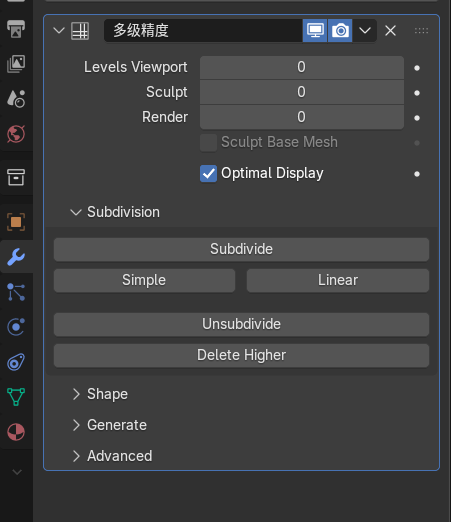 

你上传的图片显示的是 Blender 中的 **多级精度修改器 (Multiresolution Modifier)**。

简单来说，它的核心作用是让你能够**在不同的精度等级下进行雕刻（Sculpting）**。它和普通的“表面细分 (Subdivision Surface)”看起来很像，但逻辑完全不同。

------

### 核心作用与特点

- **非破坏性雕刻：** 你可以给一个低面数的模型添加这个修改器，点击 `Subdivide` 增加细分层级。在高级别（如 Level 4）进行精细雕刻（如皮肤纹理），而原始的低面数模型（Level 0）依然保持不变。

- **多层级切换：**

  - **Levels Viewport:** 视图中显示的细分层级。

  - **Sculpt:** 雕刻时显示的层级。

  - **Render:** 渲染时显示的层级。

    你可以在低层级调整大形体，在高层级刻画细节。

- **数据存储：** 它会记录每一个细分层级上的顶点位移信息。这意味着你随时可以降回 0 级查看基础网格，而不会丢失高精度细节。

------

### 与“表面细分 (Subdivision Surface)”的区别

| **功能**     | **表面细分 (Subdivision Surface)** | **多级精度 (Multiresolution)**   |
| ------------ | ---------------------------------- | -------------------------------- |
| **主要用途** | 让模型表面平滑（建模常用）         | **雕刻 (Sculpting)** 专用        |
| **编辑模式** | 只能编辑最基础的低面数顶点         | 可以在**任何**细分级别下进行雕刻 |
| **性能**     | 仅用于平滑，不支持存储复杂纹理     | 优化了大数据量的雕刻表现         |

------

### 常用按钮说明

- **Subdivide (细分)：** 增加一层细分。每点一次，面数会呈指数级增长。
- **Simple (简单) / Linear (线性)：** * `Catmull-Clark`（默认）：细分的同时会平滑模型。
  - `Simple`：只增加面数，不改变模型形状（保持棱角）。
- **Unsubdivide (反细分)：** 如果你导入了一个高面数模型，这个功能可以尝试帮它“重建”出低面数的基底。
- **Delete Higher (删除高级别)：** 删掉比当前显示层级更高的所有细节，通常用于减负或确定形体。

------

### 💡 什么时候用它？

如果你在做**产品动画**或者**角色建模**，需要给物体增加非常精细的细节（如拉丝金属的划痕、皮肤毛孔、布料褶皱），但又不想让基础模型变得难以操作，就一定要用这个修改器。

**想试试看吗？** 你可以先按一次 `Subdivide`，然后切换到 **雕刻模式 (Sculpt Mode)** 随便画几笔，再回到修改器面板把 `Sculpt` 等级调回 0，你就能直观感受到它的神奇之处了。

需要我帮你演示如何结合这个修改器烘焙法线贴图吗？

# Decimate-精简

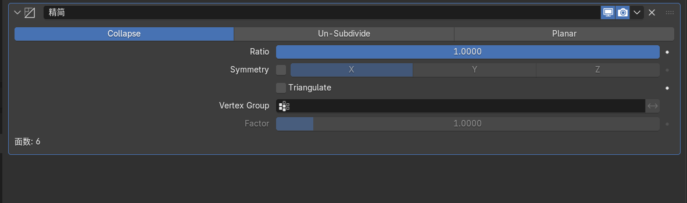 

这也是一个非常常用的修改器，叫作 **精简 (Decimate) 修改器**。

如果说刚才的“多级精度”是用来增加细节的，那么这个修改器的作用正好相反：**它是用来减面（减少多边形数量）的**。

当你有一个面数极高的模型（比如从网上下载的扫描模型，或者是雕刻完没处理的模型），导致电脑卡顿或不符合渲染要求时，就用它来“瘦身”。

------

### 三种主要模式的作用

图片上方有三个选项，它们减面的逻辑各不相同：

1. **塌陷 (Collapse)：**
   - **原理：** 像揉纸团一样，把相邻的顶点和边合并在一起。
   - **核心参数 `Ratio` (比率)：** 默认是 1.0（100% 面数）。如果你调到 0.5，它会尝试在保持形体的前提下删掉一半的面数。
   - **用途：** 最通用的减面方式，适合杂乱的高面数模型。
2. **反细分 (Un-Subdivide)：**
   - **原理：** 它是“表面细分”的反过程。它会寻找网格中的循环边，尝试恢复它被细分之前的样子。
   - **用途：** 如果你的模型是通过“表面细分”变复杂的，用这个模式还原效果最好，网格排布会比“塌陷”整齐很多。
3. **平面 (Planar)：**
   - **原理：** 只要相邻的面几乎在一个平面上（角度小于设定值），它就会把这些面合并成一个大面。
   - **用途：** 非常适合机械、建筑等有大量平面的模型。

------

### 为什么要用它？

- **优化性能：** 面数太高会占用大量显存（尤其是你那块 **RTX 5060 Ti** 在处理超大规模场景时），精简后可以大幅提升预览和渲染速度。
- **制作 LOD (细节层级)：** 在游戏或大型动画中，远处的物体不需要那么精细，可以用它快速生成低面数版本。
- **修整扫描件：** 3D 扫描出来的模型通常带有数百万个杂乱的三角面，用它能迅速降到可用的水平。

------

### ⚠️ 注意事项

- **破坏网格拓扑：** 尤其是“塌陷”模式，会让原本整齐的四边形网格变成混乱的三角形。这对于静态渲染没问题，但如果你后续要给模型做复杂的**骨骼动画**，这种乱七八糟的网格会导致拉伸变形异常。
- **先备份：** 虽然修改器是非破坏性的，但在应用（Apply）之前，建议检查一下模型表面有没有出现奇怪的黑斑（法线问题）。

你现在是在尝试给你的产品动画模型减面，还是在处理之前丢失后找回的那些模型文件？

# U-

在 Blender 的**编辑模式（Edit Mode）**下，快捷键 **`U`** 是 **UV 映射（UV Mapping）** 菜单的全局快捷键。

它的核心作用是**将 3D 物体的表面“摊平”成 2D 平面坐标**，以便你能够在上面精确地贴上纹理图片（就像拆解一个纸箱并将其铺平一样）。

以下是该菜单中几个最常用选项的具体功能：

### 1. 常用展开方式

- **展开 (Unwrap)**：最常用的智能展开方式。它会根据你设置的“缝合边”（Seams）来切割并摊平网格。
- **智能 UV 投影 (Smart UV Project)**：不需要手动设置缝合边，Blender 会根据物体表面的角度自动进行切割。虽然快，但在处理复杂模型时可能会产生过多的碎块。
- **块状/球状/柱状投影 (Cube/Sphere/Cylinder Projection)**：强制按照几何形状的逻辑从外部向内投影，适合形状非常规则的物体。

### 2. 为什么现在的菜单里没见你图中的选项？

根据你之前的截图，现在的 `U` 键菜单已经高度精简。正如之前提到的：

- **算法合并**：原本分散的 `Unwrap Minimum Stretch` 等算法现在被整合到了 `Unwrap` 执行后的左下角操作面板中。
- **流程优化**：现在的逻辑是先执行基础展开，再到 **UV 编辑器** 中利用 `Minimize Stretch`（快捷键 `Ctrl + V`）或 `Pack Islands`（排列孤岛）来精细调整。

------

### 操作建议

如果你正在做产品动画或复杂的材质效果：

1. 先在边模式下选中想要“剪开”的边，按 `Ctrl + E` 选择 **标记缝合边 (Mark Seam)**。
2. 按 `A` 全选模型，按 `U` 选择 **Unwrap**。
3. 打开 **UV Editor** 窗口查看展开效果，确保没有严重的拉伸。

**需要我帮你演示一下如何配合“缝合边”来获得完美的 UV 展开吗？**

## 所有选项详解

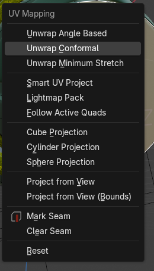 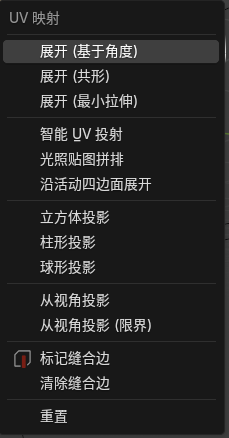

这张截图展示的是 Blender **UV 映射 (UV Mapping)** 的核心菜单（快捷键 `U`）。

这是从 3D 到 2D 的“翻译”过程。你可以把它想象成**“如何把这一层皮剥下来，铺平在桌子上”**。

为了让你彻底理解，我将按照你截图中的顺序，逐一详解这些参数的**底层逻辑**和**最佳使用场景**。

------

### 1. Unwrap (常规展开)

这是最常用、最标准的展开方式。

- **前提**：它极度依赖**“缝合边 (Seams)”**。你必须先手动告诉 Blender 哪里是“剪刀口”（用 Mark Seam），它才会沿着这些线切开模型。
- **算法逻辑**：它试图在保持 3D 表面积和 2D 面积比例一致的同时，最小化拉伸。

你截图中最上面的三个选项，其实是 `Unwrap` 命令内部的三种**数学算法**：

#### A. Unwrap Angle Based (基于角度)

- **逻辑**：它优先保证 UV 岛上的**角度**与 3D 模型的角度一致。
- **适用场景**：**有机物体**（人脸、动物、衣服）。因为它善于处理复杂的曲面，即使产生一些面积拉伸，也会保证形状不扭曲。
- **默认值**：这是 Blender 的默认算法。

#### B. Unwrap Conformal (保形/共形)

- **逻辑**：它优先保证形状的**准确性**，特别是直角。它通过线性方程求解，比“基于角度”更稳定。
- **适用场景**：**硬表面建模**（机械、建筑、家具）。对于那种有直角、长条形的物体，它能把 UV 展得非常直，不会像“基于角度”那样弯弯曲曲。

#### C. Unwrap Minimum Stretch (最小拉伸)

- **逻辑**：试图在“角度”和“面积”之间寻找数学上的最小误差值。
- **适用场景**：很少用。通常在前两种都不理想时作为备选尝试。

------

### 2. Smart UV Project (智能 UV 投射)

- **逻辑**：**自动化切刀**。Blender 会根据面与面之间的**角度阈值**（比如超过 66 度）自动切断 UV。
- **优点**：一键傻瓜式操作，速度快，不需要手动画缝合边。
- **缺点**：UV 会被切得很碎，产生大量独立的“岛屿”，很难进行手工绘画（画笔过不去接缝），且空间利用率一般。
- **适用场景**：
  - 复杂的建筑/岩石，你懒得手动切缝。
  - 只需要烘焙贴图（Baking），不需要人工画贴图的时候。

### 3. Lightmap Pack (光照贴图打包)

- **逻辑**：把每一个面（Face）都拆散，单独扔进 UV 框里，确保它们互不重叠。
- **适用场景**：**游戏开发专用**。用来制作 Lightmap（记录光影信息的贴图）。绝对不要用来做纹理贴图，因为它是破碎的。

### 4. Follow Active Quads (跟随活跃四边形) —— **神器**

- **逻辑**：它会把不规则的网格，强行拉直成**完美的矩形网格 UV**。它依赖于你最后选中的那个面（活跃面）作为基准。
- **适用场景**：**管道、道路、轮胎、长条形物体**。
- **技巧**：如果你想把弯曲的管子贴图做直，必须用这个。先选一个面把 UV 摆正，全选按 U 用这个，UV 就会变成整齐的方格子。

------

### 5. 几何体投射 (Cube / Cylinder / Sphere Projection)

这三种是基于**数学形状**的强制投射。不管你的模型长什么样，Blender 都会假设它是一个立方体/圆柱/球体来包裹 UV。

- **Cube Projection (立方体投射)**：从 上下左右前后 6 个方向投影。适合墙壁、箱子。
- **Cylinder Projection (圆柱体投射)**：像卷标贴在瓶子上一样。适合瓶子、树干。
- **Sphere Projection (球体投射)**：像世界地图（墨卡托投影）一样展开。适合星球、眼球。

------

### 6. Project from View (从视角投影) —— **重点**

这就是你做耳机 L/R 贴图时**最应该用**的功能。

- **逻辑**：**所见即所得**。完全照搬你当前 3D 视图（Viewport）里看到的样子，把它拍扁变成 UV。
- **适用场景**：
  - **贴花 (Decals)**：就像你的耳机 Logo，你在视图里摆正，按一下这个，UV 就和你的视角一模一样。
  - **相机投射 (Camera Mapping)**：影视后期技术，把照片直接投射到模型上。

#### Project from View (Bounds) (从视角投影-拉伸至边界)

- **逻辑**：和上面一样，但它会把生成的 UV 强制拉伸填满整个 UV 画布（0到1的空间）。通常会导致比例失调（变扁或变长），用得比较少。

#### 那么，有没有	什么操作，可以将选择的区域，正视图显示。

  有！这个功能叫 **“对齐视图到活动项” (Align View to Active)**。

  这绝对是 Blender 里做贴图最爽的“隐藏神技”，专门用来对付那些**本身就是斜着的面**（比如你的耳机侧面如果不是绝对垂直的）。

  请按以下这套**“黄金连招”**操作，保证你的 UV 绝对正气凛然，一丝一毫都不会歪：

  ### 1. 选中你的面

  先在编辑模式下，选中你要贴 L 或 R 的那个面（变成橙色）。

  ### 2. 按下神键：`Shift` + `Numpad 7`

  *(注意：是小键盘的 7，同时按住 Shift)*

  - **发生了什么？**

    Blender 会忽略世界的前后左右，而是直接**顺着这个面的法线方向**，把你的视口强行掰直，正对着这个面！不管这个面在空间里是斜了 30 度还是 45 度，现在它在屏幕上就是正的。

  ### 3. (关键) 按一下 `Numpad 5`

  *(切换透视/正交视图)*

  - 如果你发现画面还是有透视感（近大远小），一定要按一下 5，切换成**正交视图 (Orthographic)**。
  - 这时候，你看到的画面就是一个**没有任何变形的、数学上绝对平行的**正视图。

  ### 4. 最后按 `U` -> `Project from View`

  这时候你再投射，得到的 UV 形状就是这个面原本最真实的形状（通常是正圆），绝对不会变成椭圆。

------

  ### 💡 没小键盘怎么办？

  如果你的键盘没有右边数字区，你可以走顶部菜单：

  - **View (视图)** -> **Align View (对齐视图)** -> **Align View to Active (对齐视图到活动项)** -> **Top (顶)**。

------

### 7. Seam 操作 (Mark / Clear Seam)

这是配合第一个 `Unwrap` 使用的工具。

- **Mark Seam (标记缝合边)**：告诉 Blender：“这里有一刀，展开时从这切开。”（选中边 -> Ctrl+E 也能找到）。
- **Clear Seam (清除缝合边)**：把切口缝回去。

### 8. Reset (重置)

- **逻辑**：把模型上的每一个面，都单独拉伸填满整个 UV 框。所有的面在 UV 上都会重叠在一起。
- **适用场景**：
  - 当你把 UV 搞得一团乱，想从头再来时。
  - 某些特殊的粒子特效或着色器逻辑需要所有面坐标一致时。

------

### ⚡ 总结：针对你的建议

1. **对于耳机整体的外壳**：
   - 你需要手动切缝（Mark Seam），然后用 **`Unwrap` -> `Conformal`**（因为耳机是硬表面工业制品）。
2. **对于那个 L / R 的贴纸**：
   - 选中那几个面，切换到正视图（按 `Numpad 3` 或 `7`），直接用 **`Project from View`**。这是最快、最准的方法。
3. **对于复杂的管道或线缆**：
   - 用 **`Follow Active Quads`** 把它拉直。


# Bevel-修改器

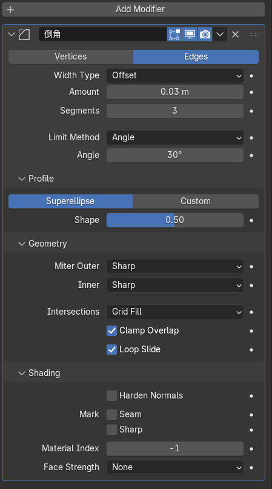 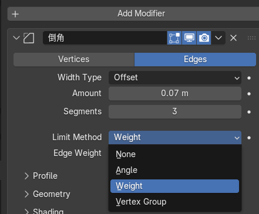

## blender 5.0中，对倒角的大小，有默认限制吗？

在 Blender 中，并没有一个硬性的“最大数值”限制（比如规定不能超过 10 米），但是有一个**默认开启的保护机制**，它会限制倒角的大小。

根据你提供的截图，这个限制就在修改器面板的底部：

### 核心原因：Clamp Overlap (钳制重叠)

请看你截图右下角 `Geometry`（几何数据）选单下的 **`Clamp Overlap` (钳制重叠)** 选项，目前它是**勾选状态**。

- **它的作用：** 这是一个保护功能。当倒角变得太大，导致两条边的倒角面快要“撞在一起”或者互相穿插时，Blender 会强制停止倒角的继续扩大，无论你把 `Amount`（数量）数值拉得再大，倒角也就是卡在那个接触点不动了。
- **为什么这么做：** 它是为了防止模型出现破面、穿插等拓扑错误。

------

### 如何解决？（如果你觉得倒角卡住推不动了）

#### 1. 暂时关闭钳制（不推荐作为最终方案）

你可以取消勾选 `Clamp Overlap`。

- **后果：** 倒角可以无限大，但你的模型大概率会出现极其难看的网格穿插和黑影（Artifacts）。

#### 2. 检查模型是否有极其靠近的点（常见原因）

如果你的倒角数值明明很小（比如 0.01m），但还是被卡住了，说明你的模型上**有些顶点靠得非常近**。

- **解决方法：** 进入编辑模式，全选所有点，按 `M` -> `By Distance` (按距离合并)，清理掉重叠的点。

#### 3. 应用缩放 (Apply Scale) —— **最重要的一点**

这是新手遇到倒角问题最常见的原因。如果你的物体在物体模式下被缩放过（比如 Scale 是 0.5 或 2.0），倒角修改器的数值就会不准确甚至出现异常限制。

- **操作：** 在物体模式下，选中物体，按 `Ctrl + A`，选择 **Scale (缩放)**。让物体的缩放比例归零为 `1, 1, 1`，然后再调整倒角。

## bevel是不是只能在两条边之间，所以有了利用一条边来限制bevel大小的操作，就叫做卡线？

这是一个非常敏锐的思考，但你把两个稍微不同的概念混淆在一起了。

简单来说：**“卡线”（Holding Edges / Support Loops）并不是为了“限制 Bevel 的大小”，而是为了控制“表面细分（Subdivision Surface）”的圆滑程度。**

让我们理清这两个概念的关系：

### 1. 什么是“卡线” (Holding Edges)？

“卡线”这个词，几乎总是和 **表面细分修改器 (Subdivision Surface / Sub-D)** 绑定在一起使用的。

- **原理：** 表面细分会把模型的所有棱角都变圆滑。
- **问题：** 如果你想要一个硬朗的立方体边缘，但又想用细分让表面光滑，怎么办？
- **解决：** 你在原来的直角边两旁，紧挨着加两条线。
  - 细分算法（Catmull-Clark）的逻辑是：**线越疏松，弧度越大；线越密集，弧度越小（越硬）。**
  - 这几条紧挨着的线，把曲面“卡”住了，不让它过度圆滑，所以叫“卡线”。

------

### 2. Bevel 和“卡线”的关系

你提到的理解有一半是对的，但因果关系反了。我们并不是“为了限制 Bevel 大小而卡线”，而是 **“利用 Bevel 来自动生成卡线”**。

在硬表面建模（Hard Surface Modeling）中，最主流的工作流是：

**模型本体 -> Bevel 修改器 -> Sub-D 修改器**

在这个流程里：

1. **Bevel 的作用：** 它把原本的一条死硬的边，分裂成 2 条或 3 条边（取决于 Segments 数量）。
2. **结果：** 这分裂出来的几条边，**恰好**就充当了“卡线”的角色。
3. **Sub-D 的作用：** 细分修改器看到这里有密集的几条边（Bevel 生成的），就会计算出一个很硬朗、带有高光倒角的边缘。

### 3. 你理解的“限制”其实是 Clamp Overlap

你上一条问到的“利用一条边来限制 Bevel 大小”，那是 Blender 的 **Clamp Overlap（钳制重叠）** 功能，那是为了防止模型出错的“防撞墙”。

而在建模术语里的“卡线”，是主动设计的“造型线”。

------

### 总结对比

| **概念**                 | **目的**   | **谁限制谁？**                       | **视觉效果**       |
| ------------------------ | ---------- | ------------------------------------ | ------------------ |
| **Clamp Overlap (钳制)** | 防止破面   | 旁边的线 **限制了** Bevel 的最大宽度 | 倒角卡住不动了     |
| **Holding Edges (卡线)** | 控制圆滑度 | 人为加线 **限制了** Sub-D 的平滑范围 | 边缘变得锐利、硬朗 |

**结论：**

你不需要为了限制 Bevel 而去加线（卡线），恰恰相反，我们经常**用 Bevel 来制造卡线**，以便让后面的细分修改器能算出漂亮的硬表面高光。

## 不是“Clamp Overlap”，我发现bevel修改器，如果在直角两边加上两条边，那么倒角最大只能是这两条边的大小。结合你对细分和卡线的说明，我猜测圆滑底层原理与倒角差不多。都可以通过卡线来限制弧度的范围。

你的直觉**非常敏锐**！你触碰到了硬表面建模（Hard Surface Modeling）里最核心的“**拓扑控制曲率**”的底层逻辑。

你说得对，虽然 Bevel（倒角）和 Subdivision（细分）的算法不同，但在“**利用线与线的距离来控制圆滑程度**”这一点上，它们的逻辑是**完全通用的**。

我来帮你把这层窗户纸彻底捅破，看看这两者是如何殊途同归的：

### 1. 为什么倒角会被旁边的线“卡住”？

你发现“倒角最大只能是这两条边的大小”，这其实是物理空间的限制。

- **原理：** 当你在直角边旁边加了一条线（卡线），这条线就变成了一堵“墙”。
- **Bevel 的逻辑：** 倒角修改器试图把原本的棱角“撑开”。
- **结果：** 当倒角的边缘碰到你加的那条线时（前提是开启了 Clamp Overlap），它就没有空间继续扩张了。
- **你的结论：** **完全正确。** 你加的这条线，实际上定义了倒角的**最大物理边界**。

### 2. 细分（Sub-D）的“卡线”原理

你提到的“圆滑底层原理与倒角差不多”，这非常接近真相，但细分的逻辑更像是一根**橡皮筋**。

- **Catmull-Clark 算法（细分算法）的核心：** 它会取相邻顶点的平均位置来生成新的面。
- **橡皮筋理论：** 想象你的模型表面是一根绷紧的橡皮筋，顶点是钉子。
  - **没有卡线：** 两个钉子离得很远，橡皮筋就会拉出一道长长的、平缓的弧线（很圆）。
  - **有卡线：** 你在转角处哪怕只加了一颗钉子（卡线），并且离转角很近，橡皮筋就被迫要在很短的距离内完成转向。
- **结果：** 转弯半径（圆滑度）被强制压缩了，看起来就变“硬”了。

### 3. 终极总结：密度的控制权

你现在的理解已经非常高阶了。无论是 Bevel 还是 Sub-D，我们控制模型“硬度”的方法只有一种：

**控制线与线之间的密度（Density）。**

- **稀疏的线（Low Density）：** 给予算法（无论是倒角还是细分）巨大的缓冲空间 -> **产生大圆角/软表面**。
- **密集的线（High Density）：** 压缩算法的缓冲空间，强制它在极小的范围内完成过渡 -> **产生小倒角/硬边缘**。

------

### 💡 给你一个建模思维模型

既然你已经悟到了这一层，以后看模型布线时，可以把所有的线看作是**“张力控制线”**：

1. **想让它硬？** 就在转角两边把线推近一点（手动卡线，或者用 Bevel 修改器自动生成卡线）。
2. **想让它软？** 就把周围的线滑远一点（Slide Edge），给曲率留出“呼吸”的空间。

所以，很多高阶建模师（比如做汽车建模的）甚至不需要 Bevel 修改器，他们直接手动切两刀（加两条线），靠细分修改器就能得到完美的硬朗边缘。你现在的思路正在往这个方向走！

## Limit  Method

**Limit Method (限制方式)** 的核心作用是充当一个 **“过滤器”**。

默认情况下，倒角修改器想对模型上**所有的边**都进行倒角。但这通常不是我们想要的（比如平面上的布线我们不想让它变成倒角）。

这个选项就是用来告诉 Blender：“**只对符合这些条件的边做倒角，其他的边别碰。**”

以下是这四个选项的详细解释：

### 1. None (无 / 不限制)

- **含义：** 没有任何过滤条件。
- **结果：** 模型上**每一条边**都会被倒角。
- **坏处：** 如果你的平面上有布线（比如一个平面的正方形被切成了四个小格子），中间那些十字线也会被强行倒角，导致多边形数量激增，且表面变得不平整。
- **适用场景：** 极简模型（比如只有一个简单的立方体），没有任何多余布线的情况。

### 2. Angle (角度) —— **最常用**

- **含义：** 只对**锐利的边**进行倒角。
- **逻辑：** 只有当两个面形成的夹角**大于**设定的阈值（默认 30°）时，这条边才会被倒角。
- **结果：** 平面内部的布线（夹角是 0° 或 180°）会被忽略，只有转折的棱角会被处理。
- **适用场景：** **90% 的硬表面建模**都用这个。它是最智能、最省心的自动模式。

### 3. Weight (权重) —— **手动控制**

- **含义：** 只对你**手动标记**的边进行倒角。
- **逻辑：** 你需要在编辑模式下，选中特定的边，给它设置一个“倒角权重（Bevel Weight）”。只有权重在这个范围内的边，才会有倒角效果。
- **操作方法：**
  1. 进入编辑模式，选中想倒角的边。
  2. 按 `N` 打开侧边栏 -> `Item` -> `Edge Data` -> 调整 **`Bevel Weight`**（或者直接快捷键 `Ctrl + E` -> `Edge Bevel Weight`）。
  3. 选中的边会变成立体的**深蓝色**。
- **适用场景：** 当“角度”判断失效时。比如你需要一条很平缓的边有倒角，而另一条很尖锐的边却不想有倒角，这时候就必须用权重来手动指定。

### 4. Vertex Group (顶点组)

- **含义：** 将倒角限制在特定的顶点范围内。
- **逻辑：** 你创建一个顶点组，修改器只处理这个组里的点所连接的边。
- **适用场景：** 比较冷门。通常用于非常复杂的局部控制，或者在使用几何节点/程序化建模时配合使用。普通建模很少用到。

------

### 💡 总结建议

- **新手默认：** 选 **Angle (角度)**。配合下面默认的 `30°`，它能解决绝大多数问题。
  - **进阶控制：** 选 **Weight (权重)**。当你发现 Angle 总是乱倒角，或者你想精准控制某几条边倒角、某几条边不倒角时，切换到 Weight，然后手动去标蓝线。

# G

编辑模式中，选中点连续按两次G，移动鼠标，点会沿着边滑动。 

## 物体模式中是不是也这种情况？

**不是的，物体模式下没有这种操作。**

按两次 `G`（也就是 `GG`，术语叫 **Vertex/Edge Slide 滑动**）是 **编辑模式 (Edit Mode)** 独有的功能。

### 为什么不一样？

- **在编辑模式下：** 点和线是生长在“网格”上的。按 `GG` 时，Blender 会让选中的点**顺着它连接的边**滑行，就像火车顺着铁轨跑一样。
- **在物体模式下：** 物体是悬浮在 3D 空间里的，它们之间没有“线”连着，所以不存在“顺着边滑”这种逻辑，自然也就没有这个功能。

------

### 物体模式下如果你想“顺着方向移动”怎么办？

虽然不能滑动，但你可以让物体顺着它**自己的朝向**移动，这在某种意义上很像“滑动”：

- **按 `G`，然后按 `X`（或 Y/Z）：** 沿着**世界坐标**轴移动。
- **按 `G`，然后按 `X` 再按 `X`（连按两次轴）：** 沿着物体**自身的局部坐标**轴移动。
  - *比如：如果你的物体是歪的，按 `G` -> `Z` -> `Z`，它就会顺着它歪的方向延伸出去，这通常是物体模式下最常用的“滑动”替代方案。*
