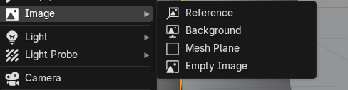

# Image<--Shift+A

 

在 Blender 中，这几种导入图像的方式虽然看起来差不多，但它们的**本质属性**和**默认设置**（尤其是遮挡关系和显示方式）有很大区别。

简单来说，前两个属于“空物体（Empty）”，后一个属于“几何体（Mesh）”。

------

### 1. Reference（参考图）

这是最常用的模式，专门为了**建模参考**设计。

- **本质：** 一个带有图像显示属性的“空物体（Empty）”。
- **特点：** * **深度（Depth）：** 默认设置为“Default”，它会和物体产生交叉遮挡。
  - **透视显示：** 在透视视图（Perspective）和正交视图（Orthographic）中都能看到。
  - **不渲染：** 它只是给你的参考，渲染时它是透明不可见的。

### 2. Background（背景图）

专门用于**垫图勾勒**，类似于临摹。

- **本质：** 也是一个“空物体（Empty）”。
- **特点：**
  - **深度（Depth）：** 默认设置为“Back”，这意味着它永远被模型挡住，哪怕你把它移动到模型前面，它也会显示在模型后面（方便你看着轮廓建模）。
  - **仅正交显示：** 默认只在侧视、前视等正交视图显示。当你旋转视角进入透视模式时，它通常会消失（可以在属性里改，但默认是关的）。
  - **不渲染：** 同样不会出现在最终渲染图中。

### 3. Mesh Plane（图片平面）

这是由官方自带插件 **"Import Images as Planes"** 提供的功能。

- **本质：** 它是一个真正的**网格几何体（Mesh）**。
- **特点：**
  - **材质：** 它是把图片当作材质贴图，自动贴在一个对应比例的平面模型上。
  - **渲染：** **它会出现在最终渲染图中。** 如果你想在场景里放一张海报、挂画或者手机屏幕，选这个。
  - **光影：** 它会接收阴影、产生反射（除非你在材质里设置了无光/发光）。

### 4. Empty Image（空图像）

这是最基础的形态。

- **本质：** 仅仅是创建了一个空的图像占位符，不包含具体的图片路径。
- **用途：** 当你还没想好用哪张图，或者想先占个位，后续再从属性面板加载图片时使用。

------

### 总结对比

| **模式**       | **类型** | **会被模型挡住吗？** | **渲染能看到吗？** | **适用场景**             |
| -------------- | -------- | -------------------- | ------------------ | ------------------------ |
| **Reference**  | Empty    | 是（默认）           | 否                 | 放在模型旁边看结构       |
| **Background** | Empty    | 永远在模型后方       | 否                 | 垫在模型底下描边         |
| **Mesh Plane** | Mesh     | 取决于物理位置       | **是**             | 场景里的海报、特效、照片 |

**建议：** 如果你只是为了对着画模型，选 **Reference**；如果你是想在场景里放一张照片作为装饰，选 **Mesh Plane**。

你需要我演示一下如何把 Reference 调整成“半透明”或者“置顶显示”吗？