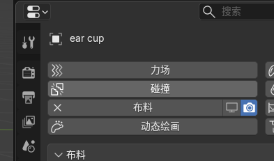

# 这俩图标啥意思？啥作用？

这两个图标是 Blender 所有修改器（包括物理模拟）通用的“总开关”，它们分别控制着这个效果在**何时**生效。

### 1. 左边的“显示器”图标 (Monitor) —— 视口显示

- **含义：** 控制该效果是否在**你现在的操作界面（3D 视口）**中显示。
- **作用：**
  - **点亮（开）：** 你现在能在屏幕上看到布料模拟的效果。
  - **点灭（关）：** 暂时屏蔽这个效果。物体会变回没有添加布料时的“原始状态”。
- **你的核心解药：** **这就是上一条里我让你点的那个！** 当你想移动耳机而不让它“拉丝”时，就把这个小显示器点灭。移好位置后，再把它点亮。

### 2. 右边的“照相机”图标 (Camera) —— 渲染显示

- **含义：** 控制该效果是否在**最终生成的图片或视频（渲染结果）**中显示。
- **作用：**
  - **点亮（开）：** 当你按 `F12` 渲染出图时，会有布料效果。
  - **点灭（关）：** 即使你现在屏幕上看着有布料，渲染出来的图里它是硬邦邦的（效果被忽略）。
- **建议：** 这个通常**永远保持开启**（除非你只是想做个测试渲染，不想花时间算物理）。

------

### 一句话总结

| **图标** | **名字**     | **此时此刻你看得到吗？**        | **最终导出视频里有吗？**    |
| -------- | ------------ | ------------------------------- | --------------------------- |
| 🖥️        | **视口显示** | **决定权在这里** (操作时开关它) | 不影响                      |
| 📷        | **渲染**     | 不影响                          | **决定权在这里** (通常常开) |