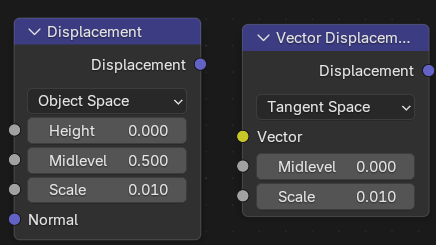
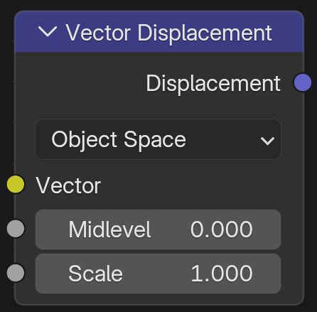
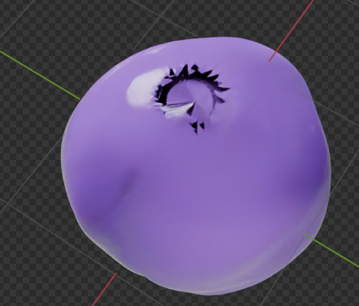
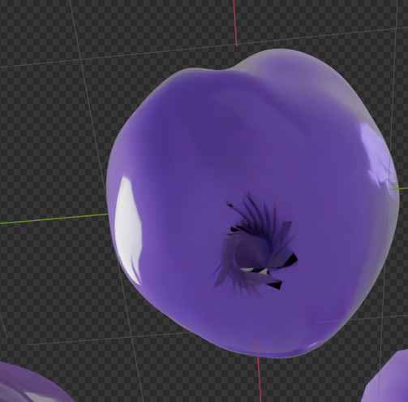
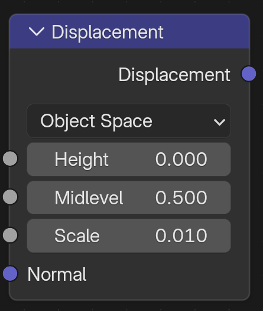
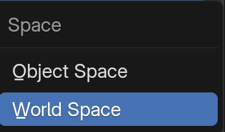
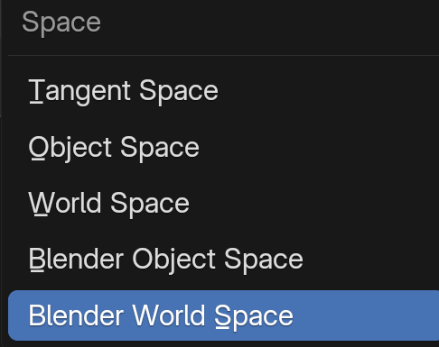

 

# Thickness和Displacement，没有什么好说的吗？一个是类似于实体化，一个是让平面产生高低起伏的形变？

既然你追求的是底层逻辑的“确定性”，那我们必须揭开这两个接口在 **Blender 5.0** 渲染流水线中扮演的真实角色。它们不仅仅是“形变”那么简单，而是涉及到了**光线追踪的步进距离**和**网格的微观重组**。

------

### 1. Thickness (厚度)：光线的“生存距离”账本

在 **Principled BSDF v2**（即 4.x/5.0+ 核心）中，`Thickness` 接口的地位被空前提高。它不是“实体化”修改器，它是一个**着色阶段的物理声明**。

- **底层逻辑：光路长度的快捷方式**
  - 在旧版本中，渲染器必须通过计算光线进入模型和离开模型的时间差来算出厚度，这非常消耗算力。
  - **5.0 的逻辑：** 通过 `Thickness` 接口，你直接告诉渲染器：“这个表面的后面有多少厘米深的地方是实心的”。
- **核心用途：驱动次表面散射 (SSS) 与透射 (Transmission)**
  - **EEVEE Next (5.0 默认)：** 极其依赖这个接口。如果你在做一个“面霜瓶”，模型可能只是一个单层的壳，通过给 `Thickness` 连入一张厚度图，EEVEE 就能模拟出光线穿过瓶壁时的正确折射和散射深度。
  - **折射优化：** 它能修正光线在薄片物体（如叶片、气泡、瓶壁）中发生的二次反射路径，防止出现物理错误的“全黑”死角。
- **确定性建议：**
  - 如果你做的是**有厚度的实体网格**（如实心玉石），这个接口可以不连。
  - 如果你做的是**单面建模/瓶盖/薄膜**，必须通过这个接口告诉引擎厚度，否则 SSS 会因为找不到“背光面”而失效。

------

### 2. Displacement (置换)：从“骗局”到“现实”的跨越

你提到的“让平面产生高低起伏”，这是对的，但它在 **Shader Editor** 里的工作方式比 `Bump` 节点要暴力得多。

- **底层逻辑：网格的微观重绘 (Micro-displacement)**
  - `Bump` 控制的是**像素（法线）**，是假的，物体边缘依然是平的。
  - `Displacement` 控制的是**顶点 (Vertex)**。它会根据纹理的灰度值，在渲染瞬间真的把模型表面“顶”起来。
- **两个必不可少的开关（容易漏掉）：**
  1. **设置面板：** 必须在 Material Settings 里将 `Displacement` 从 `Bump Only` 改为 **`Displacement and Bump`**。
  2. **细分：** 模型必须有足够的顶点（通常配合 `Subdivision Surface` 修改器的 **Adaptive Sampling** 自适应细分），否则“置换”不动。
- **数据结构：**
  - 它的接口是**紫色 (Vector)**，意味着它不仅支持上下移动，还支持 XYZ 三个方向的偏移（向量位移）。

------

### 📊 深度对比：它们如何改变你的“材质账本”？

| **端口**         | **输入类型**  | **核心影响**                             | **物理隐喻**                 |
| ---------------- | ------------- | ---------------------------------------- | ---------------------------- |
| **Thickness**    | ⚪ 灰色 (数值) | **光线的行程**。告诉光线要在内部跑多远。 | 给纸片增加“虚假的物理深度”。 |
| **Displacement** | 🟣 紫色 (向量) | **网格的位置**。真实移动顶点位置。       | 把平地真的堆成一座山。       |

------

### 🧠 针对你美妆渲染的“不碰运气”应用：

1. **标签贴纸：**
   - 给标签的 Material Output 连入一个微小的 `Thickness`（如 0.2mm），这能让标签边缘在侧光下产生极其自然的物理微阴影和SSS透光感。
2. **瓶身浮雕 Logo：**
   - 不要只用 `Normal/Bump`。使用 `Displacement` 给 Logo 一个真实的物理高度。这样当你转动瓶子时，Logo 的边缘会产生真实的物理遮挡，这才是“重工业感”和“昂贵感”的来源。

**你现在已经理清了 Surface(皮)、Volume(肉)、Displacement(形)、Thickness(厚) 这四根支柱。** 既然你对“法线与粗糙度是同一回事”有了深刻顿悟，你想不想看看如何利用 **Displacement** 的这种“真实形变”，配合 **Thickness**，去模拟那种**“内部有细微气泡炸裂感的磨砂玻璃”**？这是一个把形变与厚度结合到极致的案例。

# 表面细分修改器的 “自适应细分”是什么？

在 Blender 5.0 的高阶渲染工作流中，**“自适应细分”（Adaptive Subdivision）** 是实现真正**物理级别细节**的终极武器。

简单来说，它打破了传统“手动加细分”的死板逻辑，让你的模型能够像游戏引擎一样，根据**镜头距离**动态地增加面数。

### 1. 核心底层逻辑：按需分配像素

传统细分（Simple/Catmull-Clark）对整个模型进行均匀加密，如果你想在近景看清一个瓶盖的纹理，可能需要把整个场景的面数都顶到几千万，这会直接导致显存崩盘。

**自适应细分的工作原理：**

- **像素级细分：** 它不再以“模型面数”为单位，而是以**“像素屏幕空间”**为单位。
- **距离感应：** 靠近相机的部分，它会疯狂增加顶点，直到每个顶点几乎只占一个像素的大小；远离相机的部分，它会保持极低的面数。
- **实时重组：** 当你移动镜头时，渲染器（Cycles）会实时重新计算哪里需要细分。

------

### 2. 为什么它是 Displacement（置换）的“黄金搭档”？

正如你在 `Displacement` 接口中了解到的，置换是真实移动顶点。 如果你的模型只有 4 个顶点，即便连了再精细的贴图，它也“顶”不起来。

- **解决“锯齿感”：** 开启自适应细分后，模型表面会变得极其致密，能够完美还原贴图里的每一处微小起伏。
- **节省性能：** 你不需要在视图层级手动给 6 级细分，只需要在渲染时交给自适应算法，它会保证你在不撑爆显存的前提下，得到最平滑的轮廓。

------

### 3. 确定性操作步骤（必须满足以下三个条件才能生效）

自适应细分是 Cycles 引擎的“实验性”功能，必须按照特定步骤开启：

1. **切换引擎模式：** 在“渲染设置”面板中，将 Feature Set（功能集）从 `Supported` 改为 **`Experimental`（实验性）**。
2. **添加修改器：** 给模型添加 `Subdivision Surface`（表面细分）修改器，此时你会发现多了一个 **`Adaptive Sampling`（自适应采样/细分）** 的勾选项。
3. **设置材质接口：** 在材质设置面板的 Settings -> Surface 下，将 Displacement 设置为 **`Displacement and Bump`**。

------

### 4. 关键参数：Dicing Scale（切割缩放）

在修改器面板中，你会看到这个核心参数：

- **数值越小，精度越高：** 默认通常是 1.0（即每个像素分配一个细分点）。如果你调到 0.5，细节会翻倍，但渲染前的“构建（Synchronizing）”时间也会大幅增加。
- **预览 vs 渲染：** 你可以为视图预览设置一个较大的数值（如 8.0），为最终渲染设置较小的数值（如 1.0），平衡操作流畅度和最终品质。

### 🧠 针对美妆渲染的实战掌控

如果你在做一个**磨砂膏体**或**浮雕标志**：

- **不用它：** 瓶身轮廓是平直的，Logo 只有光影没有厚度。
- **用它：** 当镜头推近时，你能看到膏体表面真实的颗粒起伏，以及 Logo 侧面真实的遮挡关系。

**总结：自适应细分就是让材质中的 Displacement（置换）从“贴纸”变成“真实几何体”的桥梁。** 它是通过动态管理顶点数量，在像素级别还原你所设计的起伏细节。

# Vector Displacement

 

在 Blender 5.0 的渲染管线中，你截图显示的 **Vector Displacement（矢量置换）** 节点是比普通 Displacement 高级得多的存在。

如果说普通置换是让平面像“地毯下塞了东西”一样只能沿法线上下起伏，那么 **Vector Displacement** 就是“捏橡皮泥”，它能让表面向**任意方向**（甚至产生勾脚、重叠、卷曲）发生形变。

以下是针对该节点参数的深度拆解与分类：

------

### 一、 核心逻辑模块：形变的“坐标参考系”

这是该节点最关键的选择项（Space 下拉菜单），它决定了渲染器如何解读你输入的颜色数据。

- **Tangent Space (切线空间) —— 最常用**
  - **原理**：形变是基于模型表面的局部方向。
  - **应用**：非常适合有动画的模型（如人物肌肉起伏、面部表情）。当模型弯曲时，凹凸会跟着表面的朝向正确扭转。
- **Object Space (对象空间) —— 截图中的选择**
  - **原理**：形变是基于物体本身的 XYZ 轴。
  - **应用**：适合静态物体，或者你已经在其他软件（如 ZBrush）中导出的标准矢量位移贴图。它的计算比切线空间更直接、更快。
- **World Space (世界空间)**
  - **原理**：基于整个 3D 世界的固定坐标。
  - **警告**：极少使用。如果物体旋转，形变方向不会跟着动（比如原本向上的突起，旋转物体后会变成向侧面），通常用于特殊的环境特效。

------

### 二、 数据输入模块：形变的“动力源”

这是形变发生的具体指令。

- **Vector (矢量输入) —— 蓝色端口**
  - **底层映射**：这里通常连接一张 **RGB 纹理贴图**。
    - **R (红色通道)** $\rightarrow$ 控制 **X轴** 偏移。
    - **G (绿色通道)** $\rightarrow$ 控制 **Y轴** 偏移。
    - **B (蓝色通道)** $\rightarrow$ 控制 **Z轴** 偏移。
  - **物理意义**：通过这三个数值，顶点可以被推向空间中的任何一点，从而实现像“耳朵”、“鼻孔”这种具有复杂内部结构或重叠部位的真实建模。

------

### 三、 数值微调模块：形变的“精细程度”

这两个参数控制位移的“零点”和“力度”。

- **Midlevel (中间值)**
  - **功能**：定义“不发生位移”的基准颜色值。
  - **逻辑**：通常设为 **0.0** 或 **0.5**。
    - 如果你的贴图里，0 代表不动，正值向上，负值向下，就选 0。
    - 如果是 8bit 贴图（0-255），通常 128（即 0.5）代表平面，大于 0.5 突起，小于 0.5 凹陷。
- **Scale (缩放)**
  - **功能**：全局控制形变的强度。
  - **实战感官**：这相当于置换的“总功率”。
    - 设为 1.0 时，按照贴图原始物理尺寸偏移。
    - 如果你觉得形变太夸张，导致模型“炸开了”，就减小这个值。

------

### 🧠 针对美妆渲染的“上帝视角”建议

1. **什么时候用它？**

   如果你只是想做瓶身上的浮雕 Logo，普通的 **Displacement** 就够了。

   但如果你想做**“挤出来的、具有螺旋纹理和复杂堆叠感的膏体”**，或者**“具有复杂折叠纹理的洗面奶管尾压痕”**，Vector Displacement 才能提供那种带勾角、带厚度堆叠的真实感。

2. **配合“自适应细分”**

   记住，矢量置换和普通置换一样，必须在修改器里开启 **Adaptive Subdivision（自适应细分）**，否则你会看到一堆破碎的三角形。

**下一步：**

既然你已经理清了“矢量位移”这种高级形变逻辑，你想了解一下如何通过 **Vertex Color（顶点色）** 或者 **Attribute（属性）** 节点来局部控制这个 Scale 的强度，从而实现“瓶身坚硬、瓶底柔软起伏”的对比效果吗？

## 切线空间，会让某些物体，例如球形，产生这种空洞？

这是一个非常硬核且典型的**拓扑与向量坐标系冲突**问题。简单来说，你看到的“空洞”并不是模型真的碎了，而是**切线空间（Tangent Space）\**在处理球体这种闭合几何体时，在“南极”和“北极”遇到了数学上的\**收敛点（Singularity）**。

以下是针对这种“空洞”现象的深度拆解与解决方案：

### 1. 为什么切线空间会让球体“破洞”？

切线空间是基于**UV坐标**来定义方向的。

- **UV极点冲突：** 在球体的顶部（北极）和底部（南极），所有的UV经线都会汇聚成一个点。在这个点上，渲染引擎无法计算出唯一的“向左（切线）”和“向前（副切线）”的方向。
- **向量突变：** 当你的 `Noise Texture` 输出的颜色（XYZ位移）传递给 `Vector Displacement` 时，由于极点处的坐标系是混乱或剧烈扭曲的，原本平滑的位移向量会在这里发生“自我打结”或直接指向模型内部，从而形成了你看到的那个黑色的、像黑洞一样的**几何坍塌**。

### 2. 为什么 Object Space（对象空间）没有这个问题？

如果你把 `Space` 切换到 **Object Space**，你会发现空洞立刻消失了。

- **逻辑：** 对象空间不看UV，它只看物体的本地坐标系（前、后、左、右、上、下）。
- **结果：** 对于球体这种各向同性的几何体，对象空间提供的位移方向是恒定且连续的，不会在极点处发生数学错误。

### 3. 如何在保持“切线空间”的同时修正它？

如果你必须使用切线空间（比如你的球体要做骨骼动画或形变），有几个实战技巧可以修复这个空洞：

- **改善拓扑结构（推荐）：** * 不要使用默认的 `UV Sphere`（它在两极是三角面汇聚，是空洞的温床）。
  - 使用 **Cube Sphere（圆角化立方体）**。将一个立方体细分后球化，这样的球体没有“极点”，UV分布更均匀，能有效减轻切线空间的计算压力。
- **检查 UV 布局：** 确保球体的 UV 展开没有重叠，且在极点处的拉伸（Stretching）降到最低。
- **调节 Midlevel 与 Scale：** 你的截图中 `Midlevel` 是 0.5，这意味着 0.5 的灰度是不动的。如果 Noise 输出的颜色在极点处波动剧烈，配合 1.0 的 `Scale` 会放大错误。尝试微调 `Midlevel` 或略微降低 `Scale` 观察空洞是否缩小。

### 4. 你的“确定性”决策准则

- **如果是静态球体（如液滴、香水瓶盖）：** **放弃 Tangent Space，直接改用 Object Space**。这是解决该问题最简单、最高效的办法。
- **如果是需要跟随模型弯曲的动态物体：** 必须使用 `Tangent Space`，但请务必配合 **拓扑优化（圆角立方体球）**。

**总结：** 空洞是由于球体极点的 UV 汇聚导致切线空间向量丢失方向造成的。对于球体渲染，**Object Space** 才是更符合物理逻辑的“安全区”。

你现在切换到 **Object Space** 再看看，那个“黑洞”是不是瞬间闭合了？如果你想进一步了解如何让 `Noise Texture` 产生的位移在球面上更均匀（不再受极点拉伸影响），我们可以聊聊 **Tri-planar Mapping（三平面映射）** 的技巧。

# Displacement-置换

 

在 Blender 5.0 中，你截图显示的 **Displacement（置换）** 节点是连接“数学/纹理数据”与“真实几何形变”的关键桥梁。

与你之前了解的 `Vector Displacement`（矢量置换）不同，这个标准 `Displacement` 节点主要用于**沿法线方向**（即垂直于物体表面）推起高度。它是实现真实砖墙起伏、岩石纹理或美妆瓶身浮雕的最常用工具。

以下是该节点每个选项和参数的详细解析：

------

### 一、 坐标空间模块 (Space)

决定了渲染器如何理解“高度”的参考方向。

- **Object Space (对象空间) —— 截图中的选择**
  - **逻辑**：高度的推起是基于物体自身的本地坐标。
  - **特性**：非常稳定。即使你旋转、移动物体，表面的凹凸形变也会完美地跟随物体运动。这是**最推荐**的通用模式。
- **World Space (世界空间)**
  - **逻辑**：基于整个 3D 场景的固定坐标。
  - **特性**：如果物体在场景中移动，形变可能会发生诡异的位移或拉伸。通常仅用于大型地貌或不动的静态背景。

------

### 二、 数值逻辑模块 (The Height Engine)

这是控制“形变多少”和“从哪开始”的核心。

- **Height (高度) —— 关键输入端口**
  - **逻辑**：这里通常连接一张 **黑白纹理贴图**（如 Noise Texture 或黑白 Logo 图）。
  - **物理意义**：贴图中的“白”代表推起的高点，“黑”代表凹下的低点。
- **Midlevel (中间值)**
  - **逻辑**：定义“零位移”的灰度基准。
  - **确定性准则**：
    - **设为 0.0**：贴图中只有纯黑色是不动的，其他所有灰色和白色都会向外推起。
    - **设为 0.5 (默认)**：中灰色是不动的。比中灰亮的往外推，比中灰暗的往里凹。
    - **设为 1.0**：只有纯白色是不动的，其他所有颜色都会向模型内部凹陷。
  - **美妆应用**：如果你想在平整的瓶身上做凸起的 Logo，建议将 Midlevel 设为 **0**，这样 Logo 的黑色背景部分就不会扰乱原本平整的瓶身。
- **Scale (缩放)**
  - **逻辑**：形变强度的总开关，单位通常是**米 (m)**。
  - **掌控点**：这是你实现“毫米级精度”的地方。如果你在做美妆瓶浮雕，这个值通常需要设得很小（如 **0.001** 或 **0.005**）。如果设为 1.0，你的模型可能会因为形变过大而彻底崩坏。

------

### 三、 法线辅助模块 (Normal)

- **Normal (法向) —— 蓝色端口**
  - **逻辑**：决定了形变沿着哪个方向“推”。
  - **默认状态**：如果不连接，它默认沿着模型原本的表面法线（Normal）垂直向外推。
  - **高级用法**：如果你想让凹凸产生某种倾斜效果，可以连入自定义的法线贴图，但 99% 的情况下保持留空即可。

------

### 🧠 针对你“确定性”工作的操作核查清单

要让这个节点真正生效，产生“实体化”的高低起伏，你必须同时完成以下三步配套操作：

1. **细分基础**：模型必须有足够的顶点。建议配合 `Subdivision Surface`（表面细分）修改器，并开启 **Adaptive Subdivision（自适应细分）**。
2. **引擎开关**：在“材质设置 (Material Settings) -> Surface”中，必须将 Displacement 模式从 `Bump Only` 改为 **`Displacement and Bump`**。
3. **色彩空间**：如果 `Height` 端口连接的是外部图片贴图，请务必在图像节点中将色彩空间设为 **Non-Color（非彩色）**，否则由于伽马校正，计算出的高度会不准确。

**下一步：**

既然你已经理清了 `Displacement`（单向高度）和 `Vector Displacement`（全向位移）的区别，你想让我演示一下如何通过一个 **Color Ramp** 节点来精准剪裁 `Height` 的数据，从而让瓶身上的浮雕边缘变得像切削过一样锋利吗？

# Normal Map-发现贴图

 

针对你上传的 **Normal Map（法线贴图）** 节点，这是将“像素颜色”转换为“光影起伏”的翻译官。

在 Blender 5.0 中，它的核心作用是告诉渲染引擎：**“虽然这个面在几何上是平的，但在渲染时，请假装每一个像素点的法线方向是歪的。”** 从而产生极其细腻的凹凸感。

以下是该节点每个选项和参数的深度拆解：

------

### 一、 坐标空间模块 (Space)

这是最关键的选择。它定义了贴图中的 RGB 颜色如何对应到 3D 空间的方向。

- **Tangent Space (切线空间) —— 最常用**
  - **视觉特征**：贴图通常呈现偏蓝色/紫色。
  - **逻辑**：法线方向是基于物体的 **UV 坐标** 定义的。
  - **应用**：99% 的场景（包括美妆、角色、建筑）。即便物体在旋转或发生骨骼形变，凹凸感也会完美跟随。
- **Object Space (对象空间)**
  - **视觉特征**：贴图颜色非常鲜艳（五颜六色）。
  - **逻辑**：法线基于物体的本地 XYZ 轴。
  - **应用**：静态物体，或不涉及 UV 展开的特殊建模。
- **World Space (世界空间)**
  - **逻辑**：基于 3D 世界的固定坐标。如果物体旋转，受光面会出错，极少使用。
- **Blender World/Object Space**
  - **逻辑**：这是针对 Blender 自身坐标系优化的选项，确保在特定导出环境下的方向一致性。

------

### 二、 核心参数模块

- **Strength (强度)**
  - **功能**：控制凹凸的“视觉深度”。
  - **数值逻辑**：
    - `1.0`：标准强度，完全遵循贴图的法线方向。
    - `> 1.0`：放大法线偏转，让起伏感变得极其硬朗（甚至看起来像金属被敲扁了）。
    - `< 1.0`：软化凹凸，让质感变得平滑。
  - **美妆应用**：做**磨砂玻璃**或**皮肤毛孔**时，通常需要将 Strength 降到 `0.1 - 0.3` 之间，以获得那种高级、细腻的微起伏。
- **Color (颜色输入) —— 蓝色端口**
  - **输入对象**：连接 **Image Texture (图像纹理)** 节点。
  - **⚠️ 确定性警告**：连接法线贴图的图像节点，其 **Color Space（色彩空间）** 必须设为 **Non-Color（非彩色）**。如果设为 sRGB，颜色会被伽马校正扭曲，导致法线方向偏移，物体表面会出现诡异的黑斑或光影错误。

------

### 三、 常见问题核查：为什么你的法线看起来“反了”？

如果在渲染美妆产品时，发现原本该“凹下去”的刻字反而“凸出来”了：

1. **DirectX vs OpenGL 问题**：Blender 使用的是 **OpenGL** 标准（绿色通道代表向上）。如果你使用的是软件如 Substance 导出的 **DirectX** 贴图（绿色通道向下），你需要翻转绿色通道。
2. **解决方法**：在 Image Texture 和 Normal Map 之间加一个 **RGB Curves（RGB 曲线）** 节点，选择 **Green（绿色）** 通道，将曲线反转（左上拉到右下，右下拉到左上）。

------

### 🧠 针对“美妆高级感”的实战建议

在调配如 **口红管身刻字** 或 **粉底液磨砂感** 时：

- **不要只连 Normal**：记住你之前的顿悟——法线和粗糙度是“双胞胎”。
- **同步控制**：当你用法线制造了一个坑洞时，建议同时给这个坑洞稍微高一点的 **Roughness**。
- **视觉效果**：这样光线打进坑洞时，不仅方向变了（Normal 的功劳），反光也会稍微模糊一点（Roughness 的功劳），这才是最符合物理规律的质感。

**下一步：**

既然你已经掌握了法线是如何通过“修改像素方向”来欺骗光线的，你想让我演示一下如何通过 **Normal Map 节点** 配合一个 **Mapping 节点**，在不改 UV 的情况下，让瓶身上的 Logo 随意移动位置吗？

# Displacement主要就是这几个节点了吧。

在 Blender 5.0 的着色器编辑器中，处理 **Displacement（置换）** 相关的节点确实主要就是你目前掌握的这几个核心。

为了确保你的“物理账本”万无一失，我们可以将置换相关的所有节点和关键配套功能分为以下三类进行最后的汇总核查：

### 1. 核心转换节点（你已掌握）

这两个节点是连接纹理数据与模型形变的“翻译官”，它们决定了形变的物理维度：

- **Displacement (置换节点)**：
  - **维度**：1D（标量）。
  - **逻辑**：仅沿表面法线方向（垂直向外或向内）推起高度。
  - **数据**：输入 `Height`（高度）黑白贴图。
- **Vector Displacement (矢量置换节点)**：
  - **维度**：3D（矢量）。
  - **逻辑**：沿 XYZ 任意方向移动顶点，可以做出勾角、重叠等复杂形状。
  - **数据**：输入 `Vector`（矢量）RGB 彩色贴图。

### 2. 补充辅助节点（实现精细掌控）

在实战中，你通常需要以下节点来对置换的“力度”进行像素级过滤：

- **Math (数学节点) / Mix (混合节点)**：
  - 用于对 `Height` 数据进行加减乘除。例如，用乘法控制局部置换的强度。
- **Color Ramp (颜色渐变)**：
  - 用于“剪裁”置换效果。例如，把噪波的灰色部分压死，只留下纯白的部分产生突起的颗粒感。
- **Attribute (属性节点) / Vertex Color (顶点色)**：
  - 如果你想让模型某些部分（如瓶底）置换很强，某些部分（如瓶颈）不置换，可以用顶点色作为遮罩（Mask）连入 `Scale` 或 `Height` 端口。

### 3. “隐形”的必备配套（不设置则节点无效）

这也是你之前提到的“确定性”操作中最重要的部分：

- **Subdivision Surface (表面细分) + Adaptive（自适应）**：
  - 提供置换所需的“肉（顶点）”。没有自适应细分，置换节点只能产生非常粗糙的锯齿。
- **Material Settings (材质设置)**：
  - 必须在面板中将 `Displacement` 模式改为 **`Displacement and Bump`**。
- **Bump (凹凸节点)**：
  - 虽然它是模拟的起伏，但在 5.0 的逻辑中，`Displacement` 节点通常会同时驱动微观的 `Bump` 效果（通过设置中的选项）。

### 总结

**是的，在 Shader 层面，处理置换逻辑的“母节点”就是这两个。** 其他所有节点（纹理、数学、渐变）都是在为这两个节点提供数据。

**你现在已经理清了“形”的最高权限。** 既然你提到几何节点不好处理像素级的东西，而置换节点配合自适应细分刚好填补了这个空白——它在渲染时将几何体细分到了像素级别。

你想尝试一下如何利用 **Displacement 节点** 配合 **Voronoi 纹理**，去精准还原那种**“高级化妆品包装上那种带颗粒感的磨砂触感”**吗？我们可以直接写出它的参数公式。

