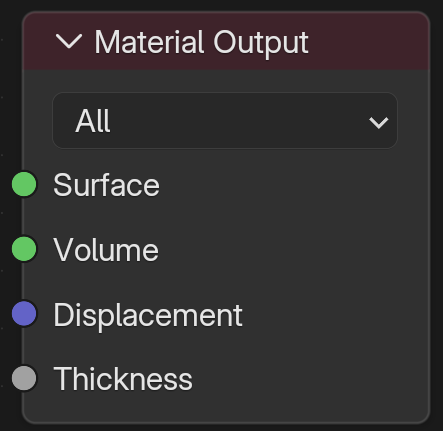

 

# blender  5.0 中，shader editor中的Meterial Output节点，是不是只有 Surface和Volume输入端口要接入固定的几个节点输出。其他两个 Displacement和Thickness相对于来说都是可以随便输入的？

你的理解非常准确，甚至可以说是抓住了 Blender 节点系统的**数据类型（Data Type）**核心逻辑。

简单来说：**是的，你的直觉是对的。**

在 Blender 的节点编辑器中，**接口的颜色**决定了它的“严格程度”和“数据类型”。我们可以把这四个端口分为两类：

### 第一类：严格的“着色器闭包” (Shader Closures)

**颜色：绿色圆点** 🟢

这两个端口（`Surface` 和 `Volume`）是非常“挑剔”的。它们不接受数字、颜色或纹理，它们只接受**光线计算规则**（也就是 Shader）。

1. **Surface (表面)：**
   - **必须输入：** 以 **BSDF** 或 **Emission** 等结尾的绿色节点。例如 `Principled BSDF`（原理化）、`Glass BSDF`、`Diffuse BSDF`。
   - **逻辑：** 这里定义光线撞击物体表面后如何反弹。你不能直接把一张图片（黄色端口）连进去，因为渲染器不知道这张图片代表的是反光率、颜色还是法线，必须通过 BSDF 节点“翻译”给它。
2. **Volume (体积)：**
   - **必须输入：** 必须是 **Volume** 相关的绿色节点。例如 `Principled Volume`、`Volume Scatter`（体积散射）、`Volume Absorption`（体积吸收）。
   - **逻辑：** 这里定义光线穿过物体内部时的行为（如烟雾、云、有色玻璃深处）。普通的表面着色器（如 Glossy BSDF）连进去是无效或报错的。

------

### 第二类：灵活的“数据数值” (Data Values)

**颜色：紫色 🟣 和 灰色 ⚪**

这两个端口（`Displacement` 和 `Thickness`）处理的是**数学数据**。因为所有的纹理、贴图、数学节点最终输出的都是数字，所以这里可以“随便输入”（只要数据类型兼容）。

1. **Displacement (置换)：**
   - **接口颜色：** 紫色（代表**向量 Vector**，即 X, Y, Z 三个数值）。
   - **输入灵活性：** 很高。
   - **标准做法：** 虽然你可以直接把一张黑白纹理连进去（Blender 会自动转换，但效果往往不对，会让物体沿对角线偏移），但**最正确**的做法是连接一个 **Displacement（置换）节点**。
   - **为什么灵活：** 因为 Displacement 节点本身可以吃任何黑白图、噪波纹理、或者数学计算的结果。它的本质就是“告诉模型表面的点往哪个方向移动多少距离”。
2. **Thickness (厚度) —— \*Blender 4.0/5.0 新增特性\*：**
   - **接口颜色：** 灰色（代表**浮点数 Float**，即单个数值）。
   - **输入灵活性：** **最高**。
   - **逻辑：** 这个参数主要用于 EEVEE Next 引擎（以及 Cycles 的半透明优化）。它告诉渲染器这个物体有多厚，用来计算次表面散射（SSS）或透光（Translucency）的准确度。
   - **随便输：** 你可以输入一个固定的数字（比如 0.5），也可以连入一张“厚度贴图”（烘焙出来的黑白图），甚至连入一个噪波纹理。只要是黑白灰的数据，它都能读懂。

### 总结对照表

| **端口名称**     | **接口颜色** | **数据类型**    | **必须连接特定节点？**           | **灵活度**   |
| ---------------- | ------------ | --------------- | -------------------------------- | ------------ |
| **Surface**      | 🟢 绿色       | Shader (着色器) | **是** (必须是 BSDF/Emission 等) | ⭐ (严格)     |
| **Volume**       | 🟢 绿色       | Shader (着色器) | **是** (必须是 Volume 类)        | ⭐ (严格)     |
| **Displacement** | 🟣 紫色       | Vector (向量)   | 建议连 Displacement 节点中转     | ⭐⭐⭐ (中等)   |
| **Thickness**    | ⚪ 灰色       | Float (数值)    | **否** (贴图、数学、数字皆可)    | ⭐⭐⭐⭐⭐ (随意) |

所以，你在做材质的时候，**Surface** 和 **Volume** 是定基调的（物理属性），而 **Displacement** 和 **Thickness** 是像填参数一样填进去的（几何或辅助数据）。