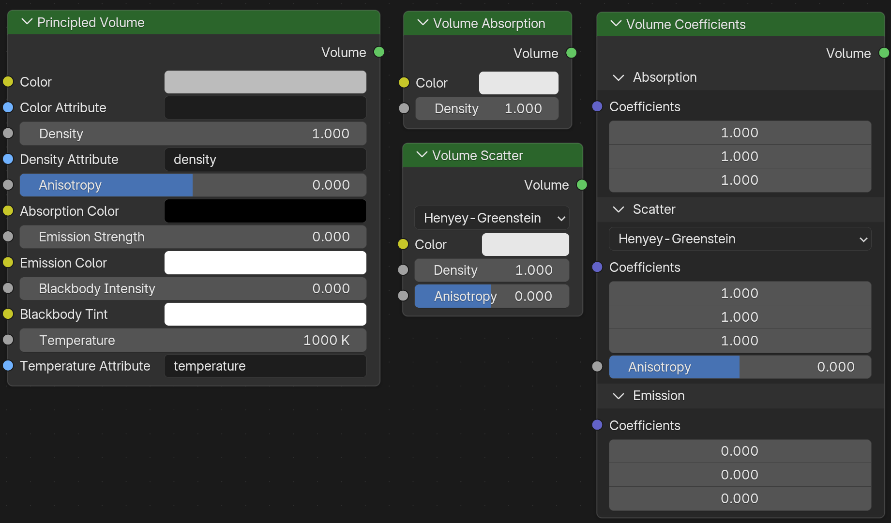
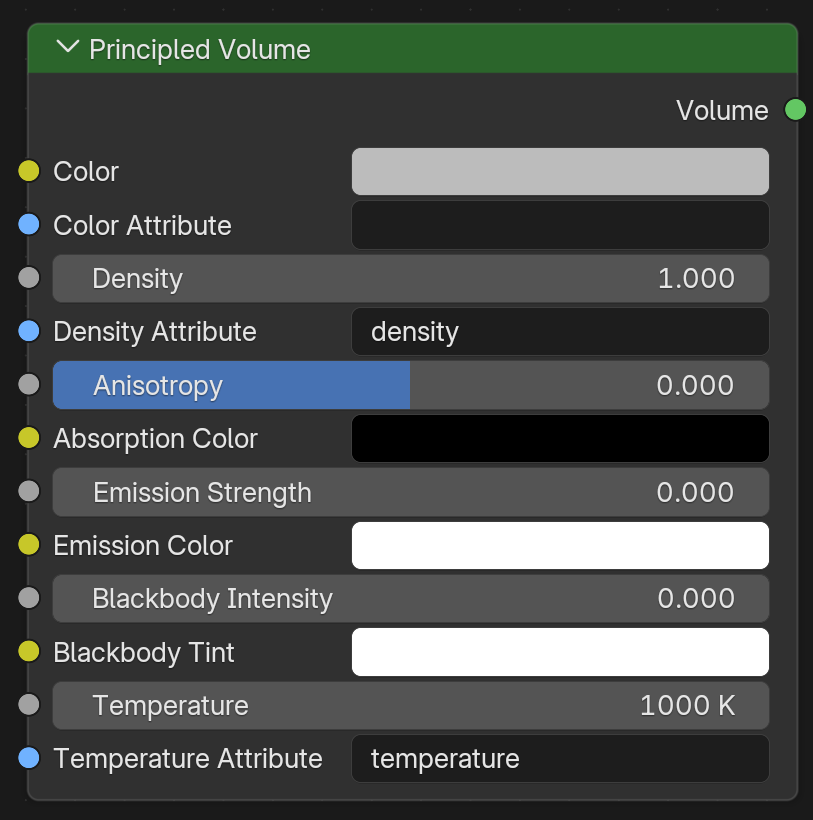
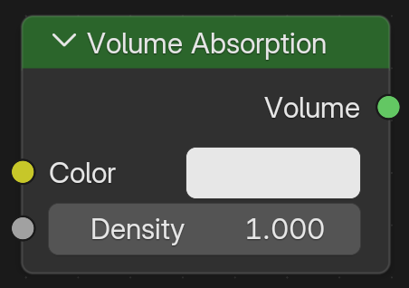
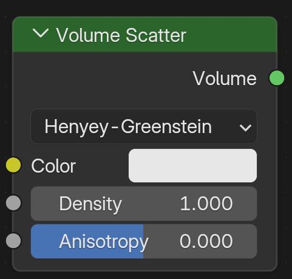
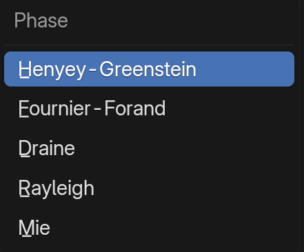
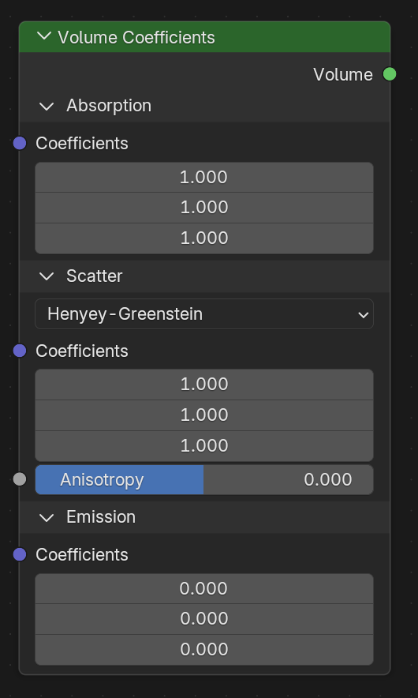
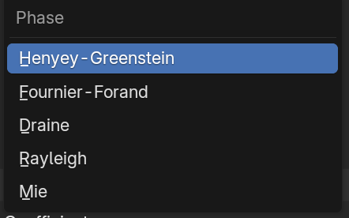

# Principled  Volume

 

这是一个非常棒的提问。**Principled Volume（原理化体积）** 是 Blender 中处理所有体积效果（烟雾、火焰、云层、雾气）的核心节点。

为了让你彻底理解，我不再按照从上到下的死板顺序，而是将它拆解为**四大物理逻辑模块**。这样你不仅知道参数是什么，还能知道在什么时候该调哪个。

------

### 🥗 模块一：物质本身（散射与密度）

**这一组决定了“这里有什么东西”，以及它长什么样。主要用于控制烟雾、云朵的实体感。**

- **Color (颜色)**
  - **定义**：体积散射光线的颜色。通俗说就是烟雾本身的颜色。
  - **应用**：白色用于云/蒸汽，灰色/黑色用于浓烟。
- **Density (密度)**
  - **定义**：体积的浓稠程度。
  - **数值逻辑**：
    - `0`：完全看不见（空气）。
    - `0.1 - 1.0`：稀薄的雾或轻烟。
    - `5.0+`：非常浓厚的浓烟或固体云层。
- **Anisotropy (各向异性)**
  - **定义**：决定光线射入体积后，是向前散射多，还是向后散射多。
  - **数值逻辑**：
    - `0`：光线均匀向四面八方散射（默认，适合大多数普通烟雾）。
    - `> 0 (正值)`：**前向散射**。光线倾向于穿过物体向前跑。效果：云层边缘的“银边”效果，或者背光时特别亮的水雾。
    - `< 0 (负值)`：**后向散射**。光线倾向于弹回来。效果：看起来比较厚重、像固体粉尘。

------

### 🌑 模块二：光线损耗（吸收）

**这一组决定了“光线穿过时会损失多少”。这对于液体的深浅、有色玻璃的体积感至关重要。**

- **Absorption Color (吸收颜色)**
  - **定义**：光线穿过体积时，**被吃掉（吸收）** 的颜色。
  - **易错点**：**它是减法！**
    - 如果你把这个设为红色，说明光线里的红色被吃掉了，剩下的光看起来是**青绿色**（红的补色）。
    - 如果你想做红酒，你应该在这里设置红酒的互补色（或者直接保持黑色，靠 Density 和 Color 来控制）。
  - **应用**：通常保持黑色（不吸收额外颜色）即可。只有在做深海海水、有色宝石内部时才深度调节。

------

### 💡 模块三：人造光（自发光）

**这一组是“不科学”的发光。不管温度多少，强行让气体发光。适合科幻、魔法效果。**

- **Emission Strength (自发光强度)**
  - **定义**：发光的亮度。
  - **应用**：魔法光雾、赛博朋克霓虹云气。
- **Emission Color (自发光颜色)**
  - **定义**：发出的光的颜色。

------

### 🔥 模块四：物理燃烧（黑体与温度）

**这一组是 Blender 模拟真实火焰的核心。它是基于物理学的“黑体辐射”定律（东西热了就会发光）。**

- **Blackbody Intensity (黑体强度)**
  - **定义**：火焰亮度的总开关。
  - **应用**：做爆炸或火焰渲染时，通常设为 `1.0`，如果觉得火不够亮，可以推高这个数值（比如到 5 或 10）。
- **Blackbody Tint (黑体色调)**
  - **定义**：给物理计算出的火焰颜色强行“染色”。
  - **应用**：通常保持白色（物理准确）。如果你想做绿色的鬼火，或者蓝色的魔法火焰，可以把这里改成对应颜色。
- **Temperature (温度)**
  - **定义**：体积的温度，单位是**开尔文 (K)**。
  - **数值逻辑**：
    - `1000K`：暗红色（快熄灭的炭火）。
    - `1500K - 2000K`：橙黄色（蜡烛、普通火焰）。
    - `5000K+`：蓝白色（高温喷枪）。
  - **注意**：如果 `Blackbody Intensity` 是 0，调节温度是看不到任何效果的。

------

### 🔌 特殊模块：数据接口（Attributes）

**你会注意到节点里有几个蓝色的输入框，名字里带“Attribute”。这些是用来“接线”的。**

当你使用流体模拟（Mantaflow）或几何节点（Geometry Nodes）生成烟雾时，模拟器会把数据存在一个个“网格数据包”里。这些输入框就是填数据包名字的地方。

- **Density Attribute (密度属性)**
  - **默认值**：`density`
  - **作用**：告诉渲染器，“去模拟数据里找一个叫 `density` 的数据，用它来驱动上面的 **Density** 参数”。哪里烟多，哪里密度就大。
- **Color Attribute (颜色属性)**
  - **作用**：如果有模拟产生的颜色数据（比如彩烟），填入对应的属性名（如 `color`），它会覆盖上面的 **Color** 参数。
- **Temperature Attribute (温度属性)**
  - **默认值**：`temperature`
  - **作用**：告诉渲染器，“去模拟数据里找一个叫 `temperature` 的数据”。模拟中哪里火大，温度就高，进而通过黑体辐射发出不同颜色的光（中心白亮，边缘橙红）。

### 📝 总结：新手调参心法

1. **做普通烟雾/雾气**：只调 **Color**（灰白）和 **Density**（密度）。

2. **做真实的火**：

   - 把 **Blackbody Intensity** 设为 1。
   - 确保 **Temperature Attribute** 里填的是 `temperature`（如果是导入的 VDB 文件）。
   - 不需要动 Emission。

3. **做魔法发光雾**：

   - 把 **Emission Strength** 拉高。

   - 调 **Emission Color**。

   - 不管 Blackbody。

# Volume Absorption-体积吸收

 

这是一个非常纯粹、非常优雅的物理节点。

如果说 **Volume Scatter (体积散射)** 是让光在内部“乱跑”（像牛奶、烟雾），那么 **Volume Absorption (体积吸收)** 就是让光在内部**“慢慢死去”**（像红酒、深海水、有色玻璃）。

它的物理底层遵循著名的 **比尔-朗伯定律 (Beer-Lambert Law)**：光线穿过介质的距离越长，能量被吸收得就越多。

我们把它仅有的两个参数拆解开，看看它们是如何控制光线“死亡”的。

------

### 1. Color (颜色)：幸存者的名单

这个参数定义了**哪些波长的光“被允许”通过**，而不是哪些被吸收。

- **物理逻辑**：这是一个“滤镜”。
  - 如果你把颜色设为 **红色 (R=1, G=0, B=0)**：这意味着只有红色光子能活着穿过物体，绿色和蓝色光子会被立刻杀掉（吸收）。
  - 如果你设为 **白色 (1, 1, 1)**：所有颜色的光都能通过。结果就是**无色透明**（像水）。
  - 如果你设为 **黑色 (0, 0, 0)**：所有光都被杀掉。物体会变成一坨**死黑**，光透不过去。
- **美妆/静物掌控**：
  - **做红酒**：颜色给深红。
  - **做翡翠**：颜色给翠绿。
  - **做透明水/伏特加**：颜色必须是**纯白**（然后把 Density 设为 0 或者极低）。

------

### 2. Density (密度)：光线的死亡速率

这是控制光线“死得有多快”的参数。它是该节点最难调、也是最容易出问题的核心。

- **物理逻辑**：它定义了每单位距离内，光线衰减的剧烈程度。
  - **Density = 0**：光线完全不衰减。物体看起来像空气一样，没有体积感。
  - **Density = 0.1**：光线要跑很远才会变暗。适合**泳池里的水**或**浅色玻璃**。
  - **Density = 100**：光线刚进表面 0.1 毫米就死光了。物体看起来像**墨水**或**黑色实心体**。
- **Scale (尺度) 陷阱**：
  - 这是新手最容易崩溃的地方：**Density 的数值必须配合物体的大小。**
  - **案例 A（大游泳池）**：如果 Density 设为 1.0，光线跑 1 米就黑了，泳池看起来会像石油。**正确做法：Density 给 0.05。**
  - **案例 B（小香水瓶）**：如果 Density 设为 0.05，光线穿过瓶子（只有 5 厘米）时根本没来得及衰减，瓶子看起来像白水。**正确做法：Density 给 20.0 或 50.0。**

------

### 🧠 你的“确定性”调参公式：

当你使用这个节点来做**有色玻璃**或**液体**时，请遵循以下步骤，不要乱试：

1. **先定色**：把 `Color` 设为你想要的液体颜色（比如橙汁的橙色）。
2. **归零**：先把 `Density` 设为 0。此时物体应该是完全透明无色的。
3. **慢慢推**：按住 Shift 键，慢慢增加 `Density`。
   - 你会看到颜色从边缘（最薄的地方）开始出现，然后逐渐向中心（最厚的地方）变深。
   - **停止点**：当你觉得最深的地方（比如瓶底）刚好变暗，但还能透出一点光时，就是完美的数值。

### 总结对照表

| **参数**    | **作用** | **物理隐喻**                             |
| ----------- | -------- | ---------------------------------------- |
| **Color**   | **定性** | 决定液体的**色相**（是红酒还是绿茶）。   |
| **Density** | **定量** | 决定液体的**浓度**（是兑了水还是原浆）。 |

**一句话总结：Volume Absorption 是用来做“清澈但有厚度”的材质的。** 它没有任何浑浊感（那是 Scatter 的事），它只负责呈现那种晶莹剔透的深邃感。

# Volume Scatter-体积散射

   

如果说 **Volume Absorption (体积吸收)** 是让光线“慢慢死去”的节点，那么 **Volume Scatter (体积散射)** 就是让光线在物体内部**“玩弹球”**的节点。

它是 **烟雾、云层、牛奶、玉石** 这种“浑浊感”的物理来源。光线没有被吸收（消失），而是被无数微小的悬浮颗粒**撞歪了方向**。

特别是你截图中的 **Phase Function (相函数)** 下拉菜单，这是 Blender 5.0 / Cycles 引入的高级物理特性，它决定了**光线撞到颗粒后，到底往哪个方向弹**。

我们来深度拆解这个节点。

------

### 1. 核心逻辑：不是“吃掉”，是“迷路”

与吸收不同，散射**不消耗能量**（在理想情况下）。

- **物理过程：** 光子撞到一个微粒 $\rightarrow$ 改变方向 $\rightarrow$ 继续飞 $\rightarrow$ 撞下一个微粒。
- **视觉结果：**
  - 光线被打散，物体变得模糊、不透明。
  - 因为光线在里面弹了很久才出来，所以物体会显得**“发亮”**或**“发白”**（想想积雨云为什么是白的，因为光在里面乱弹，没被吸收）。

------

### 2. Phase Function (相函数)：微粒的“形状”

这是你截图中最关键的部分。这个菜单定义了**悬浮微粒的物理性质**。不同的微粒（水珠、灰尘、气体分子）对光的反弹方式是完全不同的。

#### A. Henyey-Greenstein (亨耶-格林斯坦) —— **默认/万能**

- **定义：** 这是一个天体物理学公式，它是对真实散射的**数学近似**。
- **特点：** 计算最快，可控性最强。
- **适用场景：** 90% 的情况。做普通的烟雾、云、甚至简单的玉石，选它没错。它允许你自由调节 `Anisotropy`（各向异性）。

#### B. Fournier-Forand (福尼尔-福兰德) —— **海洋/大气**

- **定义：** 专门为模拟光在**水下**或**大气层**中的散射而设计的物理模型。
- **特点：** 它在处理背光（Backscatter）时的表现比 HG 更符合真实的物理测量数据。
- **适用场景：** 如果你在做**深海潜水**的浑浊海水，或者真实的**高空大气**渲染。

#### C. Draine (德雷恩) —— **星际尘埃**

- **定义：** 专门模拟宇宙中的星际尘埃。
- **特点：** 它能模拟出非常复杂的“双峰”散射特性（既有很强的前向散射，也有明显的后向散射）。
- **适用场景：** 只有你在做**星云**、**银河**渲染时才需要用它。

#### D. Rayleigh (瑞利散射) —— **气体分子**

- **定义：** 当微粒的直径**远小于**光的波长时发生的散射（如空气分子）。
- **物理现象：** 这是**天空为什么是蓝色**、**夕阳为什么是红色**的原因。
- **锁定特性：** 选中它后，`Anisotropy` 会失效（通常锁定为 0）。因为瑞利散射在物理上是**前后对称**的（像一个花生形状）。
- **适用场景：** 模拟**蓝天**、**稀薄的烟气**。

#### E. Mie (米氏散射) —— **水雾/气溶胶**

- **定义：** 当微粒的直径**接近或大于**光的波长时发生的散射（如雾滴、PM2.5、云滴）。
- **物理现象：** 米氏散射倾向于把光线**强烈地向前**抛射。这就是为什么你在大雾天看车灯，会看到车灯周围有一圈非常亮的光晕。
- **适用场景：** **浓雾**、**低空云层**、**浑浊的有机液体**（牛奶）。

------

### 3. 三大参数详解

#### Color (颜色)：反弹谁？

- **定义：** 决定了光线撞击微粒后，**哪些颜色的光被弹开**（反射），哪些被微粒吸收。
- **反直觉逻辑：**
  - 如果你想要**白色的云**：Color 设为白色（所有光都被弹开，显得亮）。
  - 如果你想要**黑烟**：这里不能只调 Color，因为黑烟通常是吸收为主。通常黑烟是用 *Absorption* 节点或者把 Scatter 的 Color 设暗。
  - **做牛奶：** Color 设为白色。
  - **做橙汁：** Color 设为橙色（橙色光被弹射出来进入眼睛）。

#### Density (密度)：撞击概率

- **定义：** 空间的“拥挤程度”。
- **数值逻辑：**
  - `0.1`：稀薄的晨雾。光线能穿透很远才发生偏折。
  - `1.0`：普通的浓烟。
  - `10.0+`：极高密度的固体感（如大理石、蜡烛）。光线刚进去就疯狂乱撞。

#### Anisotropy (各向异性)：向前还是向后？

这是配合 `Henyey-Greenstein` 使用的核心参数。

- **0.0 (各向同性)**：
  - 光线撞击后，向四面八方均匀炸开。
  - **效果：** 物体看起来比较“粉”，光感均匀。适合**面粉、石头**。
- **> 0 (前向散射，如 0.8)**：
  - 光线撞击后，倾向于**继续向前跑**，只是稍微偏了一点点角度。
  - **效果：** 逆光观察时，物体边缘会非常亮（银边效果）。适合**云朵、水雾**。
- **< 0 (后向散射，如 -0.5)**：
  - 光线撞击后，倾向于**弹回来**。
  - **效果：** 顺光观察时更亮，看起来像厚实的固体。适合**沙尘、岩石粉末**。

------

### 🧠 你的“确定性”调参公式：

如果你要用 **Volume Scatter**，请遵循以下物理归类：

1. **做天空/空气**：
   - 选 `Rayleigh`。
   - Density 极低。
2. **做云/雾/牛奶**：
   - 选 `Henyey-Greenstein` 或 `Mie`。
   - `Color` 纯白。
   - `Anisotropy` 设为 **0.7 - 0.9**（非常重要！云的银边全靠这个）。
3. **做浑浊的玉石/蜡烛**：
   - 选 `Henyey-Greenstein`。
   - `Density` 很高（配合 Scale）。
   - `Anisotropy` 设为 **0.0 - 0.2**（比较均匀的散光）。

### ⚡ 最佳实践：Add Shader (相加)

在真实世界中，很少有东西只散射不吸收。

**标准做法**是使用 **Add Shader** 节点：

- 输入 A：**Volume Absorption**（控制液体的深浅颜色，如红酒的红）。
- 输入 B：**Volume Scatter**（控制液体的浑浊度，如红酒里的沉淀物）。
- **结果：** 既有深邃的颜色，又有浑浊的质感。这就是做**脏水**、**血液**或**果肉饮料**的标准物理流。

# Volume Coefficients-体积系数

 

针对你上传的 **Volume Coefficients（体积系数）** 节点（Blender 5.0 / Cycles 核心节点），这是一个比 Principled Volume 更加底层、更符合物理实验数据的节点。

与 Principled Volume 不同，这个节点直接使用**系数（Coefficients）\**而非密度来控制体积行为。我们可以将它拆解为\**三大物理损耗模块**：

------

### 1. 🟥 Absorption（吸收模块）：光线的“死亡”

这部分定义了光线穿过体积时，哪些波长的能量被物质“吃掉”了。

- **Coefficients（吸收系数）：**
  - **物理意义：** 代表每单位距离内光线被吸收的概率。
  - **数值逻辑：** 数值越高，体积越黑、越不透明。
  - **色彩逻辑：** 这是“减法颜色”。如果你输入 $(1.0, 0, 0)$，代表红色光被吸收，剩下的光会呈现出**青色（Cyan）**。
  - **应用：** 制作深海水、红酒或有色玻璃的深处，只需要调节这里的 RGB 数值。

------

### 2. 🟦 Scatter（散射模块）：光线的“迷路”

这部分定义了光线撞击微粒后，如何改变方向继续前进。

- **Phase Function（相函数下拉菜单）：**
  - **Henyey-Greenstein：** 默认全能型，适合烟雾、云、皮肤。
  - **Fournier-Forand：** 专门用于模拟水下浑浊物体。
  - **Draine：** 用于模拟星际尘埃（星云效果）。
  - **Rayleigh（瑞利）：** 模拟天空为什么是蓝色的（气体分子散射）。
  - **Mie（米氏）：** 模拟大雾或云层中水滴的强前向散射。
- **Coefficients（散射系数）：**
  - **物理意义：** 代表单位距离内光线发生碰撞并弹开的频率。
  - **视觉效果：** 数值越高，体积看起来越“厚实”、“浑浊”（如浓奶、浓烟）。
- **Anisotropy（各向异性）：**
  - **正值 ($>0$)：** **前向散射**。光线倾向于往前走。视觉上会产生强烈的边缘亮影（如背光下的云朵）。
  - **负值 ($<0$)：** **后向散射**。光线倾向于往回弹。看起来更像实心的粉尘。

------

### 3. 🟧 Emission（自发光模块）：物质的“心火”

这部分定义了体积本身是否向外辐射能量。

- **Coefficients（发光系数）：**
  - **物理意义：** 控制体积单位长度内发出的能量。
  - **应用：** 这里不考虑温度，是强行发光。常用于模拟全息投影、魔法火焰或星云核心。

------

### 💡 核心总结与使用心法

这个节点与 Principled Volume 的最大区别在于：**它没有总的 Density（密度）开关。**

1. **如果你想增加总浓度：** 你需要同时按比例调大 `Absorption` 和 `Scatter` 的数值。
2. **单节点 vs 组合：** 在物理上，一个物质的视觉表现等于：**吸收 + 散射**。
   - **做红酒：** 吸收系数高，散射系数接近 0。
   - **做白烟：** 吸收系数低，散射系数高。
   - **做浓墨：** 吸收系数和散射系数都很高。

**你想让我演示一下如何通过这个节点，精确还原一个“光线穿过会变蓝，但深处看起来是红色”的特殊化学液体效果吗？**

