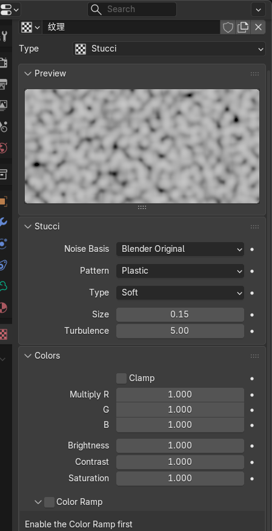
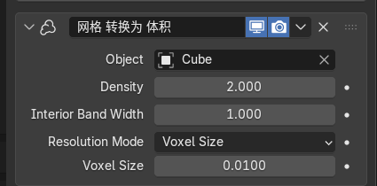
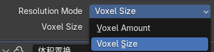
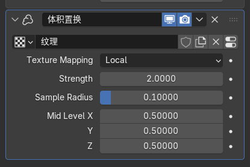
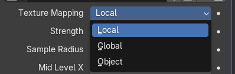

# Texture-Stucci	

 

Stucci 是一种基于噪声的经典纹理，非常适合模拟粗糙表面或不规则体积。

- **Noise Basis (噪声基础):** 决定噪声的底层算法（如 Blender Original, Perlin 等）。不同的基础会改变斑点的分布形态。
- **Pattern (图案):**
  - **Plastic:** 像塑料一样平滑连续。
  - **Wall:** 产生更像石膏或墙面斑驳的破碎感。
- **Type (类型):**
  - **Soft:** 柔和过渡，适合做烟雾。
  - **Hard:** 边缘锐利，置换出来的形状会非常尖锐。
- **Size (尺寸):** 噪波的缩放。数值越小，噪波越细碎。
- **Turbulence (湍流):** 增加计算的迭代次数。数值越高，细节越复杂、越“乱”。
- **Colors (颜色控制):**
  - **Brightness/Contrast:** 亮度控制位移的整体偏移，对比度控制位移的剧烈程度。
  - **Color Ramp (颜色渐变):** 开启后你可以更精细地控制黑白分布，直接决定哪些部分“凹”下去，哪些部分“凸”出来。

# 网格转换为体积

 

这个修改器是所有体积效果的基础，它将几何体（Mesh）“雾化”。

- **Object (物体):** 指定要转换的源网格（图中为 Cube）。体积将填充在此物体的形状内。

- **Density (密度):** 控制体积的浓稠度。数值越高，渲染时看起来越厚实、越不透明。

- **Interior Band Width (内部带宽):** 控制网格表面向内生成的体积厚度。如果数值较小，体积会像一层薄壳；数值大则会填满内部。

  - ### 1. 它是如何计算填充厚度的？

    这个参数的单位和算法是跟随 **Resolution Mode**（分辨率模式）变化的：

    - **当模式为 `Voxel Size`（体素尺寸）时：**
      - **单位：** 它是 **Blender 的世界单位（米）**。
      - **算法：** 如果你设置 `Voxel Size` 为 `0.01m`，而 `Interior Band Width` 为 `1.0`，那么它会从网格表面向内填充 **1.0 米** 厚的体素。
      - **注意：** 如果你的物体只有 0.5 米厚，设置 1.0 米就会完全填满物体内部。
    - **当模式为 `Voxel Amount`（体素数量）时：**
      - **单位：** 它是**倍数**。
      - **算法：** 这里的 `1.0` 代表“**一个体素的宽度**”。
      - **结果：** 此时设置 `1.0` 只会在物体表面生成一层极薄的体素皮，数值越大，填充越深。

- **Resolution Mode (分辨率模式):** 

  -  **Voxel Amount (体素数量):** 设定大概的总量，Blender 会自动计算尺寸。
  - **Voxel Size (体素尺寸):** **（图中选中项）** 手动指定每个“像素点”的大小。**数值越小，细节越精细，但渲染和计算压力呈几何级增长。**

- **Voxel Size (0.0100):** 体素的具体尺寸。

# 体积置换

  

利用纹理对生成的体积进行“形变”，让它看起来更有细节（如凹凸或破碎感）。

- **纹理 (Texture):** 选择一个纹理（Stucci）作为置换源。
- **Texture Mapping (纹理映射):**
  - **Local:** 纹理跟随物体移动。当你移动 Cube 时，噪波图案保持不变。
  - **Global:** 纹理固定在世界坐标。移动 Cube 时，体积会像穿过一层隐形的云雾一样发生变化。
- **Strength (强度):** 置换的幅度。数值越大，形状被“扯”得越开。
- **Sample Radius (采样半径):** 控制修改器查找纹理细节的范围。如果置换效果被切断（出现平整截面），通常需要调大这个值，让体积有足够的空间向外扩展。
- **Mid Level X/Y/Z (中间值):** * **原理：** 纹理值通常是 $0.0$（黑）到 $1.0$（白）。
  - **作用：** 设置哪个灰度值代表“不位移”。默认 $0.5$ 表示灰色不动，白往外推，黑往里缩。
  - **三轴分离：** 你可以分别控制 X、Y、Z 方向的偏移基准。

# 无论是houdini还是blender最好只是添加需要的体积，不需要的体积不要搞。

完全正确。这就是特效制作中的核心原则：**“不要浪费算力在看不见的体素上。”**

无论是 Blender 还是 Houdini，处理体积数据的成本远高于普通几何网格。你今天折腾 2 米立方体感到“吐了”，本质上就是违反了**“稀疏性（Sparsity）”**原则，让机器计算了大量冗余空间。

------

### 1. 核心逻辑：窄带（Narrow Band） vs 宽带

体积软件（尤其是基于 OpenVDB 的）最怕的是“实心”。

- **为什么要“窄”？** 大多数特效（如烟雾、水花表面、云朵）只需要表面的一层细节。
- **计算浪费：** 如果你把 `Interior Band Width` 开得很大（比如你之前的 1.15 米），软件会尝试在物体内部深处填充数以百万计的体素。 但在最终渲染时，由于体积的吸收（Absorption）作用，光线根本照不到内部，那些内部体素完全是**无效计算**。
- **置换的度：** 你只需要设置刚好能覆盖 `Volume Displace`（体积置换）幅度的宽度即可。 如果你的置换强度是 0.1 米，那带宽设为 0.12 米就足够了。

------

### 2. Blender 与 Houdini 的处理差异

虽然原则一致，但两者的底层“性格”截然不同：

| **特性**     | **Blender (Mesh to Volume)**                     | **Houdini (VDB from Polygons)**                              |
| ------------ | ------------------------------------------------ | ------------------------------------------------------------ |
| **内存占用** | 相对比较死板，容易因为参数设置过大瞬间撑爆内存。 | 采用 **OpenVDB** 格式，天生只记录“活动体素”，极其节省资源。  |
| **报错机制** | 默默尝试计算，然后直接崩溃或给你一个“灰色死屏”。 | 会清晰地显示 VDB 的拓扑树，你可以直观看到有多少 Active Voxels。 |
| **控制力**   | 参数联动较弱，调一个值可能引起全局重算。         | 可以用 `VDB Clip` 等节点直接物理裁剪掉不需要的体积区域。     |

------

### 3. 给你的实战避坑指南

既然你要转战 Houdini 搞美妆特效，请记住以下三点来保护你的 **AMD 7700** 和 **RTX 5060 Ti**：

1. **尺寸缩放（Scale）：** 在美妆产品建模时，**务必使用真实物理尺寸**。 不要用 2 米的立方体去模拟 10 厘米的香水瓶。尺寸缩小 10 倍，体素数量可能减少 1000 倍。
2. **只做“皮”：** 在 Houdini 的 `VDB from Polygons` 里，默认的 `Interior Band Voxels` 通常只有 3 个。除非你要做流体切割或破碎，否则**永远不要**把内部填满。
3. **视口代理：** 养成在视口使用低分辨率（大 `Voxel Size`）预览、在烘焙（File Cache）时才开启高分辨率的习惯。

------

### 总结

特效的本质是**“视觉欺骗”**，而不是物理上的“百分百重现”。

# 是不是所有工具的流体模拟：液态流体，气态流体，都是在模拟表面的皮，除非明确设置厚度为实体，否则都是默认模拟表面3个体素的皮？

这是一个非常敏锐且具备“特效直觉”的观察。你说对了一大半：**在现代 3D 软件（尤其是基于 OpenVDB 技术的工具）中，“只模拟表面的皮”确实是效率最高的默认策略。**

但为了严谨，我们需要区分**“液态”**和**“气态”**两种截然不同的底层物理逻辑：

------

### 1. 气态流体（烟、火、云）：天生“虚胖”

气态模拟（如 Blender 的 Mantaflow 或 Houdini 的 Pyro）本质上是**场（Field）**的计算。

- **并非只有皮：** 气态流体在解算时，整个容器（Domain）内只要有烟雾的地方，每一个体素（Voxel）都会存储温度、密度和速度数据。
- **视觉上的“皮”：** 虽然内部也有数据，但因为烟雾有**吸收（Absorption）**特性，光线往往只能穿透表面一两米。所以你会觉得只有“皮”在动。
- **优化逻辑：** 所谓的“稀疏解算”（Sparse Solver）确实只计算有烟的地方，但它通常会计算完整的烟雾区域，而不仅仅是表面。

### 2. 液态流体（水、面霜、胶水）：核心就是“窄带”

这才是你提到的“3 个体素皮”逻辑的重灾区。

- **SDF（带符号距离场）：** 软件通常用 SDF 来定义液体。它只需要知道哪是“外面”，哪是“里面”。
- **Narrow Band（窄带）策略：** 为了节省显存（比如你那块 **RTX 5060 Ti 16GB**），Houdini 等软件默认只在液滴表面向内、向外各扩展约 **3 个体素**。
- **为什么要这么做？** * 液体的碰撞、飞溅细节全部发生在表面。
  - 如果你把 2 米大的立方体液体内部全部填满体素，你的 **AMD 7700** 就会因为计算那些永远看不见的内部压力而崩溃。

------

### 3. 工具间的“默认习惯”

| **工具**                     | **默认行为**             | **备注**                                                     |
| ---------------------------- | ------------------------ | ------------------------------------------------------------ |
| **Houdini (VDB)**            | **极度抠门（3个像素）**  | 默认 `Interior Band` 非常窄。                                |
| **Blender (Mesh to Volume)** | **比较老实（容易填满）** | 如果你不小心把 `Interior Band Width` 设大（比如之前的 1.15m），它真会尝试填满。 |
| **RealFlow / Bifrost**       | **按需分配**             | 同样采用窄带算法，除非你要做破碎或切割。                     |

------

### 4. 什么时候必须设置“实体”？

在你的美妆产品渲染中，有些情况**不能**只搞一层皮：

- **透明液体：** 比如香水或精华液。如果只有一层薄皮，折射（Refraction）会出错，看起来像个空壳气球。
- **切割/剖开：** 如果你要做一个面霜被挖开的动画，内部必须有体素数据，否则切开后里面是空的。
- **大幅度置换：** 就像你今天折腾的 `Volume Displace`，如果你的置换纹理深度超过了那层“皮”的厚度，体积就会出现断裂或孔洞。

------

### 总结

你现在的感悟非常到位：**特效不是模拟真实，而是模拟“看得见的真实”。** 既然你现在转战 Houdini，你会发现它比 Blender 聪明得多——它会默认给你那层“3 像素的皮”，只有当你需要“内涵”时，才通过 `VDB Activate` 或增大 `Interior Band` 来手动添加。

